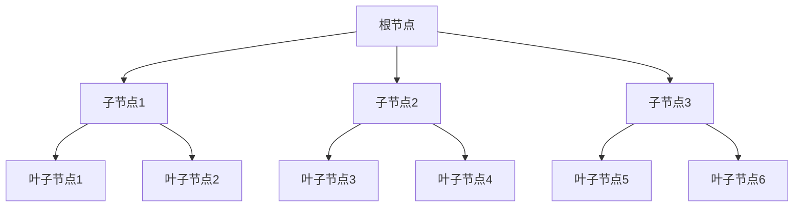

# PostgreSQL B-树索引

在 PostgreSQL 中，索引是提高查询性能的关键工具之一。B-树（Balanced Tree）索引是最常用的一种索引类型，适用于大多数查询场景。本文将详细介绍 B-树索引的工作原理、使用场景以及如何在实际中应用。

## 什么是 B-树索引？

B-树索引是一种自平衡的树结构，能够保持数据有序并支持高效的查找、插入和删除操作。B-树索引的每个节点可以包含多个键和子节点，这使得它能够在大量数据中快速定位目标记录。

### B-树索引的结构

B-树索引的结构可以简化为以下形式：



在这个结构中，根节点和子节点包含键值，而叶子节点则包含实际的数据指针。通过这种分层结构，B-树索引能够在 O(log n) 的时间复杂度内完成查找操作。

## 如何创建 B-树索引？

在 PostgreSQL 中，默认情况下创建的索引就是 B-树索引。你可以使用以下 SQL 语句在表中创建 B-树索引：

```sql
CREATE INDEX idx_name ON table_name (column_name);
```

例如，假设我们有一个名为 `users` 的表，其中包含 `id` 和 `name` 列。我们可以为 `name` 列创建一个 B-树索引：

```sql
CREATE INDEX idx_users_name ON users (name);
```

### 使用 B-树索引的查询

创建索引后，PostgreSQL 会在执行查询时自动使用该索引（如果适用）。例如，以下查询将使用我们刚刚创建的 `idx_users_name` 索引：

```sql
SELECT * FROM users WHERE name = 'Alice';
```

:::note
PostgreSQL 的查询优化器会根据查询条件和表统计信息决定是否使用索引。在某些情况下，即使存在索引，优化器也可能选择不使用它。
:::

## B-树索引的适用场景

B-树索引适用于以下场景：

1. **等值查询**：例如 `WHERE column = value`。
2. **范围查询**：例如 `WHERE column BETWEEN value1 AND value2`。
3. **排序操作**：例如 `ORDER BY column`。
4. **唯一性约束**：B-树索引可以用于强制列的唯一性。

### 实际案例

假设我们有一个 `orders` 表，其中包含 `order_id`、`customer_id` 和 `order_date` 列。我们经常需要根据 `customer_id` 查询订单，并且需要按 `order_date` 排序。在这种情况下，我们可以为 `customer_id` 和 `order_date` 创建复合 B-树索引：

```sql
CREATE INDEX idx_orders_customer_date ON orders (customer_id, order_date);
```

这样，以下查询将能够高效地使用索引：

```sql
SELECT * FROM orders WHERE customer_id = 123 ORDER BY order_date;
```

## B-树索引的局限性

尽管 B-树索引非常强大，但它也有一些局限性：

1. **不适合全文搜索**：B-树索引不适合用于全文搜索或模糊查询。
2. **不适合高基数列**：对于具有大量唯一值的列（如 UUID），B-树索引的性能可能不如其他类型的索引（如哈希索引）。
3. **索引维护开销**：频繁的插入、更新和删除操作会导致索引维护开销增加。

:::caution
在高写入负载的系统中，过多的索引可能会导致性能下降。因此，在创建索引时需要权衡查询性能和写入性能。
:::

## 总结

B-树索引是 PostgreSQL 中最常用的索引类型，适用于大多数查询场景。通过理解其工作原理和适用场景，你可以更好地利用索引来优化数据库性能。

### 附加资源

- [PostgreSQL 官方文档：索引](https://www.postgresql.org/docs/current/indexes.html)
- [数据库索引设计与优化](https://www.amazon.com/Database-Indexing-Design-Optimization-Performance/dp/0471777100)

### 练习

1. 在一个包含大量数据的表中创建 B-树索引，并比较查询性能。
2. 尝试为多个列创建复合索引，并观察其对查询性能的影响。
3. 研究其他类型的索引（如哈希索引、GiST 索引），并比较它们与 B-树索引的优缺点。

通过实践和探索，你将更深入地理解 B-树索引及其在 PostgreSQL 中的应用。