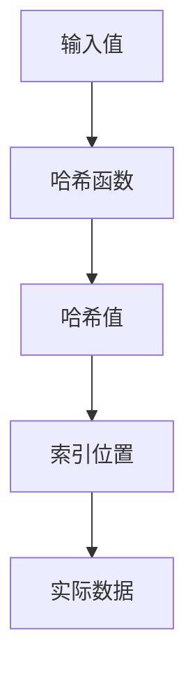

# PostgreSQL 哈希索引

在PostgreSQL中，索引是提高查询性能的重要工具。哈希索引是一种特殊类型的索引，它通过哈希函数将键值映射到索引中的特定位置。本文将详细介绍哈希索引的工作原理、适用场景以及如何在实际中使用。

## 什么是哈希索引？

哈希索引是一种基于哈希表的索引结构。它使用哈希函数将键值转换为一个固定长度的哈希值，然后将该哈希值映射到索引中的特定位置。哈希索引的主要优点是查找速度快，因为它可以在常数时间内（O(1)）找到对应的记录。

:::note
哈希索引在PostgreSQL中主要用于等值查询（即`=`操作符），而不适用于范围查询（如`>`、`<`等）。
:::

## 哈希索引的工作原理

哈希索引的核心是哈希函数。哈希函数将输入值（通常是索引列的值）转换为一个固定长度的哈希值。这个哈希值被用作索引中的键，指向存储实际数据的位置。



### 创建哈希索引

在PostgreSQL中，可以使用以下语法创建哈希索引：

```sql
CREATE INDEX index_name ON table_name USING HASH (column_name);
```

例如，假设我们有一个`users`表，其中包含`email`列，我们可以为该列创建一个哈希索引：

```sql
CREATE INDEX idx_users_email ON users USING HASH (email);
```

### 查询哈希索引

创建哈希索引后，PostgreSQL会自动在等值查询中使用该索引。例如：

```sql
SELECT * FROM users WHERE email = 'example@example.com';
```

在这个查询中，PostgreSQL会使用哈希索引快速定位到`email`为`example@example.com`的记录。

## 哈希索引的适用场景

哈希索引适用于以下场景：

1. **等值查询**：哈希索引最适合用于等值查询，即使用`=`操作符的查询。
2. **高基数列**：对于具有高基数的列（即列中有大量唯一值），哈希索引可以提供更好的性能。
3. **内存充足**：哈希索引在内存中表现良好，因此在内存充足的情况下，哈希索引的性能优势更为明显。

:::caution
哈希索引不支持范围查询、排序操作或多列索引。如果需要进行这些操作，应考虑使用B-tree索引。
:::

## 实际案例

假设我们有一个`orders`表，其中包含`order_id`列。`order_id`是一个唯一标识符，我们经常需要根据`order_id`查询订单信息。在这种情况下，我们可以为`order_id`列创建哈希索引：

```sql
CREATE INDEX idx_orders_order_id ON orders USING HASH (order_id);
```

创建索引后，查询特定订单的速度将显著提高：

```sql
SELECT * FROM orders WHERE order_id = '12345';
```

## 总结

哈希索引是PostgreSQL中一种高效的索引类型，特别适用于等值查询和高基数列。它通过哈希函数将键值映射到索引中的特定位置，从而在常数时间内完成查找操作。然而，哈希索引不支持范围查询和排序操作，因此在选择索引类型时需要根据具体需求进行权衡。

## 附加资源

- [PostgreSQL官方文档 - 索引](https://www.postgresql.org/docs/current/indexes.html)
- [PostgreSQL索引类型比较](https://www.postgresql.org/docs/current/indexes-types.html)

## 练习

1. 在一个包含大量唯一值的表上创建哈希索引，并比较查询性能。
2. 尝试在哈希索引上执行范围查询，观察结果并分析原因。
3. 研究其他类型的索引（如B-tree、GiST、GIN等），并与哈希索引进行比较。

通过本文的学习，你应该对PostgreSQL中的哈希索引有了更深入的理解。希望你能在实际项目中灵活运用哈希索引，提升查询性能。