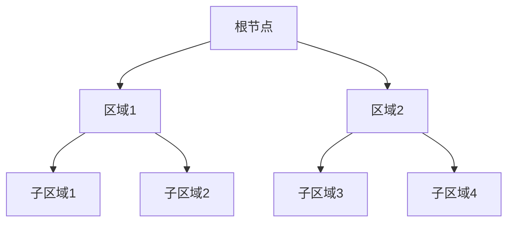

# PostgreSQL SP-GiST 索引

SP-GiST（Space-Partitioned Generalized Search Tree，空间分区通用搜索树）是 PostgreSQL 中一种高级索引类型。它适用于处理非平衡数据结构，例如几何数据、文本数据和其他复杂数据类型。SP-GiST 索引通过将数据空间划分为不相交的区域来实现高效查询。

## 什么是 SP-GiST 索引？

SP-GiST 是一种通用索引结构，允许用户定义自定义的分区和搜索策略。与 B-Tree 或 GiST 索引不同，SP-GiST 索引不依赖于平衡树结构，而是通过递归地将数据空间划分为更小的区域来实现高效查询。

SP-GiST 索引的主要特点包括：
- 支持复杂数据类型（如几何数据、文本数据）。
- 允许自定义分区和搜索策略。
- 适用于非平衡数据结构。

## SP-GiST 索引的工作原理

SP-GiST 索引的核心思想是将数据空间递归地划分为更小的区域。每个区域可以进一步划分为子区域，直到满足特定条件为止。这种分区方式使得 SP-GiST 索引能够高效地处理复杂查询。

以下是一个简单的示意图，展示了 SP-GiST 索引的分区过程：



在这个例子中，根节点将数据空间划分为两个区域（区域1和区域2），然后每个区域进一步划分为子区域。

## 创建 SP-GiST 索引

要在 PostgreSQL 中创建 SP-GiST 索引，可以使用以下语法：

```sql
CREATE INDEX index_name ON table_name USING spgist (column_name);
```

例如，假设我们有一个包含几何数据的表 `geometries`，我们可以为其创建一个 SP-GiST 索引：

```sql
CREATE INDEX geometries_spgist_idx ON geometries USING spgist (geom);
```

## 实际应用场景

SP-GiST 索引在许多实际场景中非常有用，尤其是在处理复杂数据类型时。以下是一些常见的应用场景：

### 1. 几何数据查询

假设我们有一个包含多边形数据的表 `polygons`，我们可以使用 SP-GiST 索引来加速空间查询：

```sql
CREATE TABLE polygons (
    id SERIAL PRIMARY KEY,
    geom GEOMETRY(Polygon)
);

CREATE INDEX polygons_spgist_idx ON polygons USING spgist (geom);
```

现在，我们可以高效地执行空间查询，例如查找与某个区域相交的多边形：

```sql
SELECT * FROM polygons WHERE geom && ST_MakeEnvelope(0, 0, 10, 10);
```

### 2. 文本数据查询

SP-GiST 索引也可以用于加速文本数据的查询。例如，我们可以为包含文本数据的表 `documents` 创建一个 SP-GiST 索引：

```sql
CREATE TABLE documents (
    id SERIAL PRIMARY KEY,
    content TEXT
);

CREATE INDEX documents_spgist_idx ON documents USING spgist (content);
```

然后，我们可以使用该索引来加速全文搜索查询：

```sql
SELECT * FROM documents WHERE content LIKE '%PostgreSQL%';
```

## 总结

SP-GiST 索引是 PostgreSQL 中一种强大的索引类型，特别适用于处理复杂数据类型和非平衡数据结构。通过递归地划分数据空间，SP-GiST 索引能够高效地支持各种查询操作。

在实际应用中，SP-GiST 索引可以用于加速几何数据查询、文本数据查询等场景。通过创建适当的 SP-GiST 索引，您可以显著提高查询性能。

## 附加资源

- [PostgreSQL 官方文档：SP-GiST 索引](https://www.postgresql.org/docs/current/spgist.html)
- [PostgreSQL 索引类型比较](https://www.postgresql.org/docs/current/indexes-types.html)

## 练习

1. 创建一个包含几何数据的表，并为其创建一个 SP-GiST 索引。尝试执行一些空间查询，观察索引的效果。
2. 创建一个包含文本数据的表，并为其创建一个 SP-GiST 索引。尝试执行一些全文搜索查询，观察索引的效果。