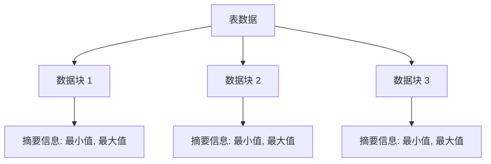

# PostgreSQL BRIN 索引

## 介绍

在 PostgreSQL 中，索引是提高查询性能的重要工具。BRIN（Block Range INdex）索引是一种专门为处理大型数据集而设计的索引类型。与传统的 B-Tree 索引不同，BRIN 索引通过存储数据块的范围摘要信息来减少索引的大小，从而在处理大规模数据时提供高效的查询性能。

BRIN 索引特别适用于那些数据按某种顺序（如时间戳或递增的 ID）存储的场景。它通过将数据分成多个块（block range），并为每个块存储最小值和最大值等摘要信息，来快速定位查询所需的数据块。

## BRIN 索引的工作原理

BRIN 索引的核心思想是**数据块范围摘要**。它将表的数据分成多个连续的块（通常每个块包含多个页面），并为每个块存储一些摘要信息，例如最小值、最大值或平均值。当执行查询时，PostgreSQL 会使用这些摘要信息来快速确定哪些块可能包含符合条件的数据，从而减少需要扫描的数据量。



## 创建 BRIN 索引

要在 PostgreSQL 中创建 BRIN 索引，可以使用以下语法：

```sql
CREATE INDEX index_name ON table_name USING brin (column_name);
```

例如，假设我们有一个存储传感器数据的表 `sensor_data`，其中包含时间戳 `timestamp` 和温度 `temperature` 列。我们可以为 `timestamp` 列创建一个 BRIN 索引：

```sql
CREATE INDEX sensor_data_timestamp_brin_idx ON sensor_data USING brin (timestamp);
```

:::note
BRIN 索引的创建速度通常比 B-Tree 索引快，因为它只需要存储每个块的摘要信息，而不是每个单独的值。
:::

## BRIN 索引的适用场景

BRIN 索引最适合以下场景：

1. **数据按顺序存储**：例如时间序列数据、递增的 ID 等。
2. **大型数据集**：BRIN 索引在处理大规模数据时表现尤为出色，因为它占用的存储空间远小于 B-Tree 索引。
3. **查询范围条件**：例如查询某个时间范围内的数据。

:::tip
如果你的数据是随机分布的，BRIN 索引可能不会带来显著的性能提升，甚至可能不如 B-Tree 索引。
:::

## 实际案例

假设我们有一个存储日志数据的表 `log_entries`，其中包含以下列：

- `id`：日志条目的唯一标识符（递增的整数）。
- `timestamp`：日志记录的时间戳。
- `message`：日志消息。

我们可以为 `timestamp` 列创建一个 BRIN 索引，以加速按时间范围查询日志的查询：

```sql
CREATE INDEX log_entries_timestamp_brin_idx ON log_entries USING brin (timestamp);
```

接下来，我们可以执行一个查询来查找某个时间范围内的日志条目：

```sql
SELECT * FROM log_entries
WHERE timestamp BETWEEN '2023-01-01 00:00:00' AND '2023-01-31 23:59:59';
```

由于 BRIN 索引的存在，PostgreSQL 可以快速定位包含该时间范围的块，从而减少需要扫描的数据量。

## BRIN 索引的优缺点

### 优点

1. **存储空间小**：BRIN 索引只存储每个块的摘要信息，因此占用的存储空间远小于 B-Tree 索引。
2. **创建速度快**：由于 BRIN 索引的轻量级特性，创建索引的速度通常比 B-Tree 索引快。
3. **适合大规模数据**：在处理大型数据集时，BRIN 索引可以提供高效的查询性能。

### 缺点

1. **查询性能有限**：BRIN 索引的查询性能通常不如 B-Tree 索引，尤其是在数据分布不均匀的情况下。
2. **不适用于高选择性查询**：BRIN 索引不适合用于需要精确匹配的查询（如 `WHERE id = 123`）。

:::caution
如果你的查询需要高选择性（即返回少量行），BRIN 索引可能不是最佳选择。
:::

## 总结

BRIN 索引是 PostgreSQL 中一种适用于大型数据集的轻量级索引类型。它通过存储数据块的摘要信息来减少索引的大小，从而在处理大规模数据时提供高效的查询性能。BRIN 索引特别适合数据按顺序存储的场景，例如时间序列数据。

虽然 BRIN 索引在某些场景下表现优异，但它并不适合所有类型的查询。在选择使用 BRIN 索引时，需要根据数据的特性和查询需求进行权衡。

## 附加资源与练习

### 练习

1. 创建一个包含时间戳列的表，并插入大量数据。
2. 为该表的列创建 BRIN 索引，并比较查询性能与无索引时的差异。
3. 尝试在不同的数据分布（如随机分布和顺序分布）下测试 BRIN 索引的性能。

### 进一步阅读

- [PostgreSQL 官方文档：BRIN 索引](https://www.postgresql.org/docs/current/brin.html)
- [PostgreSQL 索引类型比较](https://www.postgresql.org/docs/current/indexes-types.html)