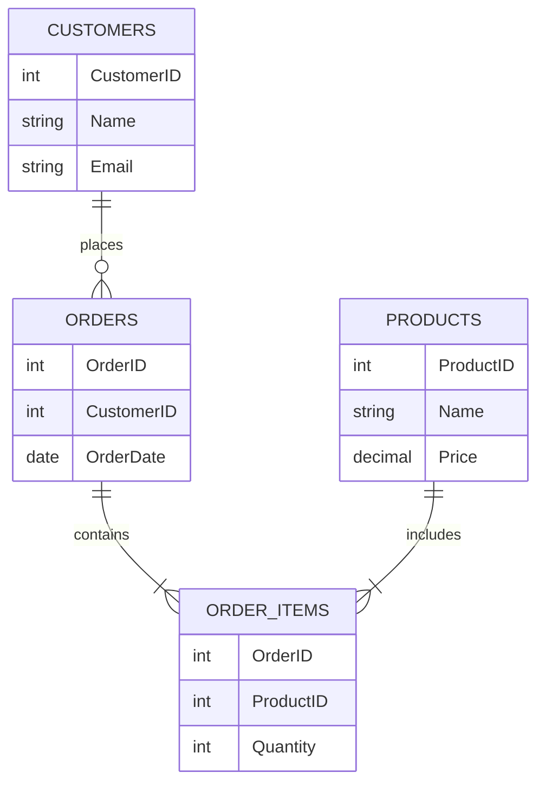

# SQL 设计原则

SQL数据库设计是构建高效、可维护数据库的关键步骤。良好的数据库设计不仅能提高查询性能，还能确保数据的完整性和一致性。本文将介绍SQL数据库设计的基本原则，并通过实际案例帮助初学者理解这些概念。

## 1. 数据库设计的重要性

数据库设计是软件开发过程中至关重要的一环。一个设计良好的数据库能够：

- 提高数据检索的效率
- 减少数据冗余
- 确保数据的一致性和完整性
- 简化数据维护和扩展

## 2. 数据库设计的基本原则

### 2.1 规范化（Normalization）

规范化是数据库设计中的核心概念，旨在通过分解表结构来减少数据冗余和提高数据完整性。常见的规范化形式包括：

- **第一范式（1NF）**：确保每列都是原子的，不可再分。
- **第二范式（2NF）**：确保每列都完全依赖于主键。
- **第三范式（3NF）**：确保每列都不依赖于其他非主键列。

:::tip
规范化有助于减少数据冗余，但过度规范化可能导致查询性能下降。因此，在实际应用中需要权衡规范化和性能。
:::

### 2.2 主键和外键

- **主键（Primary Key）**：唯一标识表中的每一行数据。主键不能为NULL，且必须唯一。
- **外键（Foreign Key）**：用于建立表与表之间的关系。外键引用另一个表的主键，确保数据的一致性。

```sql
CREATE TABLE Customers (
    CustomerID INT PRIMARY KEY,
    Name VARCHAR(100)
);

CREATE TABLE Orders (
    OrderID INT PRIMARY KEY,
    CustomerID INT,
    OrderDate DATE,
    FOREIGN KEY (CustomerID) REFERENCES Customers(CustomerID)
);
```

### 2.3 数据类型选择

选择合适的数据类型可以提高存储效率和查询性能。常见的数据类型包括：

- **INT**：用于存储整数。
- **VARCHAR**：用于存储可变长度的字符串。
- **DATE**：用于存储日期。
- **DECIMAL**：用于存储精确的数值。

:::caution
选择数据类型时，应考虑数据的实际需求。例如，使用`VARCHAR(255)`存储短字符串可能导致存储空间浪费。
:::

### 2.4 索引的使用

索引可以显著提高查询性能，但也会增加插入、更新和删除操作的开销。常见的索引类型包括：

- **单列索引**：基于单个列的索引。
- **复合索引**：基于多个列的索引。

```sql
CREATE INDEX idx_customer_name ON Customers(Name);
```

:::warning
过多的索引可能导致性能下降，因此应根据实际查询需求创建索引。
:::

## 3. 实际案例

### 3.1 电子商务网站数据库设计

假设我们正在设计一个电子商务网站的数据库，需要存储客户、订单和产品信息。以下是数据库设计的示例：



### 3.2 查询示例

以下是一个查询示例，用于获取某个客户的所有订单及其详细信息：

```sql
SELECT 
    Customers.Name, 
    Orders.OrderID, 
    Orders.OrderDate, 
    Products.Name AS ProductName, 
    Order_Items.Quantity
FROM 
    Customers
JOIN 
    Orders ON Customers.CustomerID = Orders.CustomerID
JOIN 
    Order_Items ON Orders.OrderID = Order_Items.OrderID
JOIN 
    Products ON Order_Items.ProductID = Products.ProductID
WHERE 
    Customers.CustomerID = 1;
```

## 4. 总结

SQL数据库设计是构建高效、可维护数据库的关键。通过遵循规范化原则、合理使用主键和外键、选择合适的数据类型以及创建适当的索引，可以设计出性能优越的数据库结构。在实际应用中，应根据具体需求权衡设计原则，以达到最佳效果。

## 5. 附加资源与练习

- **练习**：尝试设计一个图书馆管理系统的数据库，包括书籍、借阅者和借阅记录。
- **资源**：
  - [SQL教程](https://www.w3schools.com/sql/)
  - [数据库设计指南](https://www.guru99.com/database-design.html)

:::note
通过不断实践和优化，你将逐渐掌握SQL数据库设计的精髓。祝你在学习过程中取得成功！
:::