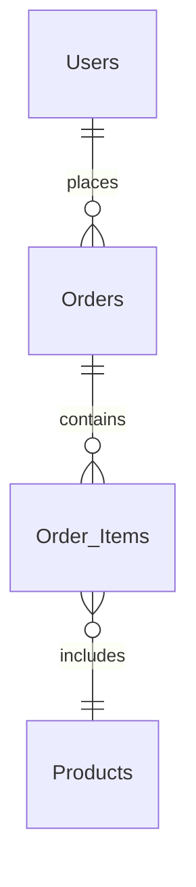

# SQL 需求分析

在数据库设计中，**SQL需求分析**是一个至关重要的步骤。它帮助我们明确数据库需要存储哪些数据、如何组织这些数据，以及如何满足业务需求。通过需求分析，我们可以为后续的数据库设计和开发奠定坚实的基础。

## 什么是SQL需求分析？

SQL需求分析是指在设计数据库之前，对业务需求进行详细的分析和整理，以确定数据库需要存储哪些数据、数据的结构如何设计，以及如何通过SQL查询和操作这些数据。需求分析的目的是确保数据库能够高效地支持业务需求，同时避免数据冗余和不一致。

:::note
需求分析不仅仅是技术问题，它还需要与业务团队紧密合作，确保技术实现与业务目标一致。
:::

## SQL 需求分析的步骤

SQL需求分析通常包括以下几个步骤：

1. **理解业务需求**  
   与业务团队沟通，了解业务流程、数据需求以及业务目标。明确数据库需要支持哪些功能。

2. **识别数据实体和关系**  
   确定数据库中的主要数据实体（如表）以及它们之间的关系（如一对一、一对多、多对多）。

3. **定义数据属性**  
   为每个数据实体定义具体的属性（如字段），并确定每个属性的数据类型、约束条件（如主键、外键、唯一性等）。

4. **设计数据模型**  
   根据需求设计逻辑数据模型（如ER图），并进一步细化为物理数据模型（如表结构）。

5. **验证需求**  
   与业务团队确认需求分析的准确性，确保数据库设计能够满足业务需求。

## 实际案例：在线商店的数据库需求分析

假设我们需要为一个在线商店设计数据库。以下是需求分析的步骤：

### 1. 理解业务需求
在线商店需要管理以下数据：
- 用户信息（如姓名、邮箱、地址）
- 商品信息（如名称、价格、库存）
- 订单信息（如订单号、用户ID、商品ID、数量、总价）

### 2. 识别数据实体和关系
主要实体包括：
- 用户（`Users`）
- 商品（`Products`）
- 订单（`Orders`）

它们之间的关系：
- 一个用户可以创建多个订单（一对多）
- 一个订单可以包含多个商品（多对多）

### 3. 定义数据属性
为每个实体定义属性：
- `Users` 表：`user_id`（主键）、`name`、`email`、`address`
- `Products` 表：`product_id`（主键）、`name`、`price`、`stock`
- `Orders` 表：`order_id`（主键）、`user_id`（外键）、`order_date`
- `Order_Items` 表（用于多对多关系）：`order_id`（外键）、`product_id`（外键）、`quantity`、`total_price`

### 4. 设计数据模型
使用Mermaid绘制ER图：



### 5. 验证需求
与业务团队确认上述设计是否满足需求，例如：
- 是否需要记录用户的登录信息？
- 是否需要支持商品分类？

## 代码示例：创建表结构

根据需求分析，我们可以使用SQL语句创建表结构：

```sql
-- 创建 Users 表
CREATE TABLE Users (
    user_id INT PRIMARY KEY AUTO_INCREMENT,
    name VARCHAR(100) NOT NULL,
    email VARCHAR(100) UNIQUE NOT NULL,
    address TEXT
);

-- 创建 Products 表
CREATE TABLE Products (
    product_id INT PRIMARY KEY AUTO_INCREMENT,
    name VARCHAR(100) NOT NULL,
    price DECIMAL(10, 2) NOT NULL,
    stock INT NOT NULL
);

-- 创建 Orders 表
CREATE TABLE Orders (
    order_id INT PRIMARY KEY AUTO_INCREMENT,
    user_id INT,
    order_date DATETIME DEFAULT CURRENT_TIMESTAMP,
    FOREIGN KEY (user_id) REFERENCES Users(user_id)
);

-- 创建 Order_Items 表
CREATE TABLE Order_Items (
    order_id INT,
    product_id INT,
    quantity INT NOT NULL,
    total_price DECIMAL(10, 2) NOT NULL,
    PRIMARY KEY (order_id, product_id),
    FOREIGN KEY (order_id) REFERENCES Orders(order_id),
    FOREIGN KEY (product_id) REFERENCES Products(product_id)
);
```

:::tip
在实际开发中，建议使用数据库管理工具（如MySQL Workbench）来可视化表结构和关系。
:::

## 总结

SQL需求分析是数据库设计的第一步，也是最重要的一步。通过明确业务需求、识别数据实体和关系、定义数据属性并设计数据模型，我们可以为后续的数据库开发奠定坚实的基础。

## 附加资源与练习

1. **练习**  
   尝试为一个图书馆管理系统进行SQL需求分析，并设计表结构。

2. **推荐资源**  
   - [SQL教程](https://www.w3schools.com/sql/)  
   - [数据库设计基础](https://www.geeksforgeeks.org/database-design/)  

通过不断练习和学习，你将能够熟练掌握SQL需求分析的技能，并设计出高效的数据库系统！