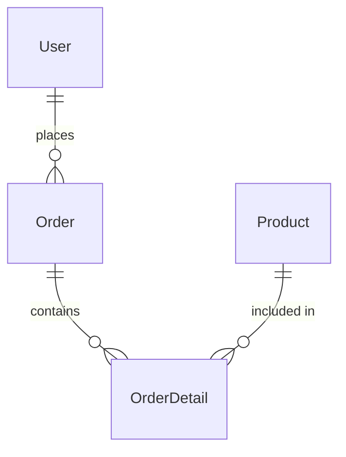

# SQL 关系设计

在数据库设计中，**关系设计**是一个核心概念。它决定了数据如何存储、组织以及如何通过SQL查询进行访问。良好的关系设计可以提高数据库的性能、减少冗余数据，并确保数据的一致性。本文将逐步介绍SQL关系设计的基础知识，并通过实际案例帮助你理解其应用。

## 什么是SQL关系设计？

SQL关系设计是指通过定义表（Table）及其之间的关系来组织数据的过程。关系数据库的核心思想是将数据存储在多个表中，并通过**主键**（Primary Key）和**外键**（Foreign Key）建立表与表之间的联系。这种设计方式使得数据更加结构化，便于管理和查询。

### 关系设计的基本原则

1. **实体和属性**：实体（Entity）是现实世界中的对象或概念，例如“用户”或“订单”。属性（Attribute）是实体的特征，例如“用户”的姓名、邮箱等。
2. **主键**：每个表都应该有一个主键，用于唯一标识表中的每一行数据。
3. **外键**：外键用于建立表与表之间的关系。它是一个表中的字段，指向另一个表的主键。
4. **范式化**：范式化（Normalization）是减少数据冗余和提高数据一致性的过程。常见的范式包括第一范式（1NF）、第二范式（2NF）和第三范式（3NF）。

---

## 关系设计的步骤

### 1. 确定实体和属性

首先，你需要确定数据库中的实体及其属性。例如，假设我们要设计一个简单的电商数据库，可能涉及的实体包括：

- **用户**（User）：用户ID、姓名、邮箱、注册时间
- **订单**（Order）：订单ID、用户ID、订单日期、总金额
- **产品**（Product）：产品ID、名称、价格、库存

### 2. 创建表并定义主键

接下来，为每个实体创建表，并定义主键。主键通常是唯一的标识符，例如用户ID或订单ID。

```sql
CREATE TABLE User (
    UserID INT PRIMARY KEY,
    Name VARCHAR(100),
    Email VARCHAR(100),
    RegistrationDate DATE
);

CREATE TABLE Order (
    OrderID INT PRIMARY KEY,
    UserID INT,
    OrderDate DATE,
    TotalAmount DECIMAL(10, 2)
);

CREATE TABLE Product (
    ProductID INT PRIMARY KEY,
    Name VARCHAR(100),
    Price DECIMAL(10, 2),
    Stock INT
);
```

### 3. 定义表之间的关系

通过外键建立表与表之间的关系。例如，订单表（Order）中的 `UserID` 字段可以指向用户表（User）中的 `UserID` 字段。

```sql
ALTER TABLE Order
ADD CONSTRAINT FK_UserOrder
FOREIGN KEY (UserID) REFERENCES User(UserID);
```

### 4. 范式化设计

范式化是优化数据库设计的重要步骤。以下是范式化的基本原则：

- **第一范式（1NF）**：确保每列都是原子的，不可再分。
- **第二范式（2NF）**：确保每列都完全依赖于主键。
- **第三范式（3NF）**：确保每列都不依赖于其他非主键列。

例如，假设我们有一个订单详情表（OrderDetail），其中包含订单ID、产品ID、数量和单价。为了满足第三范式，我们可以将单价从订单详情表中移除，因为单价是产品的属性，而不是订单的属性。

```sql
CREATE TABLE OrderDetail (
    OrderID INT,
    ProductID INT,
    Quantity INT,
    PRIMARY KEY (OrderID, ProductID),
    FOREIGN KEY (OrderID) REFERENCES Order(OrderID),
    FOREIGN KEY (ProductID) REFERENCES Product(ProductID)
);
```

---

## 实际案例：电商数据库设计

让我们通过一个实际的电商数据库设计案例来巩固所学知识。

### 需求分析

- 用户可以注册并登录。
- 用户可以下订单。
- 每个订单可以包含多个产品。
- 每个产品有名称、价格和库存。

### 数据库设计

1. **用户表（User）**：
   ```sql
   CREATE TABLE User (
       UserID INT PRIMARY KEY,
       Name VARCHAR(100),
       Email VARCHAR(100),
       RegistrationDate DATE
   );
   ```

2. **订单表（Order）**：
   ```sql
   CREATE TABLE Order (
       OrderID INT PRIMARY KEY,
       UserID INT,
       OrderDate DATE,
       TotalAmount DECIMAL(10, 2),
       FOREIGN KEY (UserID) REFERENCES User(UserID)
   );
   ```

3. **产品表（Product）**：
   ```sql
   CREATE TABLE Product (
       ProductID INT PRIMARY KEY,
       Name VARCHAR(100),
       Price DECIMAL(10, 2),
       Stock INT
   );
   ```

4. **订单详情表（OrderDetail）**：
   ```sql
   CREATE TABLE OrderDetail (
       OrderID INT,
       ProductID INT,
       Quantity INT,
       PRIMARY KEY (OrderID, ProductID),
       FOREIGN KEY (OrderID) REFERENCES Order(OrderID),
       FOREIGN KEY (ProductID) REFERENCES Product(ProductID)
   );
   ```

### 关系图

以下是一个简单的Mermaid关系图，展示了表之间的关系：



---

## 总结

SQL关系设计是数据库设计的核心部分。通过合理设计表及其关系，你可以创建高效、可维护的数据库。以下是本文的要点：

1. **实体和属性**：确定数据库中的实体及其属性。
2. **主键和外键**：使用主键唯一标识每一行数据，使用外键建立表与表之间的关系。
3. **范式化**：通过范式化减少数据冗余，提高数据一致性。

---

## 附加资源与练习

### 练习

1. 设计一个图书馆管理系统的数据库，包括书籍、用户和借阅记录。
2. 为上述系统创建SQL表，并定义主键和外键。

### 资源

- [SQL教程](https://www.w3schools.com/sql/)
- [数据库设计范式](https://en.wikipedia.org/wiki/Database_normalization)

通过不断练习和学习，你将能够掌握SQL关系设计的精髓，并设计出高效的数据库系统！