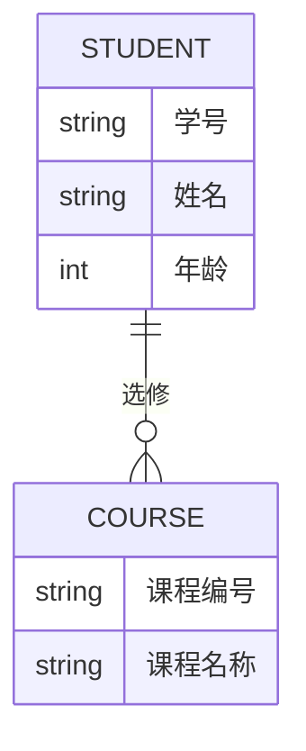

# SQL 概念模型

在数据库设计中，**概念模型**是一个关键步骤，它帮助我们以抽象的方式描述数据的结构和关系。概念模型不依赖于具体的数据库管理系统（DBMS），而是专注于数据的逻辑组织和业务需求。通过概念模型，我们可以清晰地定义实体、属性以及它们之间的关系，为后续的数据库设计奠定基础。

## 什么是SQL概念模型？

SQL概念模型是数据库设计的第一步，它通过**实体-关系模型（ER模型）**来描述数据的逻辑结构。概念模型的主要目标是：

1. **定义实体**：实体是现实世界中的对象或概念，例如“学生”、“课程”或“订单”。
2. **定义属性**：属性是实体的特征或描述，例如“学生”实体可能有“姓名”、“学号”等属性。
3. **定义关系**：关系是实体之间的关联，例如“学生”和“课程”之间可能存在“选修”关系。

概念模型通常以图形化的方式表示，使用**ER图**（实体-关系图）来展示实体、属性和关系。

## 实体-关系模型（ER模型）

### 实体（Entity）
实体是现实世界中的对象或概念，例如“学生”、“课程”或“订单”。在ER图中，实体通常用矩形表示。

在上面的例子中，`STUDENT` 和 `COURSE` 是两个实体，它们之间通过“选修”关系连接。

### 属性（Attribute）
属性是实体的特征或描述。例如，“学生”实体可能有“学号”、“姓名”和“年龄”等属性。在ER图中，属性通常用椭圆形表示。

### 关系（Relationship）
关系是实体之间的关联。例如，“学生”和“课程”之间可能存在“选修”关系。在ER图中，关系通常用菱形表示。

## 实际案例：学生选课系统

假设我们需要为一个学生选课系统设计概念模型。以下是系统的需求：

1. 学生可以选修多门课程。
2. 每门课程可以被多个学生选修。
3. 学生和课程之间的关系是“选修”。

根据这些需求，我们可以设计如下的ER图：

在这个模型中：
- `STUDENT` 实体有“学号”、“姓名”和“年龄”三个属性。
- `COURSE` 实体有“课程编号”和“课程名称”两个属性。
- `STUDENT` 和 `COURSE` 之间的关系是“选修”。

## 从概念模型到逻辑模型

概念模型设计完成后，下一步是将其转换为逻辑模型。逻辑模型是概念模型的具体化，通常以表格的形式表示。例如，上述学生选课系统的逻辑模型可以表示为以下表格：

- **STUDENT 表**
  - 学号 (主键)
  - 姓名
  - 年龄

- **COURSE 表**
  - 课程编号 (主键)
  - 课程名称

- **ENROLLMENT 表**
  - 学号 (外键)
  - 课程编号 (外键)

:::tip
在逻辑模型中，实体通常转换为表，属性转换为表的列，关系则通过外键来表示。
:::

## 总结

SQL概念模型是数据库设计的基础，它帮助我们以抽象的方式描述数据的结构和关系。通过实体-关系模型（ER模型），我们可以清晰地定义实体、属性和关系，为后续的数据库设计提供指导。

在实际应用中，概念模型的设计需要结合业务需求，确保数据的逻辑结构能够满足系统的功能需求。设计完成后，概念模型可以进一步转换为逻辑模型，最终实现为具体的数据库表结构。

## 附加资源与练习

1. **练习**：尝试为一个图书馆管理系统设计概念模型，定义“图书”、“读者”和“借阅”实体及其关系。
2. **资源**：
   - [数据库设计基础](https://example.com/database-design-basics)
   - [实体-关系模型详解](https://example.com/er-model)

通过不断练习和学习，你将能够熟练掌握SQL概念模型的设计方法，为构建高效的数据库系统打下坚实的基础。