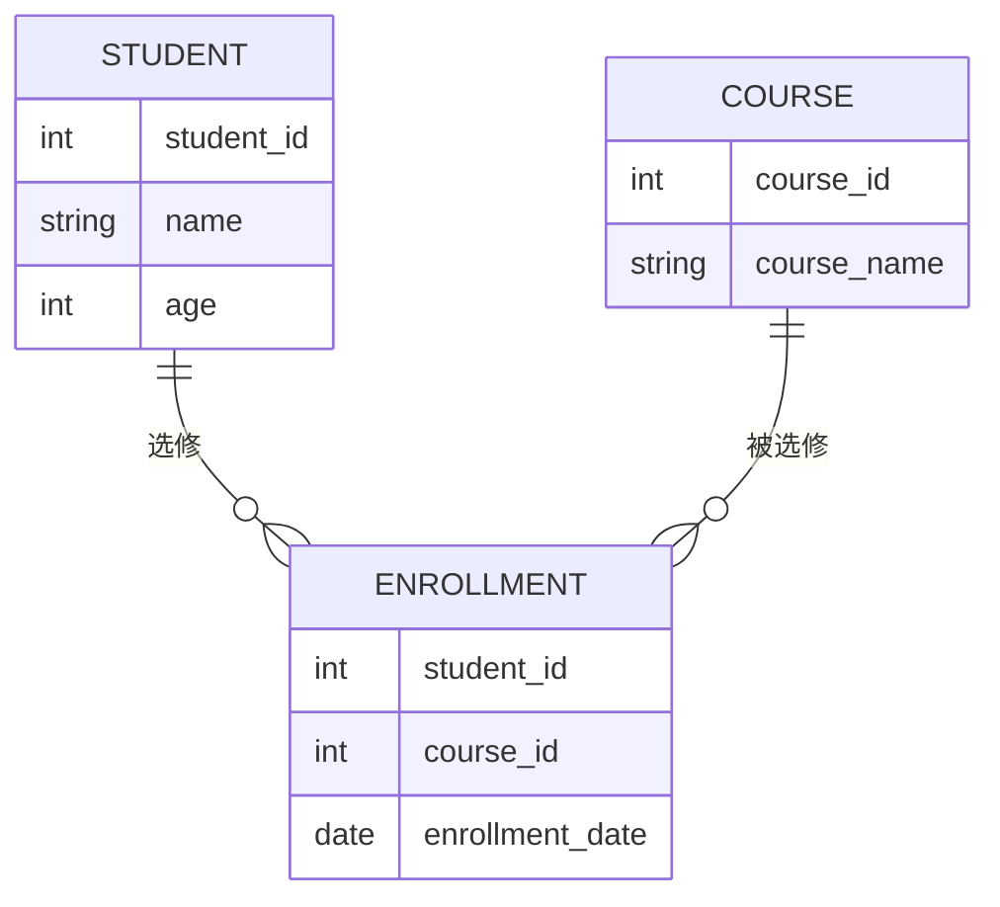

# SQL 逻辑模型

SQL逻辑模型是数据库设计中的一个重要概念，它描述了数据的组织方式和关系，而不涉及具体的物理存储细节。逻辑模型帮助开发者和数据库管理员理解数据的结构，并为后续的物理模型设计提供基础。

## 什么是SQL逻辑模型？

SQL逻辑模型是数据库设计中的一个抽象层次，它定义了数据的结构、关系和约束条件。逻辑模型不关心数据在磁盘上的存储方式，而是专注于数据之间的关系和逻辑结构。常见的逻辑模型包括**关系模型**、**层次模型**和**网络模型**，其中关系模型是最常用的。

在关系模型中，数据被组织成**表**（也称为关系），每个表由**行**（记录）和**列**（字段）组成。表与表之间通过**外键**建立关系。

## 逻辑模型的核心概念

### 1. 实体（Entity）
实体是现实世界中可区分的对象或概念，例如“学生”、“课程”或“订单”。在逻辑模型中，实体通常对应数据库中的表。

### 2. 属性（Attribute）
属性是实体的特征或描述，例如“学生”实体的属性可能包括“学号”、“姓名”和“年龄”。在表中，属性对应列。

### 3. 关系（Relationship）
关系描述了实体之间的关联。例如，“学生”和“课程”之间可能存在“选修”关系。在逻辑模型中，关系通常通过外键实现。

### 4. 主键（Primary Key）
主键是唯一标识表中每一行的列或列组合。例如，“学号”可以作为“学生”表的主键。

### 5. 外键（Foreign Key）
外键是一个表中的列，它引用了另一个表的主键，用于建立表与表之间的关系。

## 逻辑模型的示例

假设我们要设计一个简单的学生选课系统，包含“学生”和“课程”两个实体。以下是逻辑模型的设计：



### 解释：
- `STUDENT` 表存储学生信息，主键为 `student_id`。
- `COURSE` 表存储课程信息，主键为 `course_id`。
- `ENROLLMENT` 表存储学生选课记录，包含 `student_id` 和 `course_id` 作为外键，分别引用 `STUDENT` 和 `COURSE` 表。

## 实际应用场景

### 场景：学生选课系统
在一个学生选课系统中，逻辑模型的设计可以帮助我们清晰地定义学生、课程以及选课记录之间的关系。通过逻辑模型，我们可以：
1. 确保每个学生只能选修一门课程一次。
2. 查询某个学生选修的所有课程。
3. 查询某门课程的所有选修学生。

### 示例SQL查询
以下是一些基于上述逻辑模型的SQL查询示例：

#### 查询某个学生选修的所有课程
```sql
SELECT c.course_name
FROM STUDENT s
JOIN ENROLLMENT e ON s.student_id = e.student_id
JOIN COURSE c ON e.course_id = c.course_id
WHERE s.name = '张三';
```

#### 查询某门课程的所有选修学生
```sql
SELECT s.name
FROM COURSE c
JOIN ENROLLMENT e ON c.course_id = e.course_id
JOIN STUDENT s ON e.student_id = s.student_id
WHERE c.course_name = '数据库设计';
```

## 总结

SQL逻辑模型是数据库设计的基础，它帮助我们定义数据的结构和关系。通过逻辑模型，我们可以清晰地理解数据之间的联系，并为后续的物理模型设计和数据库实现提供指导。

:::tip
在设计逻辑模型时，务必确保每个实体都有明确的主键，并通过外键建立表与表之间的关系。
:::

## 附加资源与练习

### 练习
1. 设计一个图书馆管理系统的逻辑模型，包含“图书”、“借阅者”和“借阅记录”三个实体。
2. 编写SQL查询，查找某本书的所有借阅者。

### 资源
- [数据库设计基础](https://example.com/database-design-basics)
- [SQL关系模型详解](https://example.com/sql-relational-model)