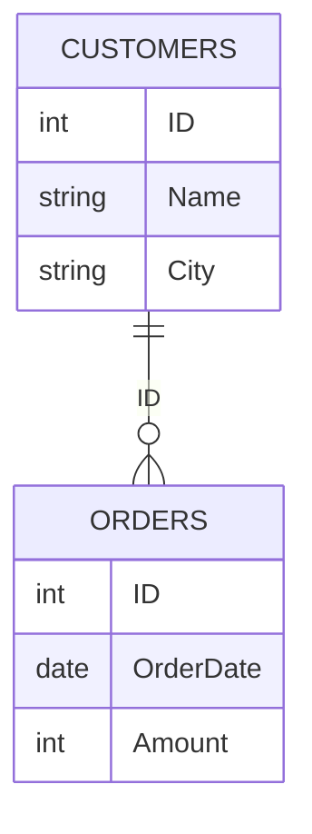

# SQL 内连接

在SQL中，**内连接（INNER JOIN）** 是最常用的表连接方式之一。它用于从两个或多个表中检索满足连接条件的记录。内连接只返回那些在两个表中都有匹配记录的行。

## 什么是内连接？

内连接基于两个表之间的共同字段（通常是主键和外键）来组合数据。它只返回那些在两个表中都有匹配记录的行。如果某个表中的记录在另一个表中没有匹配项，则该记录不会出现在结果集中。

### 内连接的语法

内连接的基本语法如下：

```sql
SELECT 列名
FROM 表1
INNER JOIN 表2
ON 表1.共同字段 = 表2.共同字段;
```

- `表1` 和 `表2` 是要连接的两个表。
- `共同字段` 是连接两个表的字段，通常是主键和外键。
- `ON` 子句用于指定连接条件。

## 内连接的示例

假设我们有两个表：`Customers` 和 `Orders`。

### 表结构

```sql
-- Customers 表
+----+----------+-----------+
| ID | Name     | City      |
+----+----------+-----------+
| 1  | Alice    | New York  |
| 2  | Bob      | Los Angeles|
| 3  | Charlie  | Chicago   |
+----+----------+-----------+

-- Orders 表
+----+------------+--------+
| ID | OrderDate  | Amount |
+----+------------+--------+
| 1  | 2023-01-01 | 100    |
| 2  | 2023-01-02 | 200    |
| 3  | 2023-01-03 | 300    |
+----+------------+--------+
```

### 内连接查询

我们想要获取每个客户的订单信息。可以使用以下SQL查询：

```sql
SELECT Customers.Name, Orders.OrderDate, Orders.Amount
FROM Customers
INNER JOIN Orders
ON Customers.ID = Orders.ID;
```

### 查询结果

```sql
+----------+------------+--------+
| Name     | OrderDate  | Amount |
+----------+------------+--------+
| Alice    | 2023-01-01 | 100    |
| Bob      | 2023-01-02 | 200    |
| Charlie  | 2023-01-03 | 300    |
+----------+------------+--------+
```

:::note
在这个例子中，`Customers` 表和 `Orders` 表通过 `ID` 字段进行连接。只有那些在两个表中都有匹配 `ID` 的记录才会出现在结果集中。
:::

## 内连接的实际应用场景

内连接在实际应用中非常常见，尤其是在需要从多个表中获取相关数据时。以下是一些常见的应用场景：

1. **客户订单信息**：如上例所示，获取客户的订单信息。
2. **员工部门信息**：从 `Employees` 表和 `Departments` 表中获取员工及其所属部门的信息。
3. **产品库存信息**：从 `Products` 表和 `Inventory` 表中获取产品的库存信息。

## 内连接的图表解释

为了更好地理解内连接的工作原理，我们可以使用Mermaid图表来展示两个表之间的连接关系。



在这个图表中，`CUSTOMERS` 表和 `ORDERS` 表通过 `ID` 字段进行连接。内连接只返回那些在两个表中都有匹配 `ID` 的记录。

## 总结

内连接是SQL中最常用的连接方式之一，它用于从两个或多个表中检索满足连接条件的记录。通过内连接，我们可以轻松地从多个表中获取相关数据，从而进行更复杂的查询和分析。

:::tip
在实际使用中，确保连接字段的数据类型和值一致，以避免连接失败或返回错误的结果。
:::

## 附加资源与练习

- **练习**：尝试在 `Customers` 表和 `Orders` 表中添加更多记录，并使用内连接查询不同的字段组合。
- **进一步学习**：了解其他类型的SQL连接，如左连接（LEFT JOIN）、右连接（RIGHT JOIN）和全连接（FULL JOIN）。

通过不断练习和探索，你将能够熟练掌握SQL内连接的使用，并在实际项目中灵活应用。