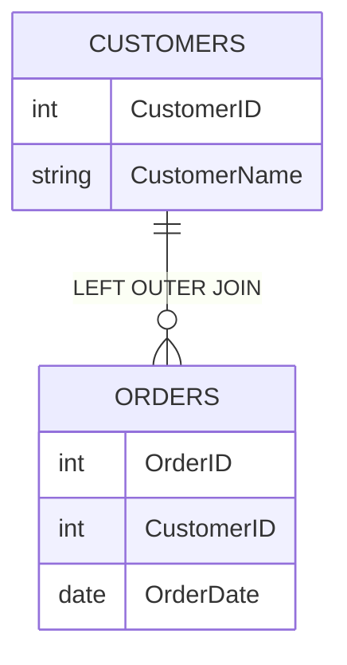

# SQL 左外连接

在SQL中，**左外连接**（LEFT OUTER JOIN）是一种用于从两个表中获取数据的连接方式。它返回左表中的所有记录，即使右表中没有匹配的记录。如果右表中没有匹配的记录，结果集中右表的列将显示为`NULL`。

## 什么是左外连接？

左外连接是SQL中最常用的连接类型之一。它的主要特点是：

- **左表**：连接操作中的第一个表，所有记录都会被返回。
- **右表**：连接操作中的第二个表，只有与左表匹配的记录才会被返回。如果没有匹配的记录，右表的列将显示为`NULL`。

左外连接的语法如下：

```sql
SELECT 列名
FROM 左表
LEFT OUTER JOIN 右表
ON 左表.列名 = 右表.列名;
```

## 左外连接的工作原理

为了更好地理解左外连接的工作原理，让我们通过一个简单的例子来说明。

假设我们有两个表：`Customers` 和 `Orders`。

- `Customers` 表包含客户信息：
  ```sql
  +------------+--------------+
  | CustomerID | CustomerName |
  +------------+--------------+
  | 1          | Alice        |
  | 2          | Bob          |
  | 3          | Charlie      |
  +------------+--------------+
  ```

- `Orders` 表包含订单信息：
  ```sql
  +---------+------------+-----------+
  | OrderID | CustomerID | OrderDate |
  +---------+------------+-----------+
  | 101     | 1          | 2023-01-01|
  | 102     | 2          | 2023-01-02|
  +---------+------------+-----------+
  ```

如果我们想要获取所有客户及其订单信息，即使某些客户没有订单，我们可以使用左外连接：

```sql
SELECT Customers.CustomerID, Customers.CustomerName, Orders.OrderID, Orders.OrderDate
FROM Customers
LEFT OUTER JOIN Orders
ON Customers.CustomerID = Orders.CustomerID;
```

执行上述查询后，结果集将如下所示：

```sql
+------------+--------------+---------+------------+
| CustomerID | CustomerName | OrderID | OrderDate  |
+------------+--------------+---------+------------+
| 1          | Alice        | 101     | 2023-01-01 |
| 2          | Bob          | 102     | 2023-01-02 |
| 3          | Charlie      | NULL    | NULL       |
+------------+--------------+---------+------------+
```

可以看到，即使`Charlie`没有订单，他的信息仍然出现在结果集中，而`OrderID`和`OrderDate`列显示为`NULL`。

## 实际应用场景

左外连接在实际应用中非常有用，尤其是在需要获取主表中的所有记录，同时关联从表中的相关记录时。以下是一些常见的应用场景：

1. **客户与订单**：获取所有客户及其订单信息，即使某些客户没有订单。
2. **员工与部门**：获取所有员工及其所属部门信息，即使某些员工没有分配到部门。
3. **产品与销售**：获取所有产品及其销售记录，即使某些产品没有销售记录。

## 使用Mermaid绘制左外连接示意图

为了更直观地理解左外连接，我们可以使用Mermaid绘制一个简单的示意图：



在这个图中，`CUSTOMERS`表和`ORDERS`表通过`CustomerID`字段进行左外连接。`CUSTOMERS`表中的所有记录都会被返回，而`ORDERS`表中只有匹配的记录才会被返回。

## 总结

左外连接是SQL中一种强大的工具，它允许我们从两个表中获取数据，即使右表中没有匹配的记录。通过左外连接，我们可以确保主表中的所有记录都被返回，同时关联从表中的相关记录。

:::tip
在实际使用左外连接时，务必确保连接条件（`ON`子句）正确，以避免返回不必要的数据。
:::

## 附加资源与练习

为了巩固你对左外连接的理解，建议你尝试以下练习：

1. 创建一个包含`Employees`和`Departments`表的数据库，并使用左外连接获取所有员工及其所属部门信息。
2. 修改查询，仅返回没有分配到部门的员工。

通过这些练习，你将更好地掌握左外连接的使用方法，并能够在实际项目中灵活应用。

:::note
如果你在练习中遇到问题，可以参考SQL文档或在线资源，进一步学习左外连接的高级用法。
:::