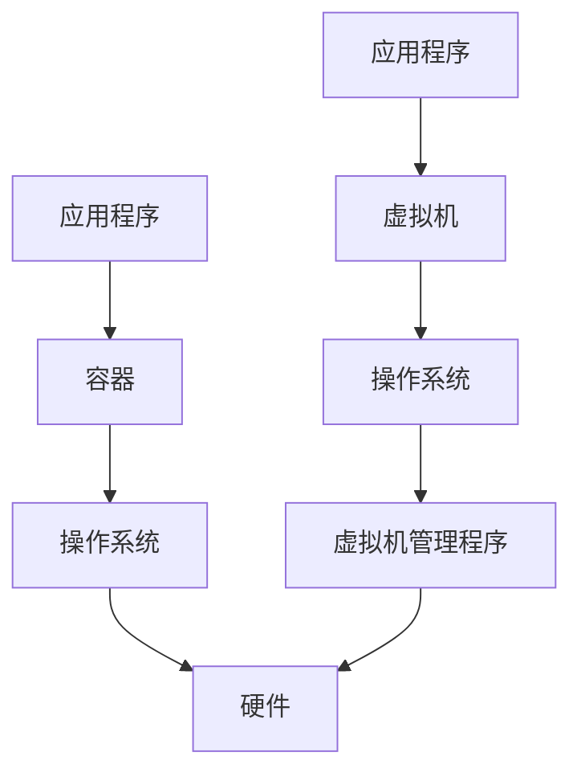

## 什么是Docker？

Docker 是一个开源的应用容器引擎，允许开发者将应用程序及其依赖项打包到一个轻量级、可移植的容器中。这些容器可以在任何支持Docker的环境中运行，确保应用程序在不同环境中的一致性。

### 容器化技术

容器化是一种虚拟化技术，但与传统的虚拟机（VM）不同。虚拟机需要模拟整个操作系统，而容器则共享宿主机的操作系统内核，因此更加轻量级和高效。



:::note
容器与虚拟机的区别在于，容器共享宿主机的操作系统内核，而虚拟机则需要运行完整的操作系统。
:::

## Docker 的核心概念

### 镜像（Image）

镜像是Docker容器的基础。它是一个只读的模板，包含了运行应用程序所需的所有文件和依赖项。你可以将镜像看作是一个应用程序的“快照”。

### 容器（Container）

容器是镜像的运行实例。你可以启动、停止、删除容器，并且每个容器都是相互隔离的。

### 仓库（Repository）

仓库是用于存储和分发Docker镜像的地方。Docker Hub 是最常用的公共仓库，你可以在其中找到大量的官方和社区维护的镜像。

## Docker 的基本使用

### 安装Docker

在开始使用Docker之前，你需要在你的机器上安装Docker。你可以从 [Docker官方网站](https://www.docker.com/) 下载并安装适合你操作系统的版本。

### 运行你的第一个容器

安装完成后，你可以通过以下命令来运行你的第一个容器：

```bash
docker run hello-world
```

这个命令会从Docker Hub下载 `hello-world` 镜像，并运行一个容器。你会看到类似以下的输出：

```bash
Hello from Docker!
This message shows that your installation appears to be working correctly.
```

### 构建自定义镜像

你可以通过编写 `Dockerfile` 来定义你的自定义镜像。以下是一个简单的 `Dockerfile` 示例：

```dockerfile
# 使用官方的Python镜像作为基础镜像
FROM python:3.8-slim

# 设置工作目录
WORKDIR /app

# 将当前目录下的所有文件复制到容器的/app目录下
COPY . /app

# 安装依赖项
RUN pip install --no-cache-dir -r requirements.txt

# 暴露端口
EXPOSE 80

# 运行应用程序
CMD ["python", "app.py"]
```

使用以下命令构建镜像：

```bash
docker build -t my-python-app .
```

然后运行容器：

```bash
docker run -p 4000:80 my-python-app
```

## 实际应用场景

### 微服务架构

在微服务架构中，每个服务都可以打包成一个独立的Docker容器。这使得开发、测试和部署变得更加简单和高效。

### 持续集成/持续部署（CI/CD）

Docker可以与CI/CD工具（如Jenkins、GitLab CI）集成，自动化构建、测试和部署流程。

### 开发环境一致性

通过使用Docker，开发团队可以确保每个开发者的环境都是一致的，避免了“在我机器上可以运行”的问题。

## 总结

Docker 是一个强大的工具，可以帮助开发者简化应用程序的开发、测试和部署过程。通过容器化技术，Docker 提供了一种轻量级、可移植的解决方案，使得应用程序可以在任何环境中一致运行。

## 附加资源

- [Docker官方文档](https://docs.docker.com/)
- [Docker Hub](https://hub.docker.com/)
- [Docker入门教程](https://www.docker.com/101-tutorial)

## 练习

1. 在你的机器上安装Docker，并运行 `hello-world` 容器。
2. 编写一个简单的 `Dockerfile`，构建并运行一个自定义镜像。
3. 尝试将你的一个现有项目容器化，并在Docker中运行。

:::tip
如果你在练习中遇到问题，可以参考Docker官方文档或社区论坛寻求帮助。
:::