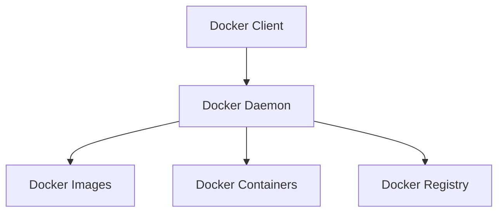

## 介绍

Docker 是一个开源的容器化平台，允许开发者将应用程序及其依赖项打包到一个轻量级、可移植的容器中。Docker 的架构是其功能强大的核心，理解其架构有助于更好地使用 Docker 进行开发和部署。

## Docker 的核心组件

Docker 架构主要由以下几个核心组件组成：

1. **Docker 客户端 (Docker Client)**  
2. **Docker 守护进程 (Docker Daemon)**  
3. **Docker 镜像 (Docker Images)**  
4. **Docker 容器 (Docker Containers)**  
5. **Docker 注册中心 (Docker Registry)**  

### 1. Docker 客户端 (Docker Client)

Docker 客户端是用户与 Docker 交互的主要方式。通过命令行工具 `docker`，用户可以发送命令到 Docker 守护进程，例如构建、运行和管理容器。

```bash
docker run hello-world
```

上述命令会从 Docker Hub 下载 `hello-world` 镜像并运行一个容器。

### 2. Docker 守护进程 (Docker Daemon)

Docker 守护进程是 Docker 的核心服务，负责管理 Docker 镜像、容器、网络和存储卷等。它监听来自 Docker 客户端的请求，并执行相应的操作。

:::note
Docker 守护进程通常以 `dockerd` 的形式运行在后台。
:::

### 3. Docker 镜像 (Docker Images)

Docker 镜像是一个只读模板，包含了运行应用程序所需的所有文件和依赖项。镜像是容器的基础，容器是镜像的运行实例。

```bash
docker pull ubuntu:latest
```

上述命令会从 Docker Hub 下载最新的 Ubuntu 镜像。

### 4. Docker 容器 (Docker Containers)

Docker 容器是 Docker 镜像的运行实例。容器是轻量级的，包含了应用程序及其依赖项，但与其他容器共享操作系统内核。

```bash
docker run -it ubuntu /bin/bash
```

上述命令会启动一个基于 Ubuntu 镜像的容器，并进入容器的交互式 shell。

### 5. Docker 注册中心 (Docker Registry)

Docker 注册中心是存储和分发 Docker 镜像的地方。最著名的 Docker 注册中心是 Docker Hub，但也可以搭建私有的 Docker 注册中心。

```bash
docker push myusername/myimage:latest
```

上述命令会将本地镜像 `myimage` 推送到 Docker Hub。

## Docker 架构图

为了更好地理解 Docker 的架构，我们可以通过以下 Mermaid 图表来展示其组件之间的关系：



## 实际应用场景

假设你正在开发一个基于 Python 的 Web 应用程序，并希望将其部署到生产环境中。使用 Docker，你可以将应用程序及其依赖项打包到一个容器中，然后在任何支持 Docker 的环境中运行。

1. **创建 Dockerfile**  
   首先，你需要创建一个 `Dockerfile`，定义如何构建你的应用程序镜像。

   ```dockerfile
   FROM python:3.9-slim
   WORKDIR /app
   COPY . .
   RUN pip install -r requirements.txt
   CMD ["python", "app.py"]
   ```

2. **构建镜像**  
   使用 `docker build` 命令构建镜像。

   ```bash
   docker build -t my-python-app .
   ```

3. **运行容器**  
   使用 `docker run` 命令运行容器。

   ```bash
   docker run -d -p 5000:5000 my-python-app
   ```

4. **访问应用程序**  
   现在，你可以通过 `http://localhost:5000` 访问你的应用程序。

## 总结

Docker 的架构是其功能强大的核心，理解其组件和工作原理对于使用 Docker 进行开发和部署至关重要。通过 Docker 客户端、守护进程、镜像、容器和注册中心，你可以轻松地构建、运行和管理容器化的应用程序。

## 附加资源

- [Docker 官方文档](https://docs.docker.com/)
- [Docker Hub](https://hub.docker.com/)
- [Dockerfile 参考](https://docs.docker.com/engine/reference/builder/)

## 练习

1. 使用 `docker run` 命令运行一个 Nginx 容器，并将其映射到本地的 8080 端口。
2. 创建一个简单的 `Dockerfile`，构建一个包含 `Hello, World!` 程序的镜像，并运行它。
3. 尝试将本地镜像推送到 Docker Hub。

通过以上练习，你将更深入地理解 Docker 的架构和使用方法。