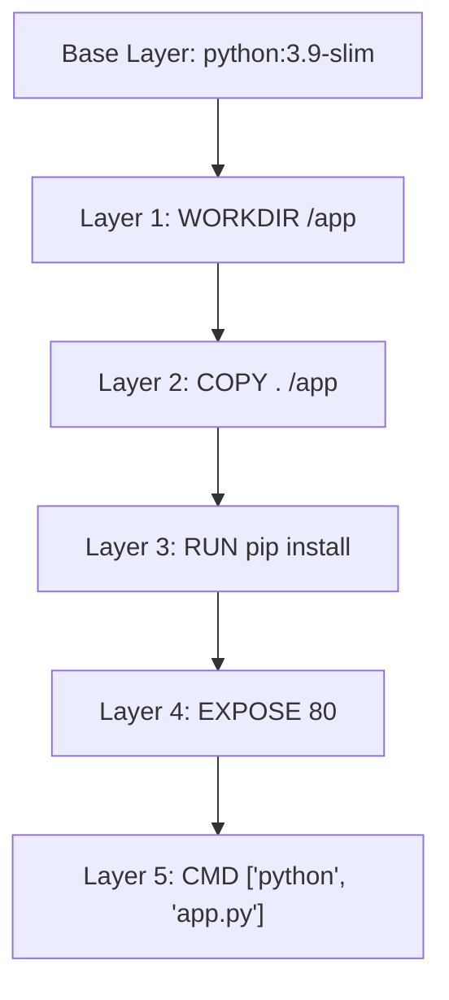

## 介绍

Docker 是一种流行的容器化技术，它允许开发者将应用程序及其依赖项打包到一个轻量级、可移植的容器中。Docker 的核心概念包括**镜像（Image）**和**容器（Container）**。理解这两者的关系是掌握 Docker 的关键。

- **Docker 镜像**：镜像是一个只读模板，包含了运行应用程序所需的所有文件、依赖项和配置。你可以将镜像看作是一个应用程序的“蓝图”。
- **Docker 容器**：容器是镜像的运行实例。当你启动一个容器时，Docker 会根据镜像创建一个可写的文件系统层，并在其中运行应用程序。

## Docker 镜像

### 什么是 Docker 镜像？

Docker 镜像是一个轻量级、独立的、可执行的软件包，包含了运行应用程序所需的一切：代码、运行时、库、环境变量和配置文件。镜像通常是基于**分层文件系统**构建的，这意味着它们由多个只读层组成，每一层都代表了对文件系统的修改。

### 如何获取 Docker 镜像？

你可以从 Docker Hub 或其他镜像仓库中拉取（pull）现有的镜像。例如，要获取官方的 Ubuntu 镜像，可以使用以下命令：

```bash
docker pull ubuntu
```

### 如何创建自定义镜像？

你可以通过编写 `Dockerfile` 来创建自定义镜像。`Dockerfile` 是一个文本文件，包含了一系列指令，用于定义如何构建镜像。以下是一个简单的 `Dockerfile` 示例：

```dockerfile
# 使用官方的 Python 镜像作为基础镜像
FROM python:3.9-slim

# 设置工作目录
WORKDIR /app

# 将当前目录下的文件复制到容器的 /app 目录
COPY . /app

# 安装依赖项
RUN pip install --no-cache-dir -r requirements.txt

# 暴露端口
EXPOSE 80

# 运行应用程序
CMD ["python", "app.py"]
```

要构建镜像，可以使用以下命令：

```bash
docker build -t my-python-app .
```

### 镜像的分层结构

Docker 镜像的分层结构使得镜像的构建和共享更加高效。每一层都是只读的，并且可以被多个镜像共享。例如，如果你有多个基于 `python:3.9-slim` 的镜像，它们都会共享相同的基础层。



## Docker 容器

### 什么是 Docker 容器？

Docker 容器是 Docker 镜像的运行实例。当你启动一个容器时，Docker 会在镜像的基础上创建一个可写的文件系统层，并在其中运行应用程序。容器是轻量级的，因为它们共享宿主机的操作系统内核，而不是每个容器都有自己的操作系统。

### 如何启动容器？

要启动一个容器，可以使用 `docker run` 命令。例如，以下命令会启动一个基于 `ubuntu` 镜像的容器，并在其中运行 `bash` 终端：

```bash
docker run -it ubuntu /bin/bash
```

- `-i`：保持标准输入打开。
- `-t`：分配一个伪终端。

### 容器的生命周期

容器的生命周期包括以下几个阶段：

1. **创建**：使用 `docker create` 命令创建一个容器，但不会启动它。
2. **启动**：使用 `docker start` 命令启动一个已创建的容器。
3. **停止**：使用 `docker stop` 命令停止一个正在运行的容器。
4. **删除**：使用 `docker rm` 命令删除一个已停止的容器。

### 容器的状态

你可以使用 `docker ps` 命令查看正在运行的容器。要查看所有容器（包括已停止的），可以使用 `docker ps -a`。

```bash
docker ps -a
```

输出示例：

```bash
CONTAINER ID   IMAGE         COMMAND       CREATED        STATUS                    PORTS     NAMES
a1b2c3d4e5f6   ubuntu        "/bin/bash"   5 minutes ago  Exited (0) 2 minutes ago            my-container
```

## 实际案例

### 案例 1：运行一个 Web 服务器

假设你有一个简单的 Python Web 应用程序，你可以使用以下 `Dockerfile` 来构建镜像并运行容器：

```dockerfile
FROM python:3.9-slim
WORKDIR /app
COPY . /app
RUN pip install --no-cache-dir -r requirements.txt
EXPOSE 80
CMD ["python", "app.py"]
```

构建镜像：

```bash
docker build -t my-web-app .
```

运行容器：

```bash
docker run -d -p 8080:80 my-web-app
```

- `-d`：在后台运行容器。
- `-p 8080:80`：将宿主机的 8080 端口映射到容器的 80 端口。

### 案例 2：使用 Docker Compose 管理多个容器

如果你有多个服务（例如 Web 服务器和数据库），可以使用 `docker-compose.yml` 文件来定义和管理它们：

```yaml
version: '3'
services:
  web:
    image: my-web-app
    ports:
      - "8080:80"
  db:
    image: postgres
    environment:
      POSTGRES_PASSWORD: example
```

启动服务：

```bash
docker-compose up -d
```

## 总结

Docker 镜像和容器是 Docker 技术的核心概念。镜像是一个只读模板，而容器是镜像的运行实例。通过理解这两者的关系，你可以更好地使用 Docker 来构建、部署和管理应用程序。

## 附加资源与练习

- **练习 1**：尝试创建一个自定义的 Docker 镜像，并在其中运行一个简单的 Python 脚本。
- **练习 2**：使用 Docker Compose 启动一个包含 Web 服务器和数据库的多容器应用程序。
- **资源**：
  - [Docker 官方文档](https://docs.docker.com/)
  - [Docker Hub](https://hub.docker.com/)

:::tip
如果你在练习中遇到问题，可以随时查阅 Docker 官方文档或社区论坛，获取帮助。
:::