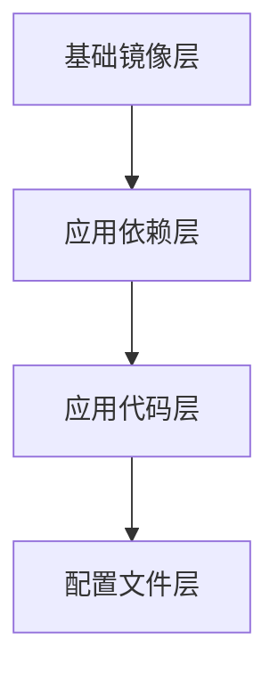

# Docker 镜像概念

Docker镜像是Docker技术的核心组件之一，它是容器化应用的基础。本文将详细介绍Docker镜像的概念、结构、创建和管理方法，并通过实际案例展示其应用场景。

## 什么是Docker镜像？

Docker镜像是一个轻量级、可执行的独立软件包，包含了运行某个应用所需的所有内容：代码、运行时环境、库、环境变量和配置文件。镜像是一个只读模板，用于创建Docker容器。你可以将镜像看作是一个应用程序的“快照”，它包含了运行该应用程序所需的一切。

:::note
Docker镜像与虚拟机镜像不同。虚拟机镜像通常包含完整的操作系统，而Docker镜像只包含应用程序及其依赖项，因此更加轻量级。
:::

## Docker 镜像的结构

Docker镜像由多个层（Layer）组成，每一层都是一个只读文件系统。这些层通过联合文件系统（Union File System）叠加在一起，形成一个完整的文件系统。每一层都包含了对文件系统的修改，例如添加、删除或修改文件。



在上面的图表中，我们可以看到Docker镜像的分层结构。每一层都是只读的，当容器启动时，Docker会在镜像的最上层添加一个可写层，用于存储容器的运行时数据。

## 创建Docker镜像

创建Docker镜像通常使用Dockerfile。Dockerfile是一个文本文件，包含了一系列指令，用于定义如何构建镜像。以下是一个简单的Dockerfile示例：

```dockerfile
# 使用官方的Python镜像作为基础镜像
FROM python:3.9-slim

# 设置工作目录
WORKDIR /app

# 将当前目录下的所有文件复制到容器的/app目录
COPY . /app

# 安装依赖
RUN pip install --no-cache-dir -r requirements.txt

# 暴露端口
EXPOSE 80

# 定义环境变量
ENV NAME World

# 运行应用
CMD ["python", "app.py"]
```

在这个Dockerfile中，我们定义了一个基于Python 3.9的镜像。我们设置了工作目录，复制了应用程序代码，安装了依赖项，并定义了容器启动时要运行的命令。

要构建这个镜像，可以使用以下命令：

```bash
docker build -t my-python-app .
```

这个命令会根据当前目录下的Dockerfile构建一个名为`my-python-app`的镜像。

## 管理Docker镜像

Docker提供了多种命令来管理镜像。以下是一些常用的命令：

- **列出本地镜像**：`docker images`
- **删除镜像**：`docker rmi <image_id>`
- **拉取远程镜像**：`docker pull <image_name>`
- **推送镜像到远程仓库**：`docker push <image_name>`

例如，要列出本地所有的Docker镜像，可以使用以下命令：

```bash
docker images
```

输出可能如下：

```bash
REPOSITORY          TAG                 IMAGE ID            CREATED             SIZE
my-python-app       latest              1234567890ab        5 minutes ago       123MB
python              3.9-slim            9876543210cd        2 weeks ago         123MB
```

## 实际应用场景

Docker镜像在实际开发中有广泛的应用场景。以下是一些常见的例子：

1. **持续集成/持续部署（CI/CD）**：在CI/CD流水线中，Docker镜像可以用于构建、测试和部署应用程序。通过使用Docker镜像，可以确保开发、测试和生产环境的一致性。

2. **微服务架构**：在微服务架构中，每个服务都可以打包成一个独立的Docker镜像。这样可以简化服务的部署和管理，同时提高系统的可扩展性。

3. **开发环境标准化**：开发团队可以使用Docker镜像来标准化开发环境，确保每个开发人员都在相同的环境中工作，从而减少“在我机器上可以运行”的问题。

## 总结

Docker镜像是容器化应用的基础，它包含了运行应用程序所需的所有内容。通过理解Docker镜像的概念、结构、创建和管理方法，你可以更好地利用Docker技术来构建和部署应用程序。

## 附加资源

- [Docker官方文档](https://docs.docker.com/)
- [Dockerfile参考](https://docs.docker.com/engine/reference/builder/)
- [Docker镜像最佳实践](https://docs.docker.com/develop/develop-images/dockerfile_best-practices/)

## 练习

1. 创建一个简单的Dockerfile，构建一个包含“Hello, World!”程序的镜像，并运行它。
2. 使用`docker images`命令列出本地所有的Docker镜像，并尝试删除一个镜像。
3. 研究Docker Hub，找到一个你感兴趣的镜像，并尝试拉取和运行它。
