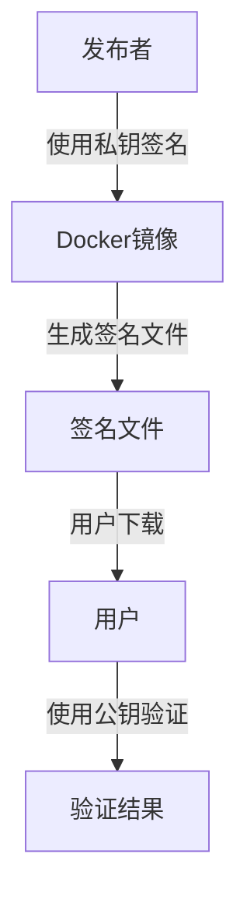

# Docker 镜像签名验证

在现代软件开发中，Docker镜像已经成为部署应用程序的标准方式。然而，随着镜像的广泛使用，确保镜像的安全性和完整性变得至关重要。Docker镜像签名验证是一种确保镜像未被篡改且来源可信的技术。本文将详细介绍Docker镜像签名验证的概念、工作原理以及如何在实际中使用它。

## 什么是Docker镜像签名验证？

Docker镜像签名验证是一种通过数字签名来验证镜像完整性和来源的机制。它确保镜像在传输和存储过程中未被篡改，并且来自可信的发布者。签名验证通常使用公钥加密技术，发布者使用私钥对镜像进行签名，用户则使用公钥来验证签名。

:::note
**数字签名**：数字签名是一种用于验证数据完整性和来源的加密技术。它通过使用私钥对数据进行签名，然后使用公钥来验证签名。
:::

## 为什么需要Docker镜像签名验证？

1. **防止镜像篡改**：确保镜像在传输和存储过程中未被恶意修改。
2. **验证镜像来源**：确保镜像来自可信的发布者，而不是恶意第三方。
3. **合规性**：在某些行业（如金融、医疗），使用签名验证是合规性要求的一部分。

## Docker 镜像签名验证的工作原理

Docker镜像签名验证基于**Notary**项目，Notary是一个用于发布和管理可信内容的工具。以下是Docker镜像签名验证的基本工作流程：

1. **发布者签名**：发布者使用私钥对镜像进行签名，生成签名文件。
2. **用户验证**：用户使用发布者的公钥来验证镜像的签名，确保镜像未被篡改且来源可信。



## 实际案例：使用Docker Content Trust (DCT) 进行镜像签名验证

Docker Content Trust (DCT) 是Docker提供的一种实现镜像签名验证的机制。以下是如何使用DCT进行镜像签名验证的步骤：

### 1. 启用Docker Content Trust

首先，确保Docker Content Trust已启用。可以通过设置环境变量来启用DCT：

```bash
export DOCKER_CONTENT_TRUST=1
```

### 2. 拉取并验证镜像

启用DCT后，尝试拉取一个镜像：

```bash
docker pull <镜像名称>
```

如果镜像已签名，Docker会自动验证签名。如果签名验证失败，Docker会拒绝拉取镜像。

### 3. 查看镜像签名信息

可以使用以下命令查看镜像的签名信息：

```bash
docker trust inspect <镜像名称>
```

输出将显示镜像的签名信息，包括签名者、签名时间等。

:::tip
**注意**：如果镜像未签名或签名验证失败，Docker会拒绝拉取镜像，并显示相应的错误信息。
:::

## 总结

Docker镜像签名验证是确保镜像安全性和完整性的重要机制。通过使用数字签名技术，用户可以验证镜像的来源和完整性，防止恶意篡改。Docker Content Trust (DCT) 提供了一种简单的方式来实现镜像签名验证，帮助开发者在生产环境中安全地使用Docker镜像。

## 附加资源与练习

- **官方文档**：阅读[Docker Content Trust官方文档](https://docs.docker.com/engine/security/trust/)以了解更多详细信息。
- **练习**：尝试在自己的环境中启用Docker Content Trust，并拉取一个已签名的镜像进行验证。

通过本文的学习，你应该已经掌握了Docker镜像签名验证的基本概念和实际应用。继续探索和实践，你将能够更好地保护你的Docker镜像安全。