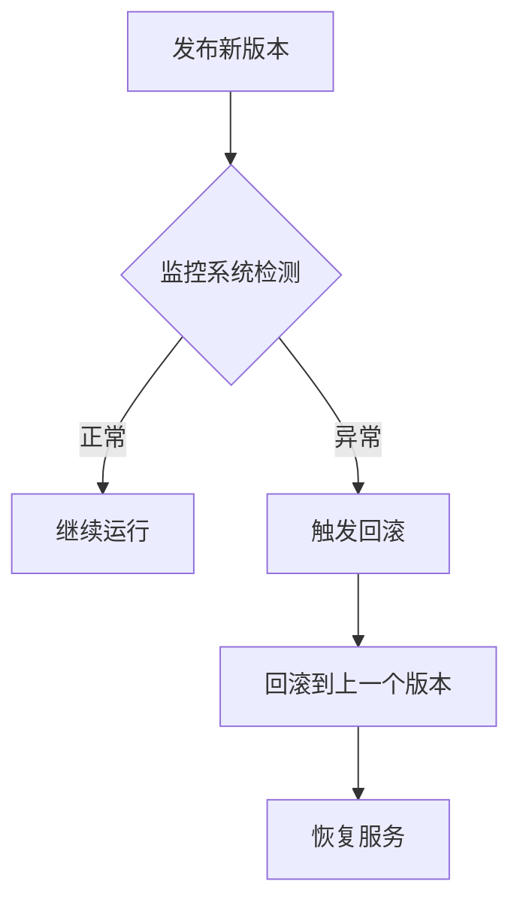

# Docker 回滚策略

在持续集成和持续交付（CI/CD）的流程中，回滚策略是一个至关重要的环节。它确保在部署新版本时，如果出现问题，能够快速恢复到之前的稳定版本。本文将详细介绍如何在Docker环境中实现回滚策略，帮助初学者理解并应用这一概念。

## 什么是回滚策略？

回滚策略是指在部署新版本的应用时，如果发现新版本存在问题（如性能下降、功能异常等），能够快速恢复到之前稳定版本的一种机制。在Docker环境中，回滚策略通常涉及到镜像版本管理、容器编排工具（如Kubernetes）以及自动化脚本的使用。

## 为什么需要回滚策略？

1. **稳定性**：确保应用在出现问题时能够快速恢复，减少停机时间。
2. **可靠性**：避免因新版本问题导致用户体验下降或数据丢失。
3. **自动化**：通过自动化工具减少人为干预，提高效率。

## 实现Docker回滚策略的步骤

### 1. 镜像版本管理

在Docker中，每个镜像都可以通过标签（tag）来标识不同的版本。为了实现回滚策略，首先需要确保每个镜像都有一个唯一的标签，并且这些标签能够清晰地表示版本号。

```bash
# 构建并推送带有版本标签的镜像
docker build -t myapp:1.0.0 .
docker push myapp:1.0.0
```

### 2. 使用Kubernetes进行部署

Kubernetes是一个强大的容器编排工具，支持自动化的部署和回滚。通过Kubernetes的Deployment资源，可以轻松实现回滚策略。

```yaml
apiVersion: apps/v1
kind: Deployment
metadata:
  name: myapp-deployment
spec:
  replicas: 3
  selector:
    matchLabels:
      app: myapp
  template:
    metadata:
      labels:
        app: myapp
    spec:
      containers:
      - name: myapp
        image: myapp:1.0.0
        ports:
        - containerPort: 80
```

### 3. 回滚到之前的版本

如果新版本出现问题，可以通过Kubernetes的`rollout`命令回滚到之前的版本。

```bash
# 查看部署历史
kubectl rollout history deployment/myapp-deployment

# 回滚到上一个版本
kubectl rollout undo deployment/myapp-deployment

# 回滚到指定版本
kubectl rollout undo deployment/myapp-deployment --to-revision=2
```

### 4. 自动化回滚

为了实现自动化回滚，可以结合CI/CD工具（如Jenkins、GitLab CI）和监控工具（如Prometheus）来检测应用的健康状态。如果检测到异常，自动触发回滚操作。

```bash
# 示例：Jenkins Pipeline脚本
pipeline {
    agent any
    stages {
        stage('Deploy') {
            steps {
                sh 'kubectl apply -f deployment.yaml'
            }
        }
        stage('Monitor') {
            steps {
                sh 'monitor_health.sh'
            }
        }
        stage('Rollback if needed') {
            steps {
                sh 'if [ "$HEALTH_STATUS" != "OK" ]; then kubectl rollout undo deployment/myapp-deployment; fi'
            }
        }
    }
}
```

## 实际案例

假设你正在开发一个电商网站，每次发布新版本时，都会通过Docker镜像进行部署。某次发布后，用户反馈购物车功能无法正常使用。通过监控系统发现，新版本的购物车服务存在性能问题。此时，你可以通过Kubernetes快速回滚到上一个稳定版本，确保用户能够正常使用购物车功能。



## 总结

Docker回滚策略是确保应用稳定性和可靠性的重要手段。通过合理的镜像版本管理、Kubernetes部署以及自动化脚本，可以快速应对新版本发布后可能出现的问题。希望本文能够帮助初学者理解并应用Docker回滚策略，提升CI/CD流程的效率和可靠性。

## 附加资源

- [Kubernetes官方文档](https://kubernetes.io/docs/home/)
- [Docker官方文档](https://docs.docker.com/)
- [Jenkins Pipeline教程](https://www.jenkins.io/doc/book/pipeline/)

## 练习

1. 创建一个简单的Docker镜像，并为其添加多个版本标签。
2. 使用Kubernetes部署该镜像，并尝试手动回滚到之前的版本。
3. 编写一个Jenkins Pipeline脚本，实现自动化部署和回滚。
