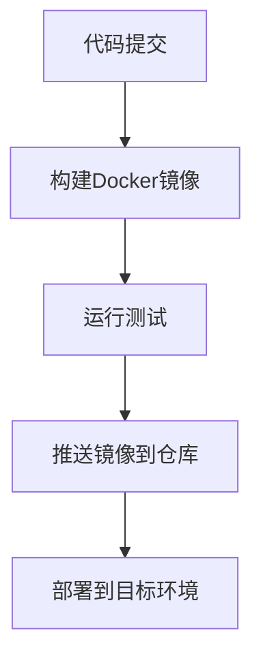

# Docker 持续交付流程

在现代软件开发中，持续集成和持续交付（CI/CD）是确保代码快速、可靠地交付到生产环境的关键实践。Docker作为一种容器化技术，为CI/CD流程提供了强大的支持。本文将带你了解如何使用Docker实现持续交付流程，从构建镜像到自动化部署的完整过程。

## 什么是持续交付？

持续交付（Continuous Delivery，简称CD）是一种软件开发实践，旨在通过自动化流程将代码变更快速、可靠地部署到生产环境。它的核心目标是通过频繁的、小规模的发布，减少发布风险并提高开发效率。

Docker在持续交付中的作用是通过容器化技术，将应用程序及其依赖项打包成一个独立的、可移植的镜像。这使得应用程序可以在任何环境中一致地运行，从而简化了部署流程。

---

## Docker 持续交付流程的核心步骤

Docker持续交付流程通常包括以下几个步骤：

1. **代码提交与构建**：开发人员将代码提交到版本控制系统（如Git），触发CI/CD流水线。
2. **构建Docker镜像**：根据代码库中的Dockerfile，构建应用程序的Docker镜像。
3. **测试**：在容器中运行自动化测试，确保代码质量。
4. **推送镜像到镜像仓库**：将构建好的Docker镜像推送到镜像仓库（如Docker Hub或私有仓库）。
5. **部署到目标环境**：从镜像仓库拉取镜像，并部署到目标环境（如开发、测试或生产环境）。

以下是一个典型的Docker持续交付流程示意图：



---

## 实际案例：从代码到部署

让我们通过一个简单的Node.js应用程序示例，演示如何使用Docker实现持续交付。

### 1. 编写Dockerfile

首先，我们需要为应用程序编写一个Dockerfile。以下是一个简单的Node.js应用程序的Dockerfile示例：

```dockerfile
# 使用官方的Node.js镜像作为基础镜像
FROM node:14

# 设置工作目录
WORKDIR /app

# 复制package.json和package-lock.json
COPY package*.json ./

# 安装依赖
RUN npm install

# 复制应用程序代码
COPY . .

# 暴露端口
EXPOSE 3000

# 启动应用程序
CMD ["node", "app.js"]
```

### 2. 构建Docker镜像

在本地开发环境中，可以使用以下命令构建Docker镜像：

```bash
docker build -t my-node-app:1.0 .
```

### 3. 运行测试

在CI/CD流水线中，通常会运行自动化测试。假设我们有一个简单的测试脚本 `test.sh`，可以在容器中运行它：

```bash
docker run my-node-app:1.0 ./test.sh
```

### 4. 推送镜像到镜像仓库

构建并测试通过后，将镜像推送到Docker Hub或其他镜像仓库：

```bash
docker tag my-node-app:1.0 my-dockerhub-username/my-node-app:1.0
docker push my-dockerhub-username/my-node-app:1.0
```

### 5. 部署到目标环境

最后，从镜像仓库拉取镜像并部署到目标环境。例如，在Kubernetes集群中部署：

```yaml
apiVersion: apps/v1
kind: Deployment
metadata:
  name: my-node-app
spec:
  replicas: 3
  template:
    spec:
      containers:
      - name: my-node-app
        image: my-dockerhub-username/my-node-app:1.0
        ports:
        - containerPort: 3000
```

---

## 总结

通过Docker实现持续交付流程，可以显著提高软件开发的效率和可靠性。Docker的容器化技术使得应用程序可以在任何环境中一致地运行，从而简化了构建、测试和部署的流程。

:::tip
如果你刚刚开始学习Docker和CI/CD，建议从简单的项目入手，逐步熟悉Dockerfile的编写、镜像构建和部署流程。
:::

---

## 附加资源与练习

- **练习**：尝试为一个简单的Python或Java应用程序编写Dockerfile，并实现从构建到部署的完整流程。
- **资源**：
  - [Docker官方文档](https://docs.docker.com/)
  - [Kubernetes官方文档](https://kubernetes.io/docs/home/)
  - [CI/CD最佳实践](https://www.redhat.com/en/topics/devops/what-is-ci-cd)

通过不断实践和学习，你将能够掌握Docker持续交付流程，并将其应用到实际项目中。