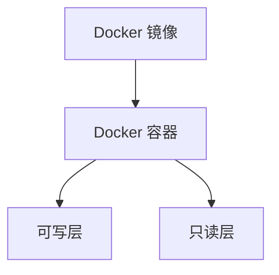

## 介绍

Docker 是一个开源的应用容器引擎，允许开发者将应用及其依赖打包到一个轻量级、可移植的容器中。Docker 的底层实现原理涉及多个核心组件和技术，包括 Linux 内核的命名空间（Namespaces）、控制组（Cgroups）、联合文件系统（UnionFS）等。本文将逐步讲解这些概念，并通过实际案例展示 Docker 的真实应用场景。

## Docker 的核心组件

### 1. 命名空间（Namespaces）

命名空间是 Linux 内核提供的一种机制，用于隔离系统资源。Docker 使用命名空间来实现容器之间的隔离。常见的命名空间包括：

- **PID 命名空间**：隔离进程 ID，使得每个容器内的进程只能看到自己容器内的进程。
- **Network 命名空间**：隔离网络接口，使得每个容器拥有独立的网络栈。
- **Mount 命名空间**：隔离文件系统挂载点，使得每个容器拥有独立的文件系统视图。
- **UTS 命名空间**：隔离主机名和域名，使得每个容器可以拥有独立的主机名。

### 2. 控制组（Cgroups）

控制组是 Linux 内核提供的另一种机制，用于限制、记录和隔离进程组的资源使用。Docker 使用 Cgroups 来控制容器的资源使用，例如 CPU、内存、磁盘 I/O 等。

```bash
# 查看某个容器的 Cgroups 配置
cat /sys/fs/cgroup/memory/docker/<container_id>/memory.limit_in_bytes
```

### 3. 联合文件系统（UnionFS）

联合文件系统是一种分层文件系统，允许将多个文件系统叠加在一起，形成一个统一的文件系统视图。Docker 使用 UnionFS 来实现镜像的分层存储和容器的文件系统。

```bash
# 查看 Docker 镜像的分层结构
docker image inspect <image_name>
```

## Docker 的工作机制

### 1. 镜像与容器

Docker 镜像是只读的模板，包含了运行应用所需的文件系统和依赖。Docker 容器是镜像的运行实例，包含了可写的文件系统层。



### 2. 容器生命周期

Docker 容器的生命周期包括创建、启动、停止、删除等阶段。Docker 使用 `docker run` 命令创建并启动容器，使用 `docker stop` 命令停止容器，使用 `docker rm` 命令删除容器。

```bash
# 创建并启动容器
docker run -d --name my_container my_image

# 停止容器
docker stop my_container

# 删除容器
docker rm my_container
```

## 实际案例

### 案例 1：使用 Docker 部署 Web 应用

假设我们有一个简单的 Node.js Web 应用，我们可以使用 Docker 将其打包并部署到生产环境中。

```Dockerfile
# Docker file
FROM node:14
WORKDIR /app
COPY package.json .
RUN npm install
COPY . .
CMD ["node", "app.js"]
```

```bash
# 构建镜像
docker build -t my_web_app .

# 运行容器
docker run -d -p 8080:8080 --name my_web_app_container my_web_app
```

### 案例 2：使用 Docker 进行持续集成

在持续集成（CI）流程中，Docker 可以用于构建和测试应用。例如，我们可以使用 Docker 在 CI 环境中运行测试套件。

```bash
# 在 CI 环境中运行测试
docker run --rm my_test_image npm test
```

## 总结

Docker 的底层实现原理涉及多个核心组件和技术，包括命名空间、控制组和联合文件系统。通过理解这些组件的工作原理，我们可以更好地使用 Docker 来构建、部署和管理应用。

## 附加资源

- [Docker 官方文档](https://docs.docker.com/)
- [Linux 命名空间](https://en.wikipedia.org/wiki/Linux_namespaces)
- [Linux 控制组](https://en.wikipedia.org/wiki/Cgroups)
- [联合文件系统](https://en.wikipedia.org/wiki/UnionFS)

## 练习

1. 使用 Docker 创建一个简单的 Python Web 应用，并将其部署到容器中。
2. 使用 `docker inspect` 命令查看容器的命名空间和 Cgroups 配置。
3. 尝试使用 Docker 进行持续集成，并在 CI 环境中运行测试套件。
