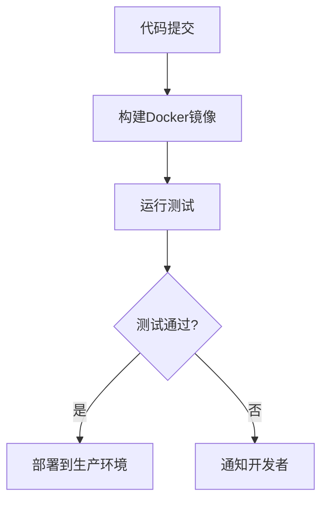

# Docker 测试环境

在现代软件开发中，测试环境是确保应用程序在不同阶段（如开发、测试、生产）中表现一致的关键。Docker通过容器化技术，为测试环境的创建和管理提供了高效、一致的解决方案。本文将详细介绍如何使用Docker构建测试环境，并通过实际案例展示其应用场景。

## 什么是Docker测试环境？

Docker测试环境是指使用Docker容器来模拟应用程序运行的环境。通过Docker，开发者可以快速创建、销毁和重建测试环境，确保每次测试都在一个干净、一致的环境中进行。这种方式不仅提高了测试的可靠性，还大大减少了环境配置的复杂性。

## 为什么使用Docker测试环境？

1. **一致性**：Docker容器确保测试环境与开发和生产环境一致，避免了“在我机器上能运行”的问题。
2. **隔离性**：每个测试环境都是独立的，互不干扰，可以并行运行多个测试。
3. **可重复性**：通过Dockerfile定义环境，可以轻松重建相同的测试环境。
4. **资源高效**：容器比虚拟机更轻量，启动更快，占用资源更少。

## 如何创建Docker测试环境？

### 1. 编写Dockerfile

首先，我们需要编写一个Dockerfile来定义测试环境。以下是一个简单的Dockerfile示例，用于运行一个基于Node.js的应用程序：

```dockerfile
# 使用官方的Node.js镜像作为基础镜像
FROM node:14

# 设置工作目录
WORKDIR /app

# 复制package.json和package-lock.json
COPY package*.json ./

# 安装依赖
RUN npm install

# 复制应用程序代码
COPY . .

# 暴露端口
EXPOSE 3000

# 启动应用程序
CMD ["npm", "start"]
```

### 2. 构建Docker镜像

使用以下命令构建Docker镜像：

```bash
docker build -t my-node-app .
```

### 3. 运行Docker容器

构建完成后，可以使用以下命令运行容器：

```bash
docker run -p 3000:3000 my-node-app
```

此时，应用程序将在本地的3000端口上运行，你可以通过浏览器访问`http://localhost:3000`来测试应用程序。

### 4. 自动化测试

为了自动化测试，可以在Dockerfile中添加测试脚本，并在容器启动时运行测试。例如：

```dockerfile
# 在Dockerfile中添加测试命令
CMD ["npm", "test"]
```

然后，使用以下命令运行测试：

```bash
docker run my-node-app
```

## 实际案例：使用Docker进行CI/CD测试

在持续集成/持续交付（CI/CD）流程中，Docker测试环境可以确保每次代码提交后，应用程序都能在一致的环境中通过所有测试。以下是一个简单的CI/CD流程示例：



在这个流程中，每次代码提交后，CI/CD工具会自动构建Docker镜像并运行测试。如果测试通过，应用程序将被部署到生产环境；如果测试失败，开发者将收到通知。

## 总结

Docker测试环境为开发者提供了一个高效、一致且可重复的测试平台。通过Docker，你可以轻松创建和管理测试环境，确保应用程序在不同阶段中的一致性。无论是本地开发还是CI/CD流程，Docker都能显著提高测试的可靠性和效率。

## 附加资源

- [Docker官方文档](https://docs.docker.com/)
- [Dockerfile参考](https://docs.docker.com/engine/reference/builder/)
- [Node.js官方镜像](https://hub.docker.com/_/node)

## 练习

1. 编写一个Dockerfile，用于运行一个基于Python的Web应用程序。
2. 使用Docker Compose创建一个包含数据库和Web应用程序的测试环境。
3. 在CI/CD工具（如GitHub Actions或Jenkins）中集成Docker测试环境。

通过以上练习，你将更深入地理解Docker测试环境的创建和管理。