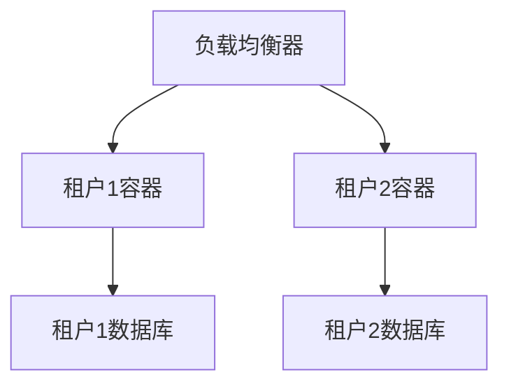

# Docker 多租户环境

在现代云计算和软件开发中，**多租户环境**是一种常见的架构模式，允许多个用户或租户共享同一套基础设施，同时确保彼此之间的资源隔离和安全性。Docker作为一种轻量级的容器化技术，非常适合用于构建和管理多租户环境。本文将详细介绍Docker在多租户环境中的应用场景、实现方式以及最佳实践。

## 什么是多租户环境？

多租户环境是指多个用户或租户共享同一套基础设施（如服务器、存储、网络等），但每个租户的数据和资源是相互隔离的。这种架构模式在云计算平台（如AWS、Azure）和SaaS（软件即服务）应用中非常常见。

在多租户环境中，**资源隔离**和**安全性**是关键。Docker通过容器化技术，能够为每个租户提供独立的运行环境，确保租户之间的资源不会相互干扰。

## Docker 在多租户环境中的优势

1. **资源隔离**：Docker容器通过Linux内核的命名空间和控制组（cgroups）技术，实现了进程、网络、文件系统等资源的隔离。
2. **轻量级**：与虚拟机相比，Docker容器更加轻量，启动速度更快，资源占用更少。
3. **可移植性**：Docker容器可以在任何支持Docker的环境中运行，确保应用在不同环境中的一致性。
4. **易于管理**：Docker提供了丰富的工具和API，便于管理和监控多租户环境中的容器。

## 实现Docker多租户环境的步骤

### 1. 为每个租户创建独立的容器

在多租户环境中，每个租户应该拥有独立的容器。可以通过Docker的`docker run`命令为每个租户启动一个容器：

```bash
docker run -d --name tenant1_container -e TENANT_ID=tenant1 my_app_image
docker run -d --name tenant2_container -e TENANT_ID=tenant2 my_app_image
```

在上述命令中，`TENANT_ID`环境变量用于标识不同的租户。

### 2. 使用Docker网络实现租户隔离

Docker提供了网络隔离功能，可以为每个租户创建独立的网络，确保租户之间的网络流量不会相互干扰：

```bash
docker network create tenant1_network
docker network create tenant2_network

docker run -d --name tenant1_container --network tenant1_network my_app_image
docker run -d --name tenant2_container --network tenant2_network my_app_image
```

### 3. 使用Docker卷实现数据隔离

为了确保每个租户的数据是独立的，可以使用Docker卷（Volume）来存储租户的数据：

```bash
docker volume create tenant1_data
docker volume create tenant2_data

docker run -d --name tenant1_container -v tenant1_data:/app/data my_app_image
docker run -d --name tenant2_container -v tenant2_data:/app/data my_app_image
```

### 4. 使用Docker Compose管理多租户环境

对于更复杂的多租户环境，可以使用Docker Compose来定义和管理多个容器的配置。以下是一个简单的`docker-compose.yml`示例：

```yaml
version: '3'
services:
  tenant1:
    image: my_app_image
    environment:
      - TENANT_ID=tenant1
    networks:
      - tenant1_network
    volumes:
      - tenant1_data:/app/data

  tenant2:
    image: my_app_image
    environment:
      - TENANT_ID=tenant2
    networks:
      - tenant2_network
    volumes:
      - tenant2_data:/app/data

networks:
  tenant1_network:
  tenant2_network:

volumes:
  tenant1_data:
  tenant2_data:
```

通过`docker-compose up -d`命令，可以一键启动多个租户的容器。

## 实际案例：SaaS平台的多租户架构

假设我们正在开发一个SaaS平台，每个租户（客户）都有自己的独立应用实例。我们可以使用Docker来实现以下架构：

1. **前端负载均衡**：使用Nginx或HAProxy作为负载均衡器，将请求路由到不同的租户容器。
2. **后端服务**：每个租户的后端服务运行在独立的Docker容器中，确保资源隔离。
3. **数据库**：每个租户的数据库也运行在独立的容器中，确保数据隔离。



## 总结

Docker在多租户环境中的应用非常广泛，能够有效实现资源隔离、安全性和高效管理。通过为每个租户创建独立的容器、网络和卷，可以确保租户之间的资源不会相互干扰。此外，Docker Compose等工具可以简化多租户环境的管理。

## 附加资源与练习

- **练习**：尝试使用Docker Compose创建一个包含两个租户的多租户环境，每个租户拥有独立的应用和数据库容器。
- **资源**：
  - [Docker官方文档](https://docs.docker.com/)
  - [Docker Compose入门指南](https://docs.docker.com/compose/gettingstarted/)

:::tip
在多租户环境中，务必定期监控容器的资源使用情况，确保每个租户都能获得足够的资源。
:::