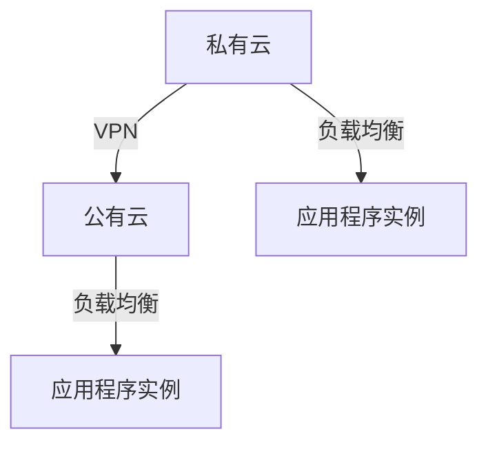

# Docker 混合云部署

在现代云计算环境中，混合云（Hybrid Cloud）已经成为一种常见的架构模式。它结合了公有云和私有云的优势，允许企业在不同的云环境中灵活部署和管理应用程序。Docker作为一种轻量级的容器化技术，为混合云部署提供了强大的支持。本文将详细介绍如何使用Docker在混合云环境中部署应用程序。

## 什么是混合云部署？

混合云部署是指将应用程序同时部署在公有云和私有云环境中。这种部署方式允许企业根据需求灵活地分配资源，同时保持对敏感数据的控制。Docker容器化技术使得应用程序可以在不同的云环境中无缝迁移和扩展，从而简化了混合云部署的复杂性。

## Docker 在混合云部署中的优势

1. **一致性**：Docker容器可以在任何支持Docker的环境中运行，确保应用程序在不同云环境中的一致性。
2. **可移植性**：容器化的应用程序可以轻松地在公有云和私有云之间迁移，无需修改代码。
3. **资源优化**：通过混合云部署，企业可以根据需求动态分配资源，优化成本。
4. **安全性**：Docker提供了强大的隔离机制，确保应用程序在混合云环境中的安全性。

## 混合云部署的基本步骤

### 1. 准备Docker镜像

首先，您需要为应用程序创建一个Docker镜像。假设您有一个简单的Node.js应用程序，以下是Dockerfile的示例：

```dockerfile
# 使用官方的Node.js镜像作为基础镜像
FROM node:14

# 设置工作目录
WORKDIR /app

# 复制package.json和package-lock.json
COPY package*.json ./

# 安装依赖
RUN npm install

# 复制应用程序代码
COPY . .

# 暴露端口
EXPOSE 3000

# 启动应用程序
CMD ["node", "app.js"]
```

使用以下命令构建Docker镜像：

```bash
docker build -t my-node-app .
```

### 2. 部署到私有云

在私有云环境中，您可以使用Docker Compose来管理多个容器的部署。以下是一个简单的`docker-compose.yml`文件示例：

```yaml
version: '3'
services:
  app:
    image: my-node-app
    ports:
      - "3000:3000"
    environment:
      - NODE_ENV=production
```

使用以下命令启动服务：

```bash
docker-compose up -d
```

### 3. 部署到公有云

在公有云环境中，您可以使用云服务提供商（如AWS、Azure或Google Cloud）的容器服务来部署Docker镜像。以AWS ECS为例，您可以使用以下步骤：

1. 将Docker镜像推送到AWS ECR（Elastic Container Registry）：

```bash
aws ecr create-repository --repository-name my-node-app
docker tag my-node-app:latest <aws_account_id>.dkr.ecr.<region>.amazonaws.com/my-node-app:latest
docker push <aws_account_id>.dkr.ecr.<region>.amazonaws.com/my-node-app:latest
```

2. 在AWS ECS中创建任务定义和服务，使用刚刚推送的镜像。

### 4. 配置混合云网络

为了实现混合云部署，您需要确保私有云和公有云之间的网络连接。可以使用VPN或专线连接来建立安全的网络通道。以下是一个简单的网络拓扑图：



### 5. 监控和管理

在混合云环境中，监控和管理是关键。您可以使用工具如Prometheus和Grafana来监控应用程序的性能，并使用Kubernetes来管理容器编排。

## 实际案例

假设您是一家电商公司，希望在销售高峰期利用公有云的弹性扩展能力，同时在非高峰期使用私有云以降低成本。通过Docker混合云部署，您可以轻松地将应用程序部署到AWS ECS和私有云环境中，并根据流量动态调整资源。

## 总结

Docker混合云部署为企业提供了灵活、高效和安全的应用程序部署方式。通过Docker容器化技术，您可以轻松地在公有云和私有云之间迁移和扩展应用程序，同时优化资源利用和成本。

## 附加资源

- [Docker官方文档](https://docs.docker.com/)
- [AWS ECS文档](https://aws.amazon.com/ecs/)
- [Kubernetes官方文档](https://kubernetes.io/docs/home/)

## 练习

1. 创建一个简单的Node.js应用程序，并使用Docker将其部署到本地Docker环境中。
2. 将同一个Docker镜像推送到AWS ECR，并在AWS ECS中部署。
3. 配置VPN连接，将本地Docker环境与AWS ECS环境连接起来，实现混合云部署。

通过以上步骤，您将掌握Docker混合云部署的基本技能，并能够在实际项目中应用这些知识。