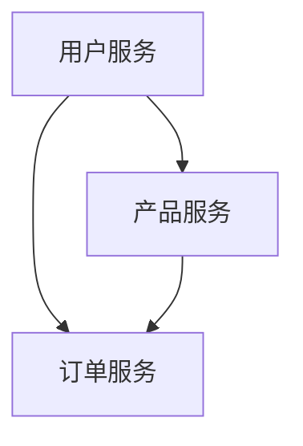

# Docker 微服务部署

## 介绍

在现代软件开发中，微服务架构已经成为一种流行的设计模式。微服务架构将应用程序拆分为多个小型、独立的服务，每个服务都可以独立开发、部署和扩展。Docker作为容器化技术的代表，为微服务部署提供了强大的支持。通过Docker，开发者可以将每个微服务打包为一个独立的容器，从而实现快速部署、隔离和扩展。

本文将逐步介绍如何使用Docker部署微服务架构，并通过实际案例展示其应用场景。

## 什么是微服务？

微服务是一种架构风格，它将应用程序拆分为多个小型、独立的服务。每个服务都运行在自己的进程中，并通过轻量级的通信机制（如HTTP或消息队列）与其他服务交互。微服务架构的主要优势包括：

- **独立性**：每个服务可以独立开发、部署和扩展。
- **技术多样性**：不同的服务可以使用不同的编程语言、框架和数据库。
- **可扩展性**：可以根据需求单独扩展某个服务，而不影响其他服务。

## Docker 与微服务

Docker是一种容器化技术，它允许开发者将应用程序及其依赖打包到一个轻量级、可移植的容器中。Docker容器可以在任何支持Docker的环境中运行，确保了应用程序在不同环境中的一致性。

在微服务架构中，Docker可以帮助我们：

- **隔离环境**：每个微服务运行在自己的容器中，避免了依赖冲突。
- **快速部署**：通过Docker镜像，可以快速部署和启动微服务。
- **易于扩展**：可以通过Docker Compose或Kubernetes等工具轻松扩展微服务。

## 使用Docker部署微服务

### 1. 创建Dockerfile

首先，我们需要为每个微服务创建一个Dockerfile。Dockerfile是一个文本文件，包含了构建Docker镜像所需的指令。

以下是一个简单的Dockerfile示例：

```dockerfile
# 使用官方的Node.js镜像作为基础镜像
FROM node:14

# 设置工作目录
WORKDIR /app

# 复制package.json和package-lock.json
COPY package*.json ./

# 安装依赖
RUN npm install

# 复制应用程序代码
COPY . .

# 暴露端口
EXPOSE 3000

# 启动应用程序
CMD ["npm", "start"]
```

### 2. 构建Docker镜像

在Dockerfile所在的目录下，运行以下命令构建Docker镜像：

```bash
docker build -t my-microservice .
```

### 3. 运行Docker容器

构建完成后，可以使用以下命令运行Docker容器：

```bash
docker run -p 3000:3000 my-microservice
```

### 4. 使用Docker Compose管理多个微服务

在实际项目中，通常会有多个微服务需要同时运行。Docker Compose是一个工具，可以帮助我们定义和运行多个Docker容器。

以下是一个简单的`docker-compose.yml`文件示例：

```yaml
version: '3'
services:
  service1:
    image: my-microservice1
    ports:
      - "3000:3000"
  service2:
    image: my-microservice2
    ports:
      - "4000:4000"
```

使用以下命令启动所有服务：

```bash
docker-compose up
```

## 实际案例

假设我们有一个简单的电子商务应用程序，包含以下微服务：

1. **用户服务**：负责用户注册、登录等功能。
2. **产品服务**：负责产品信息的展示和管理。
3. **订单服务**：负责订单的创建和管理。

每个服务都可以独立开发、部署和扩展。通过Docker，我们可以将每个服务打包为一个容器，并使用Docker Compose管理这些容器的启动和停止。



## 总结

通过Docker部署微服务架构，我们可以实现快速、可靠的应用程序部署和扩展。Docker的容器化技术为微服务提供了隔离、一致性和可移植性，使得微服务架构更加易于管理和维护。

## 附加资源

- [Docker官方文档](https://docs.docker.com/)
- [Docker Compose官方文档](https://docs.docker.com/compose/)
- [微服务架构设计模式](https://microservices.io/)

## 练习

1. 尝试为你的项目创建一个Dockerfile，并构建Docker镜像。
2. 使用Docker Compose管理多个微服务，并启动它们。
3. 探索如何在Kubernetes中部署Docker容器。

:::tip
在学习和实践过程中，如果遇到问题，可以参考Docker官方文档或社区论坛，获取更多帮助。
:::