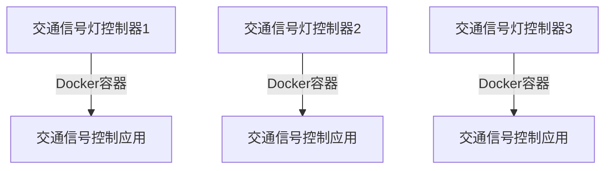

# Docker 边缘计算

## 介绍

边缘计算是一种分布式计算范式，它将数据处理和存储从中心化的云服务器转移到靠近数据源的边缘设备上。这种架构能够减少延迟、提高响应速度，并降低带宽消耗。Docker作为一种轻量级的容器化技术，非常适合在边缘计算环境中部署和管理应用程序。

Docker容器可以在各种边缘设备上运行，例如物联网设备、工业控制器和移动设备。通过使用Docker，开发者可以轻松地将应用程序打包成容器，并在边缘设备上快速部署和更新。

## Docker 在边缘计算中的优势

1. **轻量级**：Docker容器比虚拟机更轻量，占用资源更少，适合资源受限的边缘设备。
2. **可移植性**：Docker容器可以在任何支持Docker的环境中运行，确保应用程序在不同边缘设备上的一致性。
3. **快速部署**：Docker容器可以快速启动和停止，适合需要快速响应的边缘计算场景。
4. **易于管理**：Docker提供了丰富的工具和API，便于管理和监控边缘设备上的容器。

## Docker 边缘计算的实际应用

### 1. 物联网（IoT）设备

物联网设备通常分布在广泛的地理区域，且资源有限。使用Docker容器可以在这些设备上部署和管理应用程序，确保它们能够高效地处理数据并与其他设备通信。

```bash
# 在物联网设备上运行一个简单的Docker容器
docker run -d --name iot-app my-iot-app-image
```

### 2. 工业自动化

在工业自动化中，边缘设备需要实时处理大量数据。Docker容器可以在这些设备上运行复杂的应用程序，确保生产线的稳定运行。

```bash
# 在工业控制器上运行一个Docker容器
docker run -d --name industrial-app my-industrial-app-image
```

### 3. 移动边缘计算

移动边缘计算（MEC）将计算资源放置在靠近移动用户的边缘节点上。Docker容器可以在这些边缘节点上运行应用程序，提供低延迟的服务。

```bash
# 在移动边缘节点上运行一个Docker容器
docker run -d --name mec-app my-mec-app-image
```

## 实际案例：智能交通系统

假设我们有一个智能交通系统，需要在多个交通信号灯控制器上运行应用程序。这些控制器分布在城市的不同位置，且资源有限。使用Docker容器，我们可以轻松地在这些控制器上部署和管理交通信号控制应用程序。



### 步骤

1. **打包应用程序**：将交通信号控制应用程序打包成Docker镜像。
2. **部署到控制器**：将Docker镜像部署到各个交通信号灯控制器上。
3. **监控和管理**：使用Docker工具监控和管理各个控制器上的容器。

```bash
# 打包应用程序
docker build -t traffic-control-app .

# 部署到控制器
docker run -d --name traffic-control traffic-control-app
```

## 总结

Docker在边缘计算中具有显著的优势，能够帮助开发者在资源受限的边缘设备上高效地部署和管理应用程序。通过使用Docker容器，开发者可以确保应用程序在不同边缘设备上的一致性，并快速响应变化的需求。

## 附加资源

- [Docker官方文档](https://docs.docker.com/)
- [边缘计算概述](https://en.wikipedia.org/wiki/Edge_computing)
- [Docker与物联网](https://www.docker.com/use-cases/iot)

## 练习

1. 尝试在本地机器上运行一个简单的Docker容器，并观察其资源使用情况。
2. 研究如何在物联网设备上部署和管理Docker容器。
3. 探索Docker Swarm或Kubernetes在边缘计算中的应用。

:::tip
在边缘计算环境中，确保Docker容器的安全性至关重要。请务必使用Docker的安全功能，如用户命名空间和镜像签名。
:::