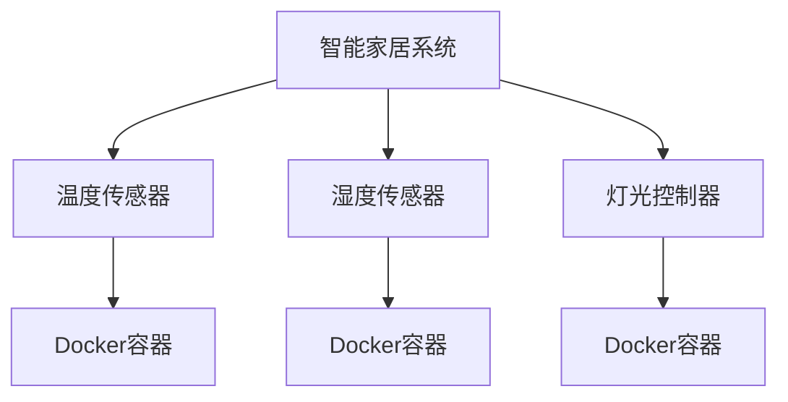
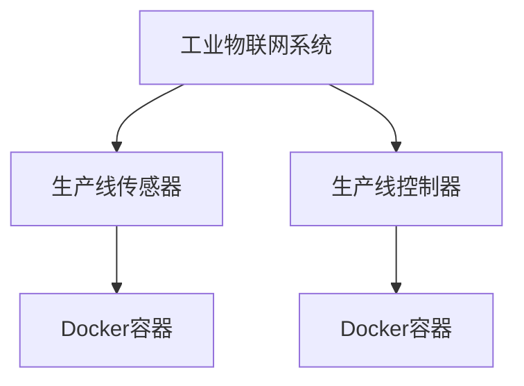

# Docker 物联网应用

## 介绍

物联网（IoT）是指通过互联网连接各种设备，使它们能够相互通信和协作。随着物联网设备的数量不断增加，管理和部署这些设备变得越来越复杂。Docker作为一种轻量级的容器化技术，可以帮助简化物联网应用的开发、测试和部署过程。通过将物联网应用及其依赖项打包到容器中，Docker可以确保应用在不同环境中的一致性，并提高开发和部署的效率。

## Docker 在物联网中的应用场景

### 1. 设备模拟与测试

在物联网开发中，通常需要在不同的硬件设备上进行测试。然而，物理设备的数量有限，且成本较高。Docker可以帮助开发者通过容器模拟不同的设备环境，从而在不依赖物理设备的情况下进行测试。

```bash
# 示例：运行一个模拟的物联网设备容器
docker run -it --name iot-device-simulator ubuntu:latest
```

### 2. 边缘计算

边缘计算是指在靠近数据源的地方进行数据处理，以减少延迟和带宽消耗。Docker可以在边缘设备上运行容器化的应用，从而简化边缘计算的部署和管理。

```bash
# 示例：在边缘设备上部署一个容器化的应用
docker run -d --name edge-app my-edge-app:latest
```

### 3. 持续集成与持续部署（CI/CD）

物联网应用的开发通常涉及多个团队和多种技术栈。Docker可以与CI/CD工具（如Jenkins、GitLab CI）集成，自动化构建、测试和部署流程，从而加快开发周期。

```bash
# 示例：使用Docker进行CI/CD
docker build -t my-iot-app .
docker run -d --name my-iot-app my-iot-app:latest
```

### 4. 多设备管理

物联网系统通常包含大量的设备，每个设备可能需要运行不同的应用版本。Docker可以通过容器编排工具（如Kubernetes）管理多个设备上的应用，确保它们的一致性和可维护性。

```bash
# 示例：使用Kubernetes管理多个物联网设备
kubectl apply -f iot-deployment.yaml
```

## 实际案例

### 案例1：智能家居系统

假设你正在开发一个智能家居系统，该系统包括多个传感器和执行器。通过Docker，你可以将每个传感器和执行器的应用打包到容器中，并在不同的设备上运行。这样，你可以轻松地管理和更新每个设备上的应用，而无需担心环境差异。



### 案例2：工业物联网（IIoT）

在工业物联网中，通常需要在生产线上部署多个传感器和控制器。通过Docker，你可以将每个传感器和控制器的应用打包到容器中，并在生产线的各个节点上运行。这样，你可以轻松地管理和更新每个节点上的应用，而无需停机。



## 总结

Docker在物联网中的应用场景非常广泛，从设备模拟与测试到边缘计算，再到多设备管理，Docker都能提供强大的支持。通过容器化技术，开发者可以简化物联网应用的开发、测试和部署过程，提高系统的可维护性和可扩展性。

## 附加资源与练习

- **练习1**：尝试在本地环境中使用Docker模拟一个物联网设备，并运行一个简单的传感器应用。
- **练习2**：使用Docker和Kubernetes部署一个包含多个设备的物联网系统，并测试其可扩展性。
- **资源**：阅读Docker官方文档，了解更多关于Docker在物联网中的应用案例和最佳实践。

:::tip
提示：在实际应用中，确保每个容器的资源限制（如CPU和内存）合理配置，以避免资源争用和性能问题。
:::