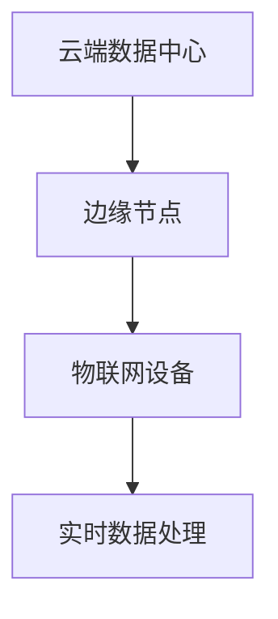

# Docker 未来发展趋势

Docker自2013年发布以来，已经成为容器化技术的代名词。它彻底改变了应用程序的开发、部署和管理方式。然而，随着技术的不断演进，Docker生态系统也在不断发展。本文将探讨Docker的未来发展趋势，帮助初学者了解容器技术的未来方向。

## 1. 容器编排的进一步成熟

虽然Kubernetes已经成为容器编排的事实标准，但Docker Swarm和Docker Compose仍然是许多开发者的首选工具。未来，Docker可能会进一步简化容器编排的复杂性，提供更直观的工具和界面，使初学者也能轻松管理大规模的容器集群。

:::tip
**小提示**：如果你刚刚开始学习容器编排，可以先从Docker Compose入手，它非常适合单机环境下的多容器应用管理。
:::

## 2. 无服务器架构与Docker的结合

无服务器架构（Serverless）正在成为云原生应用的重要组成部分。未来，Docker可能会与无服务器平台更紧密地集成，使开发者能够轻松地将容器化应用部署到无服务器环境中。例如，Docker可能会提供与AWS Lambda、Google Cloud Functions等无服务器平台的直接集成。

```bash
# 示例：将Docker容器部署到无服务器平台
docker build -t my-serverless-app .
docker push my-serverless-app
```

## 3. 安全性的持续增强

随着容器技术的普及，安全性问题也日益突出。未来，Docker可能会引入更多的安全特性，如更严格的镜像签名验证、运行时安全监控以及自动化的漏洞扫描工具。这些改进将帮助开发者在构建和部署容器化应用时更加安心。

:::caution
**注意**：在使用Docker镜像时，务必从可信的来源获取镜像，并定期更新以修复已知漏洞。
:::

## 4. 边缘计算与Docker的结合

边缘计算（Edge Computing）正在成为物联网（IoT）和5G网络的重要组成部分。未来，Docker可能会推出专门针对边缘计算的优化版本，使开发者能够轻松地在边缘设备上部署和管理容器化应用。



## 5. 开发者体验的持续优化

Docker一直致力于改善开发者的使用体验。未来，Docker可能会推出更多的可视化工具、自动化脚本和集成开发环境（IDE）插件，使开发者能够更高效地构建、测试和部署容器化应用。

:::note
**你知道吗？** Docker Desktop已经提供了直观的图形界面，帮助开发者轻松管理容器和镜像。
:::

## 6. 实际案例：Docker在微服务架构中的应用

微服务架构已经成为现代应用开发的主流模式。Docker在微服务架构中的应用非常广泛，许多企业使用Docker来隔离和管理各个微服务。例如，一个电商平台可能会将用户服务、订单服务和支付服务分别打包成不同的Docker容器，并通过Kubernetes进行编排和管理。

```bash
# 示例：启动多个微服务容器
docker-compose up -d user-service order-service payment-service
```

## 总结

Docker作为容器化技术的先驱，未来将继续在容器编排、无服务器架构、安全性、边缘计算和开发者体验等方面进行创新。对于初学者来说，了解这些发展趋势将有助于更好地规划自己的学习和职业发展路径。

## 附加资源与练习

- **练习**：尝试使用Docker Compose部署一个简单的微服务应用，并观察各个容器之间的交互。
- **资源**：
  - [Docker官方文档](https://docs.docker.com/)
  - [Kubernetes官方文档](https://kubernetes.io/docs/home/)
  - [无服务器架构入门指南](https://serverless.com/)

通过不断学习和实践，你将能够更好地掌握Docker及其生态系统，为未来的技术挑战做好准备。