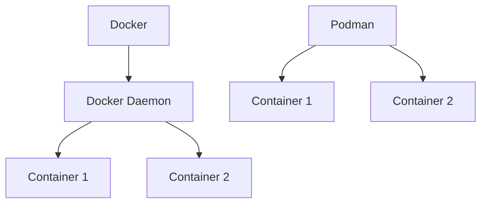

## 介绍

在现代容器化技术中，Docker和Podman是两个备受关注的开源工具。它们都用于创建、管理和运行容器，但在架构、功能和生态系统上存在显著差异。本文将深入探讨Docker和Podman的异同，帮助初学者理解如何选择适合自己需求的工具。

## 什么是Docker？

Docker是最早流行的容器化平台之一，它提供了一个完整的生态系统，包括容器运行时、镜像管理、网络和存储等功能。Docker的核心组件包括：

- **Docker Daemon**：负责管理容器的生命周期。
- **Docker CLI**：用户通过命令行与Docker交互。
- **Docker Hub**：一个公共的镜像仓库，用户可以从中拉取和推送镜像。

## 什么是Podman？

Podman是一个无守护进程的容器管理工具，由Red Hat开发。它与Docker兼容，但采用了不同的架构设计。Podman的核心特点包括：

- **无守护进程**：Podman直接与Linux内核交互，无需后台守护进程。
- **Rootless模式**：允许普通用户运行容器，无需root权限。
- **兼容Docker CLI**：Podman的命令与Docker CLI高度兼容，用户无需学习新的命令。

## Docker 与Podman的对比

### 1. 架构差异

Docker依赖于一个中央守护进程（Docker Daemon），所有容器操作都通过该守护进程进行。这种设计简化了管理，但也带来了单点故障的风险。

Podman则采用无守护进程的架构，每个容器都由独立的进程管理。这种设计提高了安全性和灵活性，但可能增加资源消耗。



### 2. 安全性

Podman支持**rootless模式**，允许普通用户运行容器，这大大降低了安全风险。Docker虽然也支持rootless模式，但其默认配置仍需要root权限。

:::tip
如果你对安全性有较高要求，Podman可能是更好的选择。
:::

### 3. 镜像管理

Docker和Podman都支持从Docker Hub拉取镜像，但Podman还支持其他镜像仓库，如Quay.io。此外，Podman的镜像管理命令与Docker完全兼容。

```bash
# 使用Docker拉取镜像
docker pull nginx

# 使用Podman拉取镜像
podman pull nginx
```

### 4. 网络和存储

Docker提供了内置的网络和存储管理功能，而Podman则依赖于Linux内核的功能。Podman的网络配置更加灵活，但可能需要用户手动管理。

### 5. 生态系统

Docker拥有庞大的生态系统，包括Docker Compose、Docker Swarm等工具。Podman虽然生态系统较小，但正在快速发展，并且与Kubernetes等工具集成良好。

## 实际案例

### 案例1：开发环境

假设你正在开发一个Web应用，需要在本地运行多个服务（如数据库、Web服务器）。使用Docker Compose可以轻松管理这些服务：

```yaml
version: '3'
services:
  web:
    image: nginx
    ports:
      - "80:80"
  db:
    image: postgres
    environment:
      POSTGRES_PASSWORD: example
```

Podman虽然没有内置的Compose工具，但可以使用`podman-compose`来实现类似功能。

### 案例2：生产环境

在生产环境中，安全性至关重要。Podman的rootless模式可以显著降低安全风险。例如，你可以使用以下命令以普通用户身份运行容器：

```bash
podman run -d --name myapp nginx
```

## 总结

Docker和Podman各有优劣，选择哪个工具取决于你的具体需求。如果你需要一个成熟的生态系统和简单的管理工具，Docker可能是更好的选择。如果你更关注安全性和灵活性，Podman则更具优势。

## 附加资源

- [Docker官方文档](https://docs.docker.com/)
- [Podman官方文档](https://podman.io/docs/)
- [Docker与Podman对比指南](https://developers.redhat.com/blog/2019/02/21/podman-and-buildah-for-docker-users)

## 练习

1. 使用Docker和Podman分别运行一个Nginx容器，并比较两者的启动时间。
2. 尝试在Podman中使用rootless模式运行一个容器，并观察其权限限制。
3. 使用Docker Compose和`podman-compose`分别管理一个多服务应用，比较两者的配置差异。
