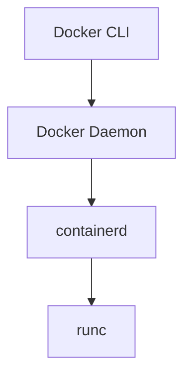

## 介绍

在现代容器化技术中，Docker 是最为广泛使用的工具之一。然而，Docker 的背后有一个关键的组件：**containerd**。containerd 是一个开源的容器运行时，负责管理容器的生命周期，包括创建、启动、停止和删除容器。Docker 使用 containerd 作为其默认的容器运行时，但 containerd 也可以独立使用。

本文将带你深入了解 Docker 与 containerd 的关系，并通过实际案例展示它们如何协同工作。

## Docker 与 containerd 的关系

Docker 是一个完整的容器化平台，包含了构建、分发和运行容器的工具。而 containerd 是 Docker 的核心组件之一，负责实际的容器运行时管理。简单来说，Docker 提供了一个用户友好的界面和工具链，而 containerd 则负责底层的容器操作。

:::note
**containerd** 是一个独立的项目，最初由 Docker 开发，后来捐赠给了云原生计算基金会（CNCF）。它被设计为一个通用的容器运行时，可以被其他工具（如 Kubernetes）使用。
:::

### Docker 架构中的 containerd

Docker 的架构可以分为以下几个主要组件：

1. **Docker CLI**：用户通过命令行与 Docker 交互。
2. **Docker Daemon**：负责管理 Docker 对象（如镜像、容器、网络等）。
3. **containerd**：负责容器的生命周期管理。
4. **runc**：一个轻量级的容器运行时，负责实际的容器创建和运行。



如上图所示，Docker CLI 通过 Docker Daemon 与 containerd 通信，containerd 再通过 runc 来管理容器。

## 实际案例：使用 containerd 直接管理容器

虽然 Docker 提供了用户友好的界面，但你也可以直接使用 containerd 来管理容器。以下是一个简单的示例，展示如何使用 containerd 创建一个容器。

### 安装 containerd

首先，你需要安装 containerd。如果你使用的是 Linux 系统，可以通过以下命令安装：

```bash
sudo apt-get update
sudo apt-get install containerd
```

### 使用 containerd 创建容器

安装完成后，你可以使用 `ctr` 命令行工具与 containerd 交互。以下是一个简单的示例，展示如何拉取一个镜像并运行一个容器。

```bash
# 拉取一个镜像
ctr images pull docker.io/library/nginx:latest

# 运行一个容器
ctr run -d --rm docker.io/library/nginx:latest my-nginx
```

:::tip
`ctr` 是 containerd 提供的命令行工具，用于直接与 containerd 交互。它类似于 Docker CLI，但功能更为基础。
:::

### 查看运行中的容器

你可以使用以下命令查看当前运行的容器：

```bash
ctr containers list
```

### 停止并删除容器

要停止并删除容器，可以使用以下命令：

```bash
ctr task kill my-nginx
ctr containers delete my-nginx
```

## Docker 与 containerd 的协同工作

在实际使用中，Docker 与 containerd 是紧密协作的。Docker 提供了用户友好的界面和工具链，而 containerd 则负责底层的容器管理。以下是一个典型的 Docker 工作流程：

1. 用户通过 Docker CLI 发出命令（如 `docker run`）。
2. Docker Daemon 接收到命令后，将其转发给 containerd。
3. containerd 使用 runc 创建并运行容器。
4. 容器运行后，Docker Daemon 将结果返回给用户。

:::caution
虽然你可以直接使用 containerd 管理容器，但对于大多数用户来说，Docker 提供了更为便捷的体验。直接使用 containerd 通常适用于需要更精细控制的场景。
:::

## 总结

Docker 与 containerd 是现代容器化技术的核心组件。Docker 提供了用户友好的界面和工具链，而 containerd 则负责底层的容器管理。通过本文，你了解了它们之间的关系，并通过实际案例展示了如何使用 containerd 直接管理容器。

## 附加资源与练习

- **官方文档**：阅读 [Docker 官方文档](https://docs.docker.com/) 和 [containerd 官方文档](https://containerd.io/) 以深入了解它们的更多功能。
- **练习**：尝试使用 `ctr` 命令行工具创建一个简单的容器，并探索其生命周期管理功能。
- **进阶学习**：了解 Kubernetes 如何使用 containerd 作为其容器运行时，并探索 Kubernetes 与 Docker 的集成。

通过不断实践和探索，你将更深入地理解 Docker 与 containerd 的工作原理，并能够在实际项目中灵活运用它们。