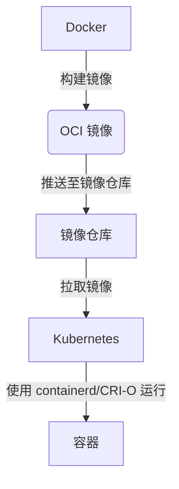

## 介绍

Docker 是现代容器技术的先驱，它通过简化应用程序的打包、分发和运行，彻底改变了软件开发和部署的方式。然而，随着容器技术的普及，标准化变得至关重要。这就是**开放容器倡议（Open Container Initiative, OCI）**的由来。OCI 是一个由 Linux 基金会支持的开源项目，旨在为容器运行时和镜像格式制定开放标准。

本文将带你了解 Docker 与 OCI 的关系，探讨 OCI 的目标及其对容器生态系统的影响。

## 什么是开放容器倡议（OCI）？

开放容器倡议（OCI）成立于2015年，由 Docker 和其他行业领导者共同发起。它的目标是制定一套开放的标准，确保容器技术的互操作性和可移植性。OCI 主要关注两个核心规范：

1. **容器运行时规范（Runtime Specification）**：定义了如何运行容器的标准接口。
2. **容器镜像规范（Image Specification）**：定义了容器镜像的格式和内容。

通过标准化，OCI 确保了不同容器运行时（如 Docker、containerd、CRI-O）之间的兼容性，使开发者能够在不同平台上无缝运行容器。

## Docker 与 OCI 的关系

Docker 是 OCI 的主要贡献者之一。Docker 的容器运行时（`runc`）和镜像格式（Docker Image）成为了 OCI 规范的基础。以下是 Docker 与 OCI 的关键联系：

- **`runc`**：Docker 开发了 `runc`，这是一个轻量级的容器运行时，符合 OCI 的运行时规范。`runc` 是 Docker 引擎的核心组件之一。
- **Docker 镜像**：Docker 镜像格式被 OCI 采纳为基础，形成了 OCI 镜像规范。这意味着 Docker 镜像可以直接用于其他符合 OCI 标准的运行时。

:::tip
Docker 的 `runc` 是 OCI 运行时规范的参考实现。如果你想深入了解容器运行时的工作原理，可以从 `runc` 开始。
:::

## OCI 的实际应用

### 1. 跨平台容器运行

OCI 的标准化使得容器可以在不同的运行时和平台上运行。例如，你可以使用 Docker 构建一个容器镜像，然后在 Kubernetes 中使用 `containerd` 运行它。

```bash
# 使用 Docker 构建镜像
docker build -t my-app .

# 将镜像保存为 tar 文件
docker save my-app -o my-app.tar

# 使用 containerd 加载并运行镜像
ctr -n k8s.io images import my-app.tar
ctr -n k8s.io run my-app my-container
```

### 2. 镜像格式的兼容性

OCI 镜像规范确保了镜像格式的兼容性。以下是一个简单的 OCI 镜像结构示例：

```plaintext
my-app/
├── blobs/
│   └── sha256/
│       ├── 123456... (镜像层)
│       └── 789abc... (镜像层)
├── oci-layout
└── index.json
```

这种结构使得镜像可以在不同的运行时之间共享和分发。

## 实际案例：Kubernetes 与 OCI

Kubernetes 是一个广泛使用的容器编排平台，它支持多种符合 OCI 标准的运行时，如 `containerd` 和 `CRI-O`。通过 OCI 规范，Kubernetes 可以无缝管理由 Docker 或其他工具构建的容器。



:::note
Kubernetes 的容器运行时接口（CRI）与 OCI 运行时规范紧密集成，确保了容器编排的灵活性和可扩展性。
:::

## 总结

开放容器倡议（OCI）为容器技术制定了开放标准，确保了容器运行时和镜像格式的互操作性和可移植性。Docker 作为 OCI 的主要贡献者，通过 `runc` 和 Docker 镜像格式推动了容器生态系统的标准化。

通过 OCI，开发者可以更自由地选择工具和平台，而不必担心兼容性问题。无论是 Docker、Kubernetes 还是其他容器技术，OCI 都为其提供了坚实的基础。

## 附加资源与练习

### 资源
- [OCI 官方网站](https://opencontainers.org/)
- [Docker 文档](https://docs.docker.com/)
- [Kubernetes 文档](https://kubernetes.io/docs/)

### 练习
1. 使用 Docker 构建一个简单的应用镜像，并将其导出为 OCI 镜像格式。
2. 尝试在 Kubernetes 中使用 `containerd` 运行一个由 Docker 构建的镜像。
3. 阅读 OCI 的运行时规范和镜像规范，了解其技术细节。

通过实践和深入学习，你将更好地理解 Docker 与 OCI 的关系，并掌握容器技术的核心原理。