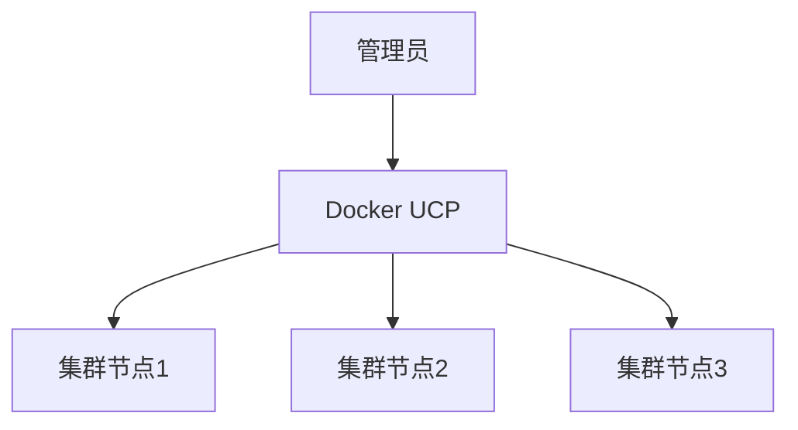

## 介绍

Docker企业版（Docker Enterprise）是Docker公司为企业用户提供的高级容器化解决方案。它不仅包含了Docker社区版的所有功能，还提供了额外的企业级特性，如高级安全性、集中化管理、支持多平台部署等。这些特性使得Docker企业版成为大型企业和组织在构建、部署和管理容器化应用时的首选工具。

## Docker 企业版的核心特性

### 1. 高级安全性

Docker企业版提供了多层次的安全机制，确保容器化应用的安全性。这些安全机制包括：

- **镜像签名**：确保只有经过验证的镜像才能在环境中运行。
- **安全扫描**：自动扫描镜像中的漏洞，并提供修复建议。
- **基于角色的访问控制（RBAC）**：允许管理员为不同用户分配不同的权限，确保只有授权用户才能访问敏感资源。

```bash
# 示例：启用镜像签名
docker trust sign my-image:latest
```

### 2. 集中化管理

Docker企业版提供了集中化的管理工具，使得管理员可以轻松管理大规模的容器集群。这些工具包括：

- **Docker Universal Control Plane (UCP)**：一个基于Web的管理界面，允许管理员监控和管理Docker集群。
- **Docker Trusted Registry (DTR)**：一个私有的镜像仓库，支持镜像的存储、管理和分发。



### 3. 多平台支持

Docker企业版支持多种操作系统和云平台，包括Linux、Windows、AWS、Azure等。这使得企业可以在不同的环境中无缝部署和管理容器化应用。

```bash
# 示例：在AWS上部署Docker企业版
docker run -d --name ucp \
  -v /var/run/docker.sock:/var/run/docker.sock \
  docker/ucp:3.2.0 install \
  --host-address <AWS_EC2_PUBLIC_IP> \
  --admin-username admin \
  --admin-password <PASSWORD>
```

### 4. 企业级支持

Docker企业版用户可以获得Docker公司的专业支持服务，包括24/7的技术支持、定期的安全更新和补丁、以及优先访问新功能和特性。

## 实际应用场景

### 场景1：金融行业的容器化应用

一家大型银行需要将其核心业务系统迁移到容器化环境中。通过使用Docker企业版，该银行能够：

- 确保镜像的安全性，防止恶意代码的注入。
- 使用UCP集中管理数千个容器实例，确保系统的高可用性和可扩展性。
- 在多个数据中心和云平台之间无缝迁移应用，确保业务的连续性。

### 场景2：电商平台的高峰期扩展

一家电商平台在促销活动期间需要快速扩展其服务能力。通过使用Docker企业版，该平台能够：

- 在几分钟内启动数百个新的容器实例，以应对突发的流量高峰。
- 使用DTR管理镜像的分发，确保所有实例都使用最新的、经过验证的镜像。
- 通过UCP监控系统的性能，及时发现并解决潜在的问题。

## 总结

Docker企业版为企业用户提供了强大的容器化解决方案，涵盖了从安全性到管理工具的各个方面。通过使用Docker企业版，企业可以更高效地构建、部署和管理容器化应用，从而提升业务的灵活性和竞争力。

## 附加资源

- [Docker企业版官方文档](https://docs.docker.com/ee/)
- [Docker UCP用户指南](https://docs.docker.com/ee/ucp/)
- [Docker Trusted Registry (DTR) 使用手册](https://docs.docker.com/ee/dtr/)

## 练习

1. 尝试在你的本地环境中安装Docker企业版，并配置UCP和DTR。
2. 使用Docker企业版的安全扫描功能，扫描一个现有的Docker镜像，并查看扫描结果。
3. 在AWS或Azure上部署一个简单的容器化应用，并使用Docker企业版进行管理。

:::tip
如果你在练习过程中遇到问题，可以参考Docker官方文档或社区论坛，获取更多帮助。
:::