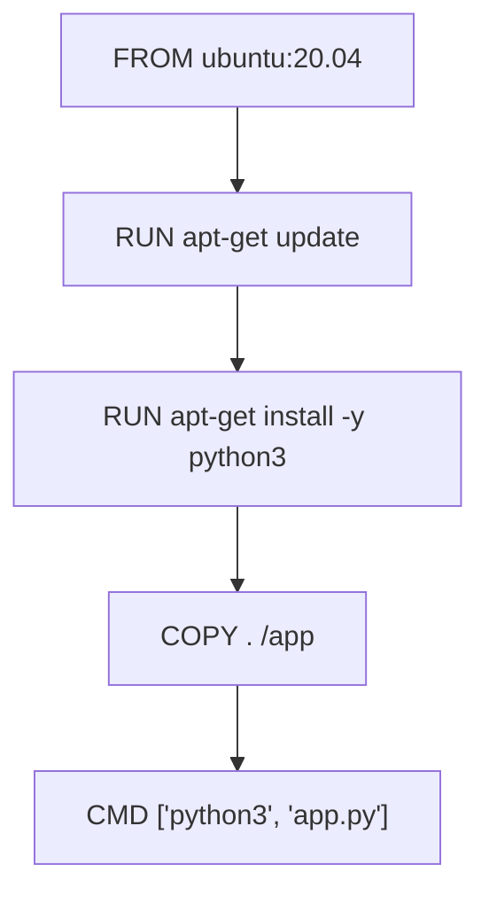

## 介绍

Docker镜像是Docker容器的基础。它们包含了运行应用程序所需的所有依赖项和配置。然而，在使用Docker时，你可能会遇到各种与镜像相关的问题，例如镜像构建失败、镜像拉取失败或镜像层缓存问题。本文将帮助你逐步排查和解决这些常见问题。

## 镜像构建失败

### 1. 检查Dockerfile

Dockerfile是构建Docker镜像的蓝图。如果镜像构建失败，首先检查Dockerfile是否有语法错误或逻辑问题。

```dockerfile
# 示例Dockerfile
FROM ubuntu:20.04
RUN apt-get update && apt-get install -y python3
COPY . /app
WORKDIR /app
CMD ["python3", "app.py"]
```

:::caution
确保每个命令都正确无误。例如，`RUN apt-get update && apt-get install -y python3` 中的 `-y` 选项用于自动确认安装，避免构建过程中断。
:::

### 2. 查看构建日志

构建失败时，Docker会输出详细的日志信息。仔细阅读日志，找出导致失败的具体步骤。

```bash
docker build -t my-app .
```

:::note
如果构建失败，Docker会输出类似以下的错误信息：
```
Step 3/5 : COPY . /app
COPY failed: stat /var/lib/docker/tmp/docker-builder123456789/app: no such file or directory
```
:::

### 3. 清理缓存

有时，Docker的构建缓存可能导致问题。你可以通过 `--no-cache` 选项禁用缓存，重新构建镜像。

```bash
docker build --no-cache -t my-app .
```

## 镜像拉取问题

### 1. 检查镜像名称和标签

确保你使用的镜像名称和标签是正确的。例如，`ubuntu:20.04` 是一个有效的镜像名称和标签组合。

```bash
docker pull ubuntu:20.04
```

:::warning
如果镜像名称或标签拼写错误，Docker会返回类似以下的错误：
```
Error response from daemon: pull access denied for ubuntu, repository does not exist or may require 'docker login'
```
:::

### 2. 检查网络连接

镜像拉取失败可能是由于网络问题导致的。确保你的网络连接正常，并且可以访问Docker Hub。

```bash
ping hub.docker.com
```

:::tip
如果你在公司网络中使用代理，可能需要配置Docker的代理设置。
:::

### 3. 登录Docker Hub

如果你尝试拉取私有镜像，确保你已经登录到Docker Hub。

```bash
docker login
```

## 镜像层缓存问题

### 1. 理解镜像层

Docker镜像由多个层组成，每个层代表Dockerfile中的一个指令。Docker会缓存这些层以加速后续构建。



### 2. 清理未使用的镜像层

随着时间的推移，未使用的镜像层可能会占用大量磁盘空间。你可以使用以下命令清理未使用的镜像层：

```bash
docker image prune -a
```

:::caution
`docker image prune -a` 会删除所有未使用的镜像层，包括那些未被任何容器引用的镜像。
:::

## 实际案例

### 案例1：镜像构建失败

假设你在构建一个Python应用程序的Docker镜像时遇到以下错误：

```
Step 3/5 : COPY . /app
COPY failed: stat /var/lib/docker/tmp/docker-builder123456789/app: no such file or directory
```

**解决方案：**

1. 确保当前目录下有 `app.py` 文件。
2. 检查Dockerfile中的 `COPY . /app` 指令是否正确。

### 案例2：镜像拉取失败

假设你在拉取一个私有镜像时遇到以下错误：

```
Error response from daemon: pull access denied for my-private-repo/my-app, repository does not exist or may require 'docker login'
```

**解决方案：**

1. 确保你已经登录到Docker Hub。
2. 检查镜像名称和标签是否正确。

## 总结

Docker镜像问题排查是Docker使用过程中不可避免的一部分。通过仔细检查Dockerfile、查看构建日志、清理缓存以及确保网络连接正常，你可以有效地解决大多数镜像相关的问题。

## 附加资源

- [Docker官方文档](https://docs.docker.com/)
- [Dockerfile最佳实践](https://docs.docker.com/develop/develop-images/dockerfile_best-practices/)
- [Docker镜像管理](https://docs.docker.com/engine/reference/commandline/image/)

## 练习

1. 尝试构建一个简单的Docker镜像，并故意引入一个错误，观察Docker的输出日志。
2. 使用 `docker image prune -a` 清理未使用的镜像层，并观察磁盘空间的变化。
