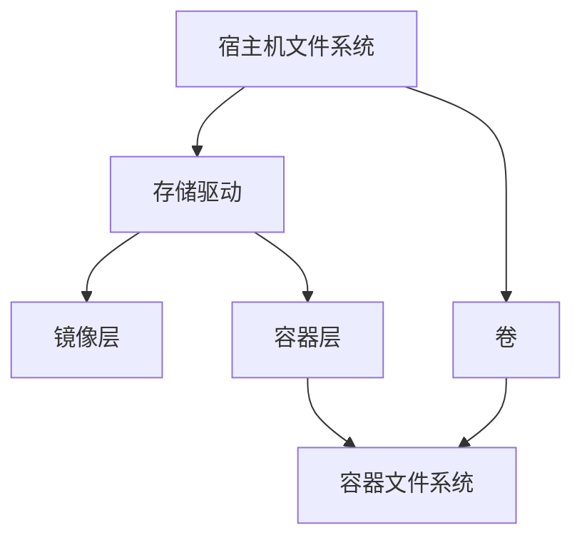

# Docker 存储模型

Docker存储模型是Docker容器技术中一个重要的组成部分，它负责管理容器中数据的存储和持久化。对于初学者来说，理解Docker存储模型是掌握容器化技术的关键一步。本文将详细介绍Docker存储模型的基本概念、工作原理以及实际应用场景。

## 什么是Docker存储模型？

Docker存储模型是指Docker容器在运行过程中如何管理和存储数据的方式。Docker容器本身是轻量级的、可移植的，但它们的数据存储需要一种机制来确保数据的持久性和一致性。Docker存储模型通过多种存储驱动和卷（Volume）机制来实现这一点。

### 存储驱动

Docker使用存储驱动（Storage Driver）来管理容器的文件系统。存储驱动负责将容器的读写操作映射到宿主机的文件系统上。常见的存储驱动包括：

- `overlay2`：适用于大多数Linux发行版，性能较好。
- `aufs`：早期的存储驱动，逐渐被`overlay2`取代。
- `btrfs`：适用于使用Btrfs文件系统的宿主机。
- `zfs`：适用于使用ZFS文件系统的宿主机。

:::tip
默认情况下，Docker会根据宿主机的文件系统自动选择最佳的存储驱动。你可以通过`docker info`命令查看当前使用的存储驱动。
:::

### 卷（Volume）

卷是Docker中用于持久化数据的一种机制。与容器的文件系统不同，卷是独立于容器的生命周期存在的，即使容器被删除，卷中的数据仍然可以保留。卷通常用于存储数据库文件、配置文件等需要持久化的数据。

## Docker 存储模型的工作原理

Docker存储模型的核心在于如何将容器的文件系统与宿主机的文件系统进行映射。以下是Docker存储模型的基本工作原理：

1. **镜像层（Image Layer）**：Docker镜像由多个只读层组成，每一层都包含文件系统的一部分。这些层是只读的，不能被修改。

2. **容器层（Container Layer）**：当容器启动时，Docker会在镜像层之上创建一个可写层（也称为容器层）。所有对文件系统的修改都发生在这一层。

3. **存储驱动**：存储驱动负责将镜像层和容器层组合在一起，形成一个统一的文件系统视图。存储驱动还负责将文件系统的读写操作映射到宿主机的文件系统上。

4. **卷**：卷是宿主机上的一个目录，Docker将其挂载到容器中。卷中的数据是持久化的，即使容器被删除，卷中的数据仍然存在。



## 实际应用场景

### 场景1：数据库持久化

假设你正在运行一个MySQL数据库容器，并且希望数据库文件在容器重启或删除后仍然保留。你可以使用Docker卷来实现这一点。

```bash
docker run -d --name mysql-container -v mysql-data:/var/lib/mysql -e MYSQL_ROOT_PASSWORD=my-secret-pw mysql:latest
```

在这个命令中，`-v mysql-data:/var/lib/mysql`表示将名为`mysql-data`的卷挂载到容器中的`/var/lib/mysql`目录。这样，即使容器被删除，数据库文件仍然会保留在`mysql-data`卷中。

### 场景2：配置文件管理

假设你有一个Web应用容器，并且希望将配置文件存储在宿主机上，以便在容器重启时可以快速恢复配置。你可以使用绑定挂载（Bind Mount）来实现这一点。

```bash
docker run -d --name web-app -v /path/to/config:/app/config my-web-app:latest
```

在这个命令中，`-v /path/to/config:/app/config`表示将宿主机的`/path/to/config`目录挂载到容器中的`/app/config`目录。这样，配置文件可以方便地在宿主机上进行编辑和管理。

## 总结

Docker存储模型是Docker容器技术中不可或缺的一部分，它通过存储驱动和卷机制实现了容器数据的持久化和高效管理。对于初学者来说，理解Docker存储模型的基本概念和工作原理是掌握容器化技术的重要一步。

在实际应用中，Docker存储模型可以用于数据库持久化、配置文件管理等多种场景。通过合理使用卷和存储驱动，你可以确保容器中的数据在容器生命周期之外仍然可用。

## 附加资源与练习

- **练习1**：尝试在一个MySQL容器中使用卷来持久化数据库文件，并验证在容器删除后数据是否仍然存在。
- **练习2**：使用绑定挂载将宿主机的配置文件挂载到一个Web应用容器中，并尝试在宿主机上修改配置文件，观察容器中的变化。

:::note
更多关于Docker存储模型的详细信息，可以参考[Docker官方文档](https://docs.docker.com/storage/)。
:::