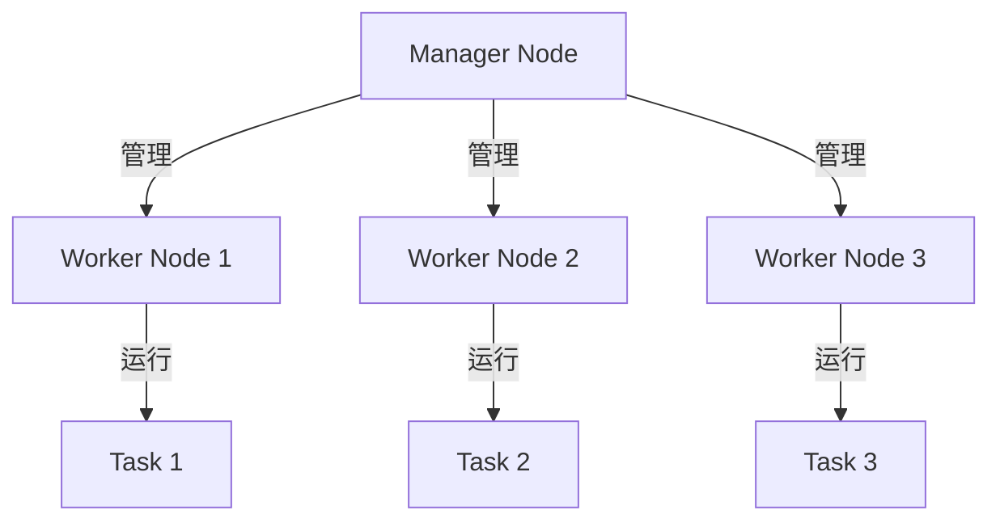

## 什么是Docker Swarm？

Docker Swarm 是 Docker 官方提供的容器编排工具，用于管理和调度多个 Docker 容器。它允许你将多个 Docker 主机组成一个集群，并在集群中部署和管理容器化应用。Docker Swarm 的核心目标是简化容器编排，使开发者能够轻松扩展和管理分布式应用。

:::note
Docker Swarm 是 Docker 原生的编排工具，与 Kubernetes 相比，它更轻量级且易于上手，适合中小型项目或初学者。
:::

---

## Docker Swarm 架构概述

Docker Swarm 的架构由以下几个核心组件组成：

1. **Manager 节点**：负责集群的管理和调度任务。它维护集群的状态、调度服务，并处理来自客户端的请求。
2. **Worker 节点**：运行实际的服务任务（容器）。Worker 节点接收来自 Manager 节点的指令，并执行容器化应用的部署。
3. **服务（Service）**：定义需要在集群中运行的容器化应用。服务可以指定副本数量、网络配置等。
4. **任务（Task）**：服务的最小单元，代表一个正在运行的容器实例。
5. **负载均衡**：Docker Swarm 内置负载均衡功能，自动将流量分发到服务的各个实例。

以下是一个简单的 Docker Swarm 架构图：



---

## Docker Swarm 的核心组件

### 1. Manager 节点

Manager 节点是 Docker Swarm 集群的“大脑”。它负责以下任务：
- 维护集群的状态（通过 Raft 一致性算法）。
- 调度服务任务到 Worker 节点。
- 处理客户端请求（如创建服务、扩展服务等）。

:::caution
为了保证高可用性，建议在生产环境中至少部署 3 个 Manager 节点，以避免单点故障。
:::

### 2. Worker 节点

Worker 节点是实际运行容器的地方。它们接收来自 Manager 节点的指令，并启动、停止或更新容器。Worker 节点不参与集群管理，只专注于执行任务。

### 3. 服务（Service）

服务是 Docker Swarm 的核心概念。它定义了需要在集群中运行的容器化应用。一个服务可以包含多个任务（即容器实例），并且可以指定副本数量、网络配置、存储卷等。

例如，以下命令创建一个包含 3 个副本的 Nginx 服务：

```bash
docker service create --name nginx --replicas 3 -p 80:80 nginx
```

### 4. 任务（Task）

任务是服务的最小单元，代表一个正在运行的容器实例。每个任务都会被调度到一个 Worker 节点上运行。如果某个任务失败，Swarm 会自动重新调度一个新的任务。

### 5. 负载均衡

Docker Swarm 内置了负载均衡功能。当客户端访问服务时，Swarm 会自动将流量分发到服务的各个实例。例如，如果你有 3 个 Nginx 容器，Swarm 会将请求均匀分配到这些容器中。

---

## Docker Swarm 的实际应用场景

### 场景 1：Web 应用的高可用部署

假设你有一个 Web 应用，需要部署到多个服务器上以实现高可用性。使用 Docker Swarm，你可以轻松实现这一点：

1. 初始化 Swarm 集群：
   ```bash
   docker swarm init
   ```
2. 在其他节点上加入集群：
   ```bash
   docker swarm join --token <token> <manager-ip>:2377
   ```
3. 部署 Web 应用服务：
   ```bash
   docker service create --name web-app --replicas 5 -p 8080:80 my-web-app
   ```

这样，你的 Web 应用将在 5 个容器中运行，Swarm 会自动处理负载均衡和故障恢复。

### 场景 2：数据库服务的扩展

如果你需要扩展数据库服务，可以使用 Docker Swarm 的全局模式（`--mode global`）。全局模式会在每个 Worker 节点上运行一个任务实例：

```bash
docker service create --name db --mode global -e MYSQL_ROOT_PASSWORD=secret mysql
```

---

## 总结

Docker Swarm 是一个简单而强大的容器编排工具，适合初学者和中小型项目。它的架构清晰，核心组件包括 Manager 节点、Worker 节点、服务和任务。通过 Swarm，你可以轻松实现高可用、负载均衡和自动故障恢复。

---

## 附加资源与练习

### 资源
- [Docker 官方文档 - Swarm 模式](https://docs.docker.com/engine/swarm/)
- [Docker Swarm 入门指南](https://www.docker.com/blog/getting-started-with-docker-swarm-mode/)

### 练习
1. 尝试在本地机器上初始化一个 Docker Swarm 集群。
2. 创建一个包含 3 个副本的 Nginx 服务，并观察 Swarm 的负载均衡行为。
3. 模拟一个 Worker 节点故障，观察 Swarm 如何自动恢复服务。

通过实践，你将更深入地理解 Docker Swarm 的工作原理和应用场景。