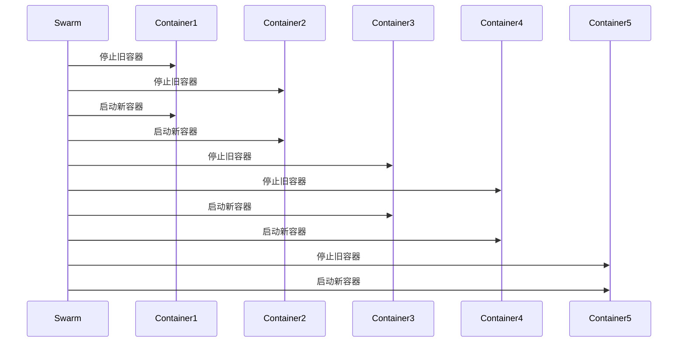

# Docker Swarm 滚动更新

在 Docker Swarm 中，滚动更新是一种在不中断服务的情况下逐步更新服务的方法。它允许您逐步替换旧版本的容器实例，同时确保服务始终可用。这对于需要高可用性和零停机时间的生产环境尤为重要。

## 什么是滚动更新？

滚动更新是一种逐步替换服务中旧容器实例的过程。在 Docker Swarm 中，您可以通过配置更新策略来控制更新的速度和方式。Swarm 会逐步停止旧容器并启动新容器，直到所有容器都更新为新版本。

### 为什么需要滚动更新？

- **零停机时间**：滚动更新确保服务在更新过程中始终可用。
- **高可用性**：通过逐步替换容器，Swarm 可以确保服务不会因为所有容器同时更新而中断。
- **回滚能力**：如果更新出现问题，可以轻松回滚到之前的版本。

## 如何配置滚动更新？

在 Docker Swarm 中，您可以通过 `docker service update` 命令或直接在服务定义中配置滚动更新策略。以下是一个示例服务定义，展示了如何配置滚动更新：

```yaml
version: '3.8'

services:
  web:
    image: nginx:1.20
    deploy:
      replicas: 5
      update_config:
        parallelism: 2
        delay: 10s
        order: start-first
```

### 参数解释

- **parallelism**：每次更新时同时替换的容器数量。在上面的示例中，每次更新会替换 2 个容器。
- **delay**：在替换下一批容器之前等待的时间。在上面的示例中，每次更新后等待 10 秒。
- **order**：更新顺序。`start-first` 表示先启动新容器，再停止旧容器，确保服务不中断。

## 实际案例

假设您有一个运行 Nginx 的 Docker Swarm 服务，并且您希望将 Nginx 从版本 `1.20` 更新到 `1.21`。您可以使用以下命令进行滚动更新：

```bash
docker service update --image nginx:1.21 web
```

Swarm 会根据您在服务定义中配置的更新策略逐步替换容器。例如，如果 `parallelism` 设置为 2，Swarm 会一次替换 2 个容器，并在每次替换后等待 10 秒。

### 更新过程示例



在上面的示例中，Swarm 会逐步替换所有容器，确保服务在更新过程中始终可用。

## 总结

Docker Swarm 的滚动更新功能使得在不中断服务的情况下更新容器成为可能。通过配置更新策略，您可以控制更新的速度和顺序，确保服务的高可用性。

### 附加资源

- [Docker 官方文档 - 服务更新](https://docs.docker.com/engine/swarm/swarm-tutorial/rolling-update/)
- [Docker Swarm 部署策略](https://docs.docker.com/engine/swarm/how-swarm-mode-works/services/)

### 练习

1. 创建一个包含 3 个副本的 Nginx 服务，并配置滚动更新策略，使其每次更新 1 个容器，并在每次更新后等待 5 秒。
2. 尝试将 Nginx 从版本 `1.20` 更新到 `1.21`，并观察更新过程。

通过实践这些练习，您将更好地理解 Docker Swarm 的滚动更新机制。