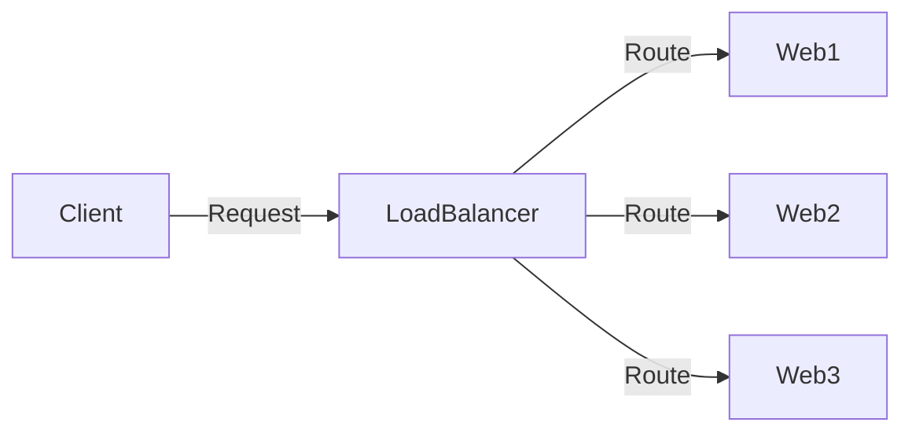

# Docker Swarm 服务发现

在 Docker Swarm 中，**服务发现**是一个关键功能，它允许容器在集群中动态地找到彼此并进行通信。服务发现机制使得容器无需知道其他容器的具体 IP 地址或位置，只需通过服务名称即可访问。这对于构建分布式应用程序至关重要，尤其是在微服务架构中。

## 什么是服务发现？

服务发现是一种机制，用于在分布式系统中自动检测和定位服务实例。在 Docker Swarm 中，服务发现通过内置的 DNS 和负载均衡器实现。当你在 Swarm 中创建一个服务时，Docker 会自动为该服务分配一个唯一的 DNS 名称，其他服务可以通过这个名称访问它。

:::note
服务发现的核心思想是解耦服务的位置信息，使得服务之间的通信更加灵活和可靠。
:::

## Docker Swarm 中的服务发现机制

在 Docker Swarm 中，服务发现主要通过以下两种方式实现：

1. **DNS 解析**：每个服务都会被分配一个 DNS 名称，其他服务可以通过这个名称访问它。
2. **内置负载均衡**：Docker Swarm 会自动将请求分发到服务的所有实例，确保负载均衡和高可用性。

### DNS 解析示例

假设我们在 Swarm 中创建了一个名为 `web` 的服务，Docker 会自动为其分配一个 DNS 名称 `web`。其他服务可以通过 `web` 这个名称访问该服务，而无需关心其具体的 IP 地址。

```bash
# 创建一个名为 web 的服务
docker service create --name web --replicas 3 nginx
```

在另一个服务中，你可以通过以下方式访问 `web` 服务：

```bash
curl http://web
```

Docker Swarm 会自动将请求路由到 `web` 服务的某个实例。

### 内置负载均衡

Docker Swarm 内置了负载均衡器，它会自动将请求分发到服务的所有实例。例如，如果你有 3 个 `web` 服务的实例，Swarm 会确保请求均匀地分发到这些实例上。



:::tip
负载均衡不仅提高了系统的可用性，还确保了资源的合理利用。
:::

## 实际应用场景

### 场景 1：微服务架构中的服务通信

在微服务架构中，服务之间需要频繁通信。通过 Docker Swarm 的服务发现机制，每个微服务只需知道其他服务的名称即可进行通信，而无需关心它们的具体位置。

例如，假设你有两个微服务：`user-service` 和 `order-service`。`order-service` 需要调用 `user-service` 来获取用户信息。通过服务发现，`order-service` 只需通过 `http://user-service` 即可访问 `user-service`。

### 场景 2：负载均衡和高可用性

假设你有一个高流量的 Web 应用程序，你需要确保即使在某个实例崩溃的情况下，应用程序仍然可以正常运行。通过 Docker Swarm 的服务发现和负载均衡机制，你可以轻松地扩展服务实例，并确保请求被均匀地分发到所有实例上。

```bash
# 扩展 web 服务到 5 个实例
docker service scale web=5
```

## 总结

Docker Swarm 的服务发现机制使得容器间的通信变得更加简单和可靠。通过 DNS 解析和内置负载均衡，你可以轻松地构建高可用、可扩展的分布式应用程序。

:::caution
虽然服务发现简化了容器间的通信，但在设计应用程序时仍需考虑网络延迟和故障处理。
:::

## 附加资源与练习

1. **练习**：尝试在 Docker Swarm 中创建两个服务，并通过服务名称让它们互相通信。
2. **进一步学习**：阅读 Docker 官方文档中关于 [Swarm 模式](https://docs.docker.com/engine/swarm/) 的更多内容。
3. **挑战**：在 Swarm 中部署一个包含多个微服务的应用程序，并测试服务发现和负载均衡的效果。

通过掌握 Docker Swarm 的服务发现机制，你将能够更好地管理和扩展你的容器化应用程序。