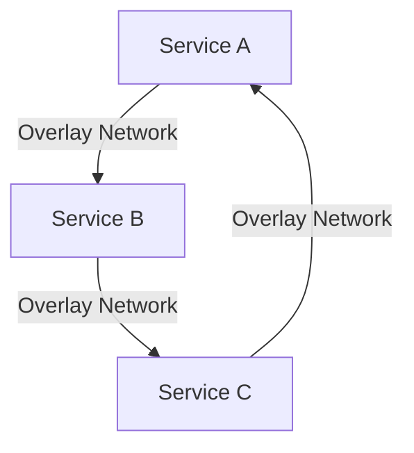

# Docker Swarm 网络

Docker Swarm 是 Docker 的原生集群管理工具，允许你将多个 Docker 主机组合成一个虚拟的 Docker 引擎。在 Swarm 模式下，网络管理是一个关键部分，因为它决定了容器之间如何通信以及如何与外部世界交互。本文将详细介绍 Docker Swarm 网络的基础知识，帮助你理解其工作原理、配置方法以及实际应用场景。

## 什么是 Docker Swarm 网络？

Docker Swarm 网络是 Swarm 模式下用于管理容器之间通信的机制。它允许你在 Swarm 集群中创建和管理多个网络，每个网络可以包含多个服务（Services）。Swarm 网络的主要功能包括：

- **服务发现**：自动为服务分配 DNS 名称，使得服务之间可以通过名称相互访问。
- **负载均衡**：Swarm 会自动为服务分配负载均衡器，确保流量均匀分布到所有容器实例。
- **网络隔离**：不同的网络可以隔离服务，确保只有特定网络中的服务可以相互通信。

## Docker Swarm 网络的类型

在 Docker Swarm 中，主要有以下几种网络类型：

1. **Overlay 网络**：这是 Swarm 模式下最常用的网络类型，用于跨多个主机的容器通信。Overlay 网络允许不同主机上的容器通过虚拟网络进行通信。
2. **Bridge 网络**：Bridge 网络是单主机网络，通常用于本地开发环境。在 Swarm 模式下，Bridge 网络的作用有限。
3. **Host 网络**：Host 网络允许容器直接使用主机的网络栈，适用于需要高性能的场景。
4. **Macvlan 网络**：Macvlan 网络允许容器直接连接到物理网络，每个容器都有自己的 MAC 地址。

### Overlay 网络示例

以下是一个创建 Overlay 网络的示例：

```bash
docker network create --driver overlay my_overlay_network
```

创建完成后，你可以使用以下命令查看网络列表：

```bash
docker network ls
```

输出可能如下：

```
NETWORK ID     NAME                DRIVER    SCOPE
abc123def456   my_overlay_network   overlay   swarm
```

## 如何在 Swarm 中使用网络

在 Swarm 模式下，你可以为服务指定网络。以下是一个创建服务并将其连接到 Overlay 网络的示例：

```bash
docker service create --name my_service --network my_overlay_network nginx
```

在这个示例中，`my_service` 服务将使用 `my_overlay_network` 网络进行通信。

### 服务发现与负载均衡

Swarm 会自动为服务分配 DNS 名称，并且通过内置的负载均衡器将流量分发到所有容器实例。例如，如果你有多个 `my_service` 实例，Swarm 会自动将请求分发到这些实例。

## 实际应用场景

### 场景 1：微服务架构

在微服务架构中，通常会有多个服务需要相互通信。使用 Docker Swarm 的 Overlay 网络，你可以轻松地为每个服务创建独立的网络，并确保它们之间的通信是安全的。



### 场景 2：多环境部署

在开发、测试和生产环境中，你可能需要为每个环境创建独立的网络。使用 Docker Swarm 网络，你可以轻松地为每个环境创建独立的 Overlay 网络，确保环境之间的隔离。

## 总结

Docker Swarm 网络是 Swarm 模式下管理容器通信的关键组件。通过 Overlay 网络，你可以轻松地在多个主机之间创建虚拟网络，确保服务之间的通信是安全和高效的。本文介绍了 Docker Swarm 网络的基础知识、配置方法以及实际应用场景，希望对你理解和使用 Docker Swarm 网络有所帮助。

## 附加资源与练习

- **官方文档**：[Docker Swarm 网络文档](https://docs.docker.com/network/swarm/)
- **练习**：尝试在本地环境中创建一个 Swarm 集群，并使用 Overlay 网络部署多个服务，观察它们之间的通信方式。

:::tip
如果你在练习中遇到问题，可以参考 Docker 官方文档或社区论坛，获取更多帮助。
:::