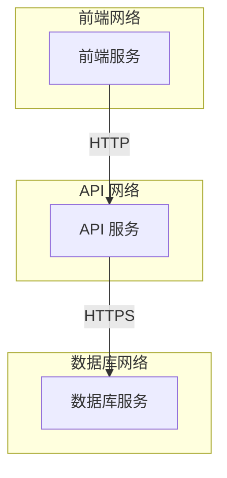

## 介绍

Docker 是一个强大的容器化平台，允许开发者将应用程序及其依赖项打包到一个轻量级的容器中。然而，随着容器化技术的普及，网络安全问题也变得越来越重要。Docker 网络安全涉及保护容器之间的通信、管理网络访问权限以及防止潜在的网络攻击。

在本教程中，我们将逐步讲解 Docker 网络安全的基础知识，并通过实际案例帮助您理解如何在实际应用中保护容器化应用程序。

## Docker 网络基础

在 Docker 中，每个容器都有自己的网络栈，这意味着容器之间默认是隔离的。Docker 提供了多种网络模式，包括：

- **桥接网络（Bridge Network）**：默认网络模式，容器通过虚拟网络桥接与主机通信。
- **主机网络（Host Network）**：容器直接使用主机的网络栈，没有网络隔离。
- **无网络（None Network）**：容器没有网络接口，完全隔离。
- **覆盖网络（Overlay Network）**：用于跨多个 Docker 主机的容器通信。

### 桥接网络示例

让我们创建一个简单的桥接网络并运行两个容器：

```bash
# 创建一个自定义桥接网络
docker network create my_bridge_network

# 运行第一个容器
docker run -d --name container1 --network my_bridge_network alpine sleep 3600

# 运行第二个容器
docker run -d --name container2 --network my_bridge_network alpine sleep 3600
```

在这个示例中，`container1` 和 `container2` 可以通过容器名称相互通信，因为它们位于同一个桥接网络中。

## Docker 网络安全策略

### 1. 网络隔离

网络隔离是 Docker 网络安全的基础。通过将容器放置在不同的网络中，可以限制容器之间的通信。例如，您可以将前端容器和后端容器放置在不同的网络中，以减少攻击面。

```bash
# 创建前端网络和后端网络
docker network create frontend_network
docker network create backend_network

# 运行前端容器
docker run -d --name frontend --network frontend_network nginx

# 运行后端容器
docker run -d --name backend --network backend_network my_backend_app
```

在这个示例中，`frontend` 和 `backend` 容器位于不同的网络中，无法直接通信。

### 2. 使用网络策略

Docker 允许您通过 `--publish` 或 `-p` 选项将容器的端口映射到主机端口。然而，暴露过多的端口可能会增加安全风险。建议仅暴露必要的端口，并使用防火墙规则限制访问。

```bash
# 仅暴露必要的端口
docker run -d --name web_app -p 80:80 nginx
```

### 3. 使用 TLS 加密通信

对于需要加密的通信，可以使用 TLS（传输层安全协议）来保护容器之间的数据传输。例如，您可以在 Nginx 容器中配置 TLS 以加密 HTTP 流量。

```bash
# 运行带有 TLS 配置的 Nginx 容器
docker run -d --name secure_nginx -p 443:443 -v /path/to/certs:/etc/nginx/certs nginx
```

### 4. 使用 Docker 安全扫描工具

Docker 提供了安全扫描工具，可以帮助您检测容器镜像中的漏洞。通过定期扫描镜像，您可以确保容器运行在安全的环境中。

```bash
# 扫描容器镜像
docker scan my_image
```

## 实际案例：保护微服务架构

假设您有一个微服务架构，包含前端服务、API 服务和数据库服务。为了保护这个架构，您可以采取以下措施：

1. **网络隔离**：将前端服务、API 服务和数据库服务放置在不同的网络中。
2. **限制端口暴露**：仅暴露前端服务的 HTTP 端口和 API 服务的 HTTPS 端口。
3. **使用 TLS**：为 API 服务配置 TLS 加密。
4. **定期扫描镜像**：使用 Docker 安全扫描工具定期检查镜像中的漏洞。



## 总结

Docker 网络安全是保护容器化应用程序的重要环节。通过理解 Docker 网络基础、实施网络隔离、限制端口暴露、使用 TLS 加密以及定期扫描镜像，您可以显著提高容器化应用程序的安全性。

## 附加资源

- [Docker 官方文档](https://docs.docker.com/)
- [Docker 安全最佳实践](https://docs.docker.com/engine/security/)
- [Docker 网络配置指南](https://docs.docker.com/network/)

## 练习

1. 创建一个自定义桥接网络，并运行两个容器，确保它们可以相互通信。
2. 使用 Docker 安全扫描工具扫描一个现有的容器镜像，查看是否存在漏洞。
3. 配置一个 Nginx 容器，使用 TLS 加密 HTTP 流量。

通过完成这些练习，您将更好地理解 Docker 网络安全的概念，并能够在实际项目中应用这些知识。