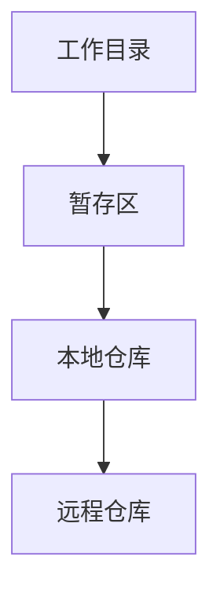

# Git 简介

Git是一个分布式版本控制系统，广泛用于跟踪代码的变化、协作开发以及管理项目的历史记录。无论你是独立开发者还是团队的一员，Git都能帮助你更高效地管理代码。

## 什么是Git？

Git是由Linus Torvalds于2005年创建的，最初是为了管理Linux内核的开发。它的设计目标是快速、高效地处理从小型到大型项目的版本控制需求。Git的核心思想是**分布式**，这意味着每个开发者的本地仓库都包含完整的项目历史记录，而不仅仅是一个快照。

### 版本控制的重要性

在软件开发中，代码会不断变化。如果没有版本控制，你将很难跟踪这些变化，尤其是在多人协作的情况下。Git允许你：

- 记录每次代码的修改
- 回滚到之前的版本
- 并行开发多个功能
- 合并不同开发者的代码

## Git 的基本概念

### 仓库（Repository）

仓库是Git的核心概念。它是一个包含项目所有文件和版本历史的目录。仓库可以是本地的，也可以是远程的（例如托管在GitHub或GitLab上）。

### 提交（Commit）

提交是Git中的一个重要操作，它记录了项目在某个时间点的状态。每次提交都会生成一个唯一的哈希值，用于标识这次提交。

```bash
git commit -m "Initial commit"
```

### 分支（Branch）

分支允许你在同一个项目中并行开发不同的功能。默认情况下，Git会创建一个名为`main`（或`master`）的主分支。你可以创建新的分支来开发新功能，而不会影响主分支。

```bash
git branch new-feature
git checkout new-feature
```

### 合并（Merge）

当你完成一个分支的开发后，你可以将其合并回主分支。Git会自动尝试合并代码，如果有冲突，你需要手动解决。

```bash
git checkout main
git merge new-feature
```

## Git 的实际应用场景

### 场景1：独立开发

假设你正在开发一个个人项目。你可以使用Git来记录每次的代码修改。例如：

```bash
git add .
git commit -m "Added new feature"
```

### 场景2：团队协作

在团队开发中，Git可以帮助你管理不同开发者的代码。每个人可以在自己的分支上工作，最后将代码合并到主分支。

```bash
git checkout -b feature-branch
# 开发代码...
git add .
git commit -m "Completed feature"
git checkout main
git merge feature-branch
```

## Git 的工作流程

为了更好地理解Git的工作原理，我们可以通过以下Mermaid图表来展示Git的基本工作流程：



1. **工作目录**：你在本地编辑的文件。
2. **暂存区**：你使用`git add`命令将文件添加到暂存区。
3. **本地仓库**：你使用`git commit`命令将暂存区的文件提交到本地仓库。
4. **远程仓库**：你使用`git push`命令将本地仓库的更改推送到远程仓库。

## 总结

Git是一个强大的工具，能够帮助你高效地管理代码的版本和协作开发。通过掌握Git的基本概念和操作，你可以更好地管理你的项目，并与团队成员无缝协作。

:::tip 提示
如果你刚刚开始学习Git，建议从简单的命令开始，例如`git init`、`git add`、`git commit`和`git push`。随着你对Git的熟悉，你可以逐步学习更高级的功能，如分支管理、合并和冲突解决。
:::

## 附加资源

- [Pro Git 书籍](https://git-scm.com/book/zh/v2) - 一本免费的Git学习书籍，适合初学者和高级用户。
- [Git官方文档](https://git-scm.com/doc) - 官方提供的Git文档，涵盖了所有命令和选项。

## 练习

1. 创建一个新的Git仓库，并提交你的第一个文件。
2. 创建一个新的分支，并在该分支上开发一个新功能，最后将其合并回主分支。
3. 尝试使用`git log`命令查看提交历史。

通过这些练习，你将更好地理解Git的基本操作和工作流程。