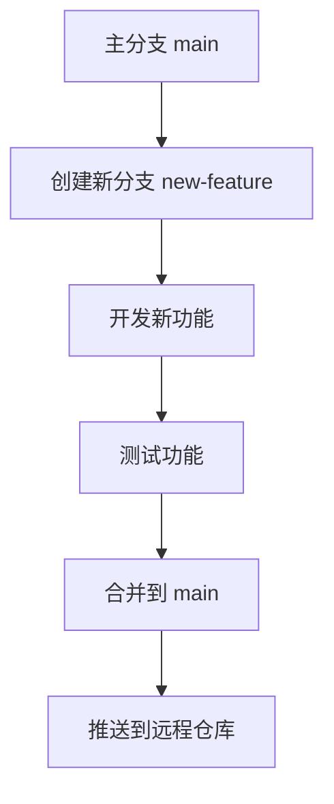

## 什么是 Git 版本控制？

Git 是一种分布式版本控制系统，用于跟踪文件的变化并协调多人协作开发。它允许开发者记录代码的历史版本，并在需要时回滚到之前的版本。Git 的核心目标是帮助团队高效管理代码，同时确保代码的安全性和可追溯性。

:::note
版本控制系统（Version Control System, VCS）是一种记录文件变化的工具，常用于软件开发中管理代码的版本。
:::

## Git 的核心概念

### 1. 仓库（Repository）
仓库是 Git 的核心组成部分，它是一个包含项目所有文件和版本历史的目录。仓库可以是本地的（存储在您的计算机上）或远程的（存储在服务器上，如 GitHub 或 GitLab）。

```bash
# 初始化一个新的 Git 仓库
git init
```

执行上述命令后，Git 会在当前目录中创建一个隐藏的 `.git` 文件夹，用于存储版本控制所需的所有信息。

### 2. 提交（Commit）
提交是 Git 中记录文件变化的基本单位。每次提交都会创建一个快照，保存当前工作目录的状态。提交信息通常包括一个简短的描述，以便开发者了解这次提交的目的。

```bash
# 添加文件到暂存区
git add filename.txt

# 提交更改
git commit -m "添加了新的功能"
```

:::tip
提交信息应简洁明了，描述清楚本次更改的内容和目的。
:::

### 3. 分支（Branch）
分支是 Git 中用于并行开发的功能。每个分支代表一个独立的工作流，允许开发者在不影响主分支的情况下进行实验或开发新功能。

```bash
# 创建一个新分支
git branch new-feature

# 切换到新分支
git checkout new-feature
```

:::caution
在切换分支之前，请确保当前分支的更改已提交或暂存，否则可能会丢失未保存的更改。
:::

### 4. 合并（Merge）
合并是将两个分支的更改整合到一起的操作。通常用于将功能分支的更改合并到主分支中。

```bash
# 切换到主分支
git checkout main

# 将 new-feature 分支合并到主分支
git merge new-feature
```

:::warning
合并时可能会发生冲突（Conflict），需要手动解决冲突后再提交。
:::

### 5. 远程仓库（Remote Repository）
远程仓库是存储在服务器上的 Git 仓库，通常用于团队协作。开发者可以将本地仓库的更改推送到远程仓库，或从远程仓库拉取最新的更改。

```bash
# 添加远程仓库
git remote add origin https://github.com/username/repository.git

# 将本地更改推送到远程仓库
git push origin main
```

## 实际应用场景

假设您正在开发一个网站，并且需要添加一个新功能。以下是使用 Git 的典型工作流程：

1. **创建新分支**：从主分支（`main`）创建一个新分支（`new-feature`）。
2. **开发功能**：在新分支上编写代码并提交更改。
3. **测试功能**：确保新功能正常工作。
4. **合并到主分支**：将新功能分支合并到主分支。
5. **推送到远程仓库**：将主分支的更改推送到远程仓库，以便团队其他成员同步更新。



## 总结

Git 是一个强大的版本控制工具，掌握其核心概念（如仓库、提交、分支和合并）是学习 Git 的基础。通过使用 Git，您可以更高效地管理代码，并与团队成员协作开发项目。

## 附加资源与练习

- **练习**：尝试在本地创建一个 Git 仓库，添加一些文件并提交更改。然后创建一个新分支，进行一些修改并合并到主分支。
- **资源**：
  - [Pro Git 书籍](https://git-scm.com/book/zh/v2)（中文版）
  - [Git 官方文档](https://git-scm.com/doc)

通过不断实践和探索，您将逐渐掌握 Git 的更多高级功能！