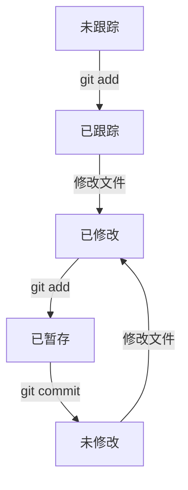

## 介绍

在Git中，文件的状态是理解版本控制的核心概念之一。Git通过跟踪文件的状态来管理项目的变更。每个文件在Git中都有其特定的状态，这些状态决定了文件在版本控制中的行为。理解这些状态对于有效地使用Git至关重要。

## Git 文件状态概述

Git中的文件状态可以分为以下几种：

1. **未跟踪（Untracked）**：文件未被Git管理，Git不会跟踪其变更。
2. **已跟踪（Tracked）**：文件已被Git管理，Git会跟踪其变更。已跟踪的文件又可以分为以下几种状态：
   - **未修改（Unmodified）**：文件自上次提交以来未被修改。
   - **已修改（Modified）**：文件自上次提交以来已被修改。
   - **已暂存（Staged）**：文件的修改已被暂存，准备提交。

:::tip
你可以使用 `git status` 命令查看当前工作目录中文件的状态。
:::

## 文件状态的生命周期

文件在Git中的状态会随着你的操作而变化。以下是一个典型的文件状态生命周期：

1. **未跟踪 -> 已跟踪**：当你第一次将文件添加到Git仓库时，文件从未跟踪状态变为已跟踪状态。
2. **已跟踪 -> 已修改**：当你对文件进行修改后，文件状态变为已修改。
3. **已修改 -> 已暂存**：当你使用 `git add` 命令将修改的文件添加到暂存区时，文件状态变为已暂存。
4. **已暂存 -> 未修改**：当你提交暂存区的文件后，文件状态变为未修改。



## 实际案例

假设你有一个名为 `example.txt` 的文件，以下是该文件在Git中的状态变化过程：

1. **未跟踪状态**：你创建了一个新文件 `example.txt`，但尚未将其添加到Git仓库。

   ```bash
   $ git status
   On branch main
   Untracked files:
     (use "git add <file>..." to include in what will be committed)
           example.txt
   ```

2. **已跟踪状态**：你使用 `git add` 命令将 `example.txt` 添加到Git仓库。

   ```bash
   $ git add example.txt
   $ git status
   On branch main
   Changes to be committed:
     (use "git restore --staged <file>..." to unstage)
           new file:   example.txt
   ```

3. **已修改状态**：你对 `example.txt` 进行了修改。

   ```bash
   $ echo "Hello, Git!" > example.txt
   $ git status
   On branch main
   Changes to be committed:
     (use "git restore --staged <file>..." to unstage)
           new file:   example.txt

   Changes not staged for commit:
     (use "git add <file>..." to update what will be committed)
     (use "git restore <file>..." to discard changes in working directory)
           modified:   example.txt
   ```

4. **已暂存状态**：你再次使用 `git add` 命令将修改后的 `example.txt` 添加到暂存区。

   ```bash
   $ git add example.txt
   $ git status
   On branch main
   Changes to be committed:
     (use "git restore --staged <file>..." to unstage)
           modified:   example.txt
   ```

5. **未修改状态**：你提交了暂存区的文件。

   ```bash
   $ git commit -m "Add example.txt"
   [main 1a2b3c4] Add example.txt
    1 file changed, 1 insertion(+)
    create mode 100644 example.txt
   $ git status
   On branch main
   nothing to commit, working tree clean
   ```

## 总结

理解Git文件状态是掌握Git版本控制的基础。通过 `git status` 命令，你可以随时查看文件的状态，并根据需要执行相应的操作。无论是添加新文件、修改现有文件，还是提交变更，文件状态的变化都会帮助你更好地管理项目。

:::caution
请记住，未跟踪的文件不会被Git管理，因此如果你希望Git跟踪某个文件，务必使用 `git add` 命令将其添加到Git仓库。
:::

## 附加资源与练习

- **练习**：创建一个新文件，尝试将其从未跟踪状态变为已跟踪状态，然后进行修改并提交。
- **资源**：阅读 [Git官方文档](https://git-scm.com/doc) 以深入了解Git文件状态及其相关命令。