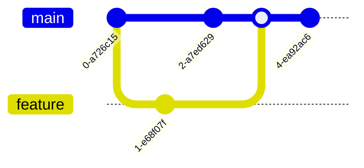

## 介绍

Git日志是Git版本控制系统中一个强大的工具，它记录了项目的所有提交历史。通过分析Git日志，你可以了解项目的演变过程、排查问题、追踪代码变更，甚至优化团队的工作流程。本文将带你逐步学习如何使用Git日志分析来解决实际问题。

## 基本Git日志命令

### 查看完整日志

要查看项目的完整提交历史，可以使用以下命令：

```bash
git log
```

这将显示每个提交的详细信息，包括提交哈希、作者、日期和提交信息。

### 简化日志输出

如果你只想查看简化的提交历史，可以使用 `--oneline` 选项：

```bash
git log --oneline
```

这将只显示每个提交的简短哈希和提交信息。

### 查看特定文件的日志

如果你想查看某个文件的提交历史，可以使用以下命令：

```bash
git log <file-path>
```

例如，查看 `README.md` 文件的提交历史：

```bash
git log README.md
```

## 高级日志分析

### 按作者过滤日志

你可以通过 `--author` 选项来过滤某个作者的提交：

```bash
git log --author="John Doe"
```

### 按日期范围过滤日志

如果你想查看某个日期范围内的提交，可以使用 `--since` 和 `--until` 选项：

```bash
git log --since="2023-01-01" --until="2023-12-31"
```

### 查看分支合并历史

要查看分支的合并历史，可以使用 `--graph` 选项：

```bash
git log --graph --oneline
```

这将显示一个可视化的分支合并历史图。



## 实际案例

### 案例1：排查引入Bug的提交

假设你在项目中发现了一个Bug，但不确定是哪个提交引入的。你可以使用 `git bisect` 命令来二分查找引入Bug的提交。

1. 启动二分查找：

   ```bash
   git bisect start
   ```

2. 标记当前版本为有Bug：

   ```bash
   git bisect bad
   ```

3. 标记一个已知没有Bug的旧版本：

   ```bash
   git bisect good <commit-hash>
   ```

4. Git会自动切换到中间的提交，你可以测试是否有Bug，然后标记为 `good` 或 `bad`，直到找到引入Bug的提交。

### 案例2：分析团队的工作流程

通过分析Git日志，你可以了解团队成员的工作习惯和项目进展。例如，你可以使用以下命令查看每个作者的提交数量：

```bash
git shortlog -s -n
```

这将显示每个作者的提交次数，帮助你了解谁在项目中贡献最多。

## 总结

Git日志分析是Git中一个非常强大的工具，它可以帮助你排查问题、理解项目历史以及优化工作流程。通过本文的学习，你应该已经掌握了基本的Git日志命令和一些高级用法。希望这些知识能帮助你在实际项目中更好地使用Git。

## 附加资源

- [Git官方文档](https://git-scm.com/doc)
- [Pro Git书籍](https://git-scm.com/book/en/v2)
- [Git教程 - Atlassian](https://www.atlassian.com/git/tutorials)

## 练习

1. 使用 `git log --oneline` 查看你当前项目的提交历史。
2. 尝试使用 `git bisect` 来查找一个已知Bug的引入提交。
3. 使用 `git shortlog -s -n` 查看你团队中每个成员的提交次数。

:::tip
记得定期查看Git日志，了解项目的进展和团队成员的工作情况。这将有助于你更好地管理项目和团队。
:::