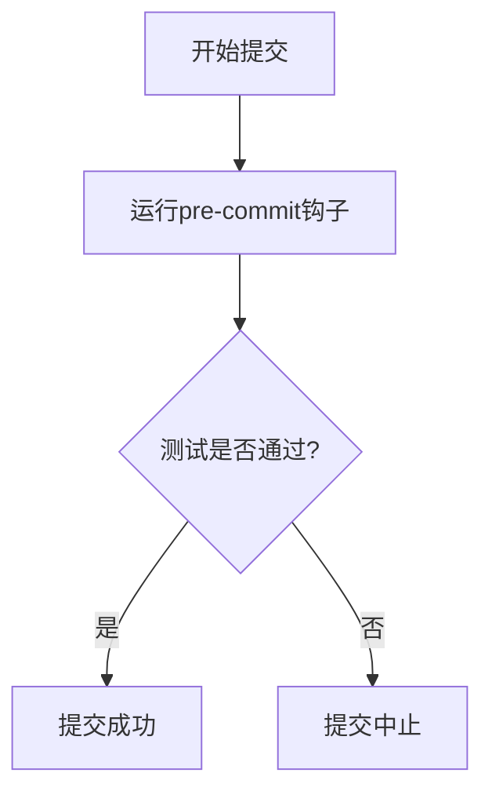

# Git 钩子扩展

Git钩子（Git Hooks）是Git提供的一种机制，允许你在特定的Git事件发生时自动执行脚本。通过Git钩子扩展，你可以自定义Git的行为，例如在提交代码前运行测试、在推送代码前检查代码风格等。本文将详细介绍Git钩子的概念、使用方法以及实际应用场景。

## 什么是Git钩子？

Git钩子是存储在 `.git/hooks` 目录下的脚本文件。当Git执行某些操作时（如提交、推送、合并等），它会自动触发这些脚本。Git钩子分为客户端钩子和服务器端钩子，客户端钩子运行在本地开发环境中，而服务器端钩子运行在远程仓库中。

:::note
Git钩子脚本可以是任何可执行文件，例如Shell脚本、Python脚本等。
:::

## Git 钩子的类型

Git提供了多种钩子类型，以下是一些常见的客户端钩子：

- **pre-commit**：在提交代码之前运行，常用于代码风格检查或运行测试。
- **commit-msg**：在提交信息被保存后运行，可用于验证提交信息的格式。
- **pre-push**：在推送代码之前运行，常用于检查代码是否符合推送条件。

## 如何创建Git钩子？

要创建一个Git钩子，你需要在 `.git/hooks` 目录下创建一个与钩子类型同名的可执行文件。例如，要创建一个 `pre-commit` 钩子，可以按照以下步骤操作：

1. 进入你的Git仓库目录：
   ```bash
   cd /path/to/your/repo
   ```

2. 创建 `pre-commit` 钩子文件：
   ```bash
   touch .git/hooks/pre-commit
   ```

3. 赋予脚本执行权限：
   ```bash
   chmod +x .git/hooks/pre-commit
   ```

4. 编辑 `pre-commit` 文件，添加你希望执行的脚本。例如，以下是一个简单的 `pre-commit` 钩子，用于在提交前运行代码格式化工具：

   ```bash
   #!/bin/sh
   echo "Running pre-commit hook..."
   # 运行代码格式化工具
   prettier --write .
   ```

:::tip
你可以使用任何编程语言编写Git钩子脚本，只需确保脚本文件是可执行的。
:::

## 实际案例：自动运行测试

假设你希望在每次提交代码前自动运行测试，以确保代码质量。你可以通过 `pre-commit` 钩子来实现这一目标。

1. 创建 `pre-commit` 钩子文件：
   ```bash
   touch .git/hooks/pre-commit
   chmod +x .git/hooks/pre-commit
   ```

2. 编辑 `pre-commit` 文件，添加以下内容：

   ```bash
   #!/bin/sh
   echo "Running tests before commit..."
   # 运行测试
   npm test
   if [ $? -ne 0 ]; then
     echo "Tests failed. Commit aborted."
     exit 1
   fi
   ```

3. 现在，每次你尝试提交代码时，Git都会自动运行测试。如果测试失败，提交将被中止。

:::caution
如果钩子脚本返回非零退出码，Git将中止当前操作。因此，请确保你的钩子脚本在成功时返回0，失败时返回1。
:::

## 使用Mermaid绘制Git钩子流程图

以下是一个简单的流程图，展示了 `pre-commit` 钩子的执行过程：



## 总结

Git钩子是一种强大的工具，可以帮助你自动化Git工作流，提升开发效率。通过自定义Git钩子，你可以在提交、推送等操作前后执行特定的任务，例如运行测试、格式化代码等。本文介绍了Git钩子的基本概念、创建方法以及实际应用场景，希望对你有所帮助。

## 附加资源与练习

- **练习**：尝试创建一个 `commit-msg` 钩子，用于验证提交信息的格式是否符合规范。
- **资源**：阅读Git官方文档中关于[Git钩子](https://git-scm.com/docs/githooks)的更多信息。

:::warning
请谨慎使用Git钩子，确保钩子脚本不会影响团队其他成员的开发流程。
:::