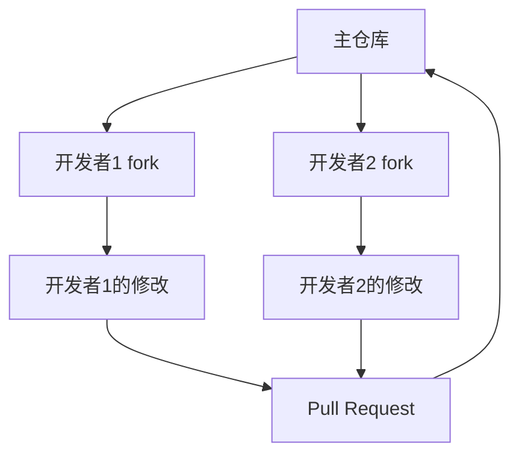

## 什么是Git托管平台？

Git托管平台是基于Git版本控制系统的在线服务，允许开发者存储、管理和协作开发代码。Git本身是一个分布式版本控制系统，而Git托管平台则提供了远程仓库的托管服务，使得开发者可以轻松地共享代码、协作开发以及管理项目。

常见的Git托管平台包括GitHub、GitLab、Bitbucket等。这些平台不仅提供了代码托管功能，还集成了问题跟踪、代码审查、持续集成等工具，极大地提高了开发效率。

## 为什么需要Git托管平台？

1. **代码备份与共享**：Git托管平台允许你将代码存储在远程服务器上，确保代码的安全性和可访问性。
2. **团队协作**：多个开发者可以在同一个项目上协作，通过分支、合并请求等功能高效地管理代码变更。
3. **版本控制**：Git托管平台提供了完整的版本控制功能，帮助你跟踪代码的每一次变更。
4. **自动化工具集成**：许多Git托管平台支持与CI/CD工具集成，自动化测试和部署流程。

## 常见的Git托管平台

### 1. GitHub
GitHub是最流行的Git托管平台之一，拥有庞大的开发者社区。它提供了丰富的功能，包括代码托管、问题跟踪、代码审查、持续集成等。

### 2. GitLab
GitLab是一个开源的Git托管平台，提供了与GitHub类似的功能，但更注重自托管和企业级解决方案。GitLab还内置了CI/CD工具，支持自动化构建和部署。

### 3. Bitbucket
Bitbucket是由Atlassian提供的Git托管平台，特别适合与Jira、Confluence等Atlassian工具集成。Bitbucket支持Git和Mercurial两种版本控制系统。

## 如何使用Git托管平台？

### 1. 创建远程仓库
在Git托管平台上创建一个新的仓库非常简单。以GitHub为例：

1. 登录GitHub账户。
2. 点击右上角的“+”按钮，选择“New repository”。
3. 填写仓库名称、描述等信息，选择公开或私有。
4. 点击“Create repository”完成创建。

### 2. 克隆远程仓库
创建仓库后，你可以通过以下命令将远程仓库克隆到本地：

```bash
git clone https://github.com/username/repository-name.git
```

### 3. 推送代码到远程仓库
在本地完成代码修改后，可以通过以下命令将代码推送到远程仓库：

```bash
git add .
git commit -m "Your commit message"
git push origin main
```

### 4. 拉取远程仓库的更新
如果其他开发者对远程仓库进行了修改，你可以通过以下命令拉取最新的代码：

```bash
git pull origin main
```

## 实际案例

假设你正在开发一个开源项目，并希望与全球的开发者协作。你可以将项目托管在GitHub上，创建一个公开的仓库。其他开发者可以通过`fork`你的仓库，创建自己的分支进行开发，然后通过`Pull Request`将他们的修改合并到主仓库中。



## 总结

Git托管平台是现代软件开发中不可或缺的工具，它们不仅提供了代码托管的功能，还极大地简化了团队协作和项目管理。通过选择合适的Git托管平台，你可以更高效地管理代码，提升开发效率。

## 附加资源

- [Git官方文档](https://git-scm.com/doc)
- [GitHub Guides](https://guides.github.com/)
- [GitLab Documentation](https://docs.gitlab.com/)
- [Bitbucket Tutorials](https://www.atlassian.com/git/tutorials/learn-git-with-bitbucket-cloud)

## 练习

1. 在GitHub上创建一个新的仓库，并将本地项目推送到该仓库。
2. 邀请一位朋友协作开发，尝试使用分支和合并请求功能。
3. 探索GitLab或Bitbucket，比较它们与GitHub的异同。

:::tip
如果你在练习中遇到问题，可以查阅相关文档或向社区寻求帮助。Git托管平台通常有活跃的社区支持。
:::