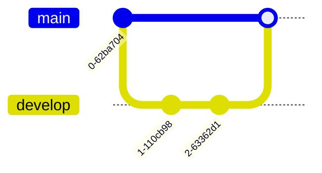

# Git 托管平台管理

Git托管平台是现代软件开发中不可或缺的工具，它允许开发者协作管理代码库，跟踪变更，并确保代码的安全性和可追溯性。本文将带你了解Git托管平台的核心管理功能，帮助你从零开始掌握这些技能。

## 什么是Git托管平台？

Git托管平台是基于Git版本控制系统的在线服务，允许用户创建、管理和协作开发代码库。常见的Git托管平台包括GitHub、GitLab和Bitbucket。这些平台不仅提供了代码托管功能，还集成了问题跟踪、持续集成、代码审查等工具。

## 创建和管理仓库

### 创建新仓库

在Git托管平台上创建新仓库非常简单。以下是GitHub上的操作步骤：

1. 登录到你的GitHub账户。
2. 点击右上角的“+”按钮，选择“New repository”。
3. 填写仓库名称、描述，并选择公开或私有。
4. 点击“Create repository”完成创建。

### 克隆仓库到本地

创建仓库后，你可以将其克隆到本地进行开发：

```bash
git clone https://github.com/username/repository-name.git
```

### 管理仓库设置

在仓库的设置页面，你可以配置仓库的可见性、协作者权限、分支保护规则等。例如，设置分支保护规则可以防止直接推送到主分支，确保代码质量。

## 权限管理

### 添加协作者

在Git托管平台上，你可以为仓库添加协作者，并为他们分配不同的权限。例如，在GitHub上：

1. 进入仓库的“Settings”页面。
2. 选择“Manage access”。
3. 点击“Invite a collaborator”并输入对方的GitHub用户名或邮箱。

### 权限级别

不同的Git托管平台提供不同的权限级别。以GitHub为例，常见的权限级别包括：

- **Read**：只能查看代码。
- **Write**：可以推送代码和创建分支。
- **Admin**：可以管理仓库设置和协作者。

## 分支策略

### 主分支与开发分支

常见的分支策略包括主分支（`main`或`master`）和开发分支（`develop`）。主分支用于发布稳定版本，而开发分支用于日常开发。



### 功能分支

每个新功能应在单独的分支上开发，完成后合并到开发分支：

```bash
git checkout -b feature/new-feature
# 开发完成后
git checkout develop
git merge feature/new-feature
```

## 协作流程

### Pull Request（PR）

Pull Request是Git托管平台上协作开发的核心机制。开发者通过PR将代码变更提交给团队审查，审查通过后合并到主分支。

1. 在功能分支上完成开发后，推送分支到远程仓库：
   ```bash
   git push origin feature/new-feature
   ```
2. 在Git托管平台上创建PR，选择目标分支（如`develop`）。
3. 团队成员审查代码，提出修改建议。
4. 审查通过后，合并PR。

### 代码审查

代码审查是确保代码质量的重要步骤。在PR中，审查者可以逐行评论代码，提出改进建议。开发者根据反馈修改代码后，可以重新提交审查。

## 实际案例

### 案例：团队协作开发新功能

假设你和你的团队正在开发一个新功能。以下是典型的协作流程：

1. 你从`develop`分支创建一个新分支`feature/new-feature`。
2. 在本地开发完成后，推送分支并创建PR。
3. 团队成员审查代码，提出修改建议。
4. 你根据反馈修改代码，重新提交审查。
5. 审查通过后，PR被合并到`develop`分支。

## 总结

Git托管平台管理是软件开发中的核心技能。通过本文，你学习了如何创建和管理仓库、设置权限、制定分支策略以及协作开发。掌握这些技能将帮助你在团队中高效协作，确保代码质量和项目进度。

## 附加资源与练习

- **练习**：在GitHub上创建一个新仓库，尝试克隆、创建分支、提交PR并合并。
- **资源**：
  - [GitHub Docs](https://docs.github.com/)
  - [GitLab Docs](https://docs.gitlab.com/)
  - [Bitbucket Docs](https://support.atlassian.com/bitbucket-cloud/)

通过不断实践和探索，你将更加熟练地使用Git托管平台，成为一名高效的开发者。