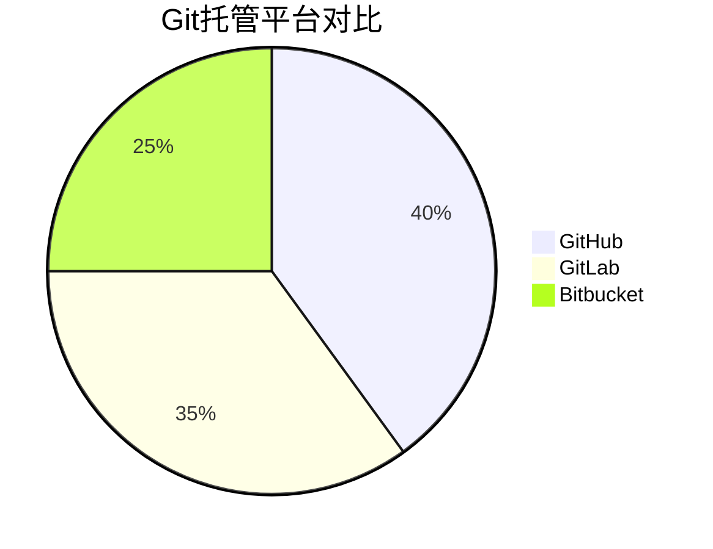

# Git 托管平台对比

在编程和软件开发中，Git是一个广泛使用的版本控制系统，而Git托管平台则是用于存储和管理Git仓库的在线服务。对于初学者来说，选择一个合适的Git托管平台非常重要，因为它不仅影响团队协作的效率，还决定了项目的可维护性和扩展性。本文将介绍几种常见的Git托管平台，并对它们的功能、优缺点进行对比。

## 什么是Git托管平台？

Git托管平台是一个在线服务，允许开发者将Git仓库存储在云端，并提供协作、代码审查、问题跟踪等功能。通过这些平台，团队成员可以轻松地共享代码、协作开发，并管理项目的整个生命周期。

常见的Git托管平台包括：

- **GitHub**
- **GitLab**
- **Bitbucket**

接下来，我们将逐一介绍这些平台，并对比它们的主要功能。

---

## Git Hub

GitHub 是目前最流行的Git托管平台之一，拥有庞大的开发者社区和丰富的功能。它支持公开和私有仓库，并提供强大的协作工具。

### 主要功能

- **代码托管**：支持Git仓库的存储和管理。
- **Pull Requests**：用于代码审查和合并请求。
- **Issues**：用于任务管理和问题跟踪。
- **Actions**：自动化CI/CD（持续集成/持续交付）工具。
- **社区支持**：开源项目可以通过GitHub获得广泛的社区支持。

### 优点

- 用户界面友好，适合初学者。
- 强大的社区和生态系统。
- 丰富的集成工具和插件。

### 缺点

- 私有仓库需要付费（免费用户只能使用公开仓库）。
- 对于小型团队或个人开发者，功能可能过于复杂。

### 适用场景

- 开源项目。
- 需要强大社区支持的项目。
- 需要复杂CI/CD流程的团队。

---

## Git Lab

GitLab 是一个功能全面的DevOps平台，不仅提供Git仓库托管，还集成了CI/CD、项目管理等功能。

### 主要功能

- **代码托管**：支持Git仓库的存储和管理。
- **CI/CD**：内置的持续集成和持续交付工具。
- **项目管理**：包括问题跟踪、看板、里程碑等功能。
- **自托管选项**：支持在自己的服务器上部署GitLab。

### 优点

- 功能全面，适合DevOps团队。
- 提供免费的自托管选项。
- 内置CI/CD工具，无需额外配置。

### 缺点

- 用户界面相对复杂，初学者可能需要时间适应。
- 免费版的存储和功能有限。

### 适用场景

- 需要完整DevOps解决方案的团队。
- 需要自托管选项的企业。

---

## Bitbucket

Bitbucket 是由Atlassian开发的Git托管平台，主要面向企业和团队，与Jira、Confluence等工具深度集成。

### 主要功能

- **代码托管**：支持Git和Mercurial仓库。
- **Pull Requests**：用于代码审查和合并请求。
- **CI/CD**：通过Bitbucket Pipelines实现。
- **Jira集成**：与Atlassian的其他工具无缝集成。

### 优点

- 与Atlassian生态系统深度集成。
- 免费提供私有仓库（适用于小型团队）。
- 适合企业级用户。

### 缺点

- 社区支持较弱，适合开源项目的功能有限。
- 用户界面不如GitHub直观。

### 适用场景

- 使用Atlassian工具（如Jira、Confluence）的团队。
- 需要私有仓库的小型团队。

---

## 对比总结

以下是对GitHub、GitLab和Bitbucket的简要对比：

| 特性            | GitHub          | GitLab          | Bitbucket       |
|-----------------|-----------------|-----------------|-----------------|
| **代码托管**    | 支持            | 支持            | 支持            |
| **私有仓库**    | 付费            | 免费（有限）    | 免费（小型团队）|
| **CI/CD**       | GitHub Actions  | 内置CI/CD       | Bitbucket Pipelines |
| **社区支持**    | 强大            | 中等            | 较弱            |
| **自托管**      | 不支持          | 支持            | 不支持          |
| **集成工具**    | 丰富            | 丰富            | Atlassian生态系统|

---

## 实际案例

### 案例1：开源项目

如果你正在开发一个开源项目，GitHub是最佳选择。它的社区支持和可见性可以帮助你的项目获得更多的关注和贡献。

### 案例2：企业级DevOps

如果你的团队需要一个完整的DevOps解决方案，GitLab是更好的选择。它的内置CI/CD工具和自托管选项可以满足企业的需求。

### 案例3：小型团队

对于小型团队或个人开发者，Bitbucket提供免费的私有仓库，并且与Jira等工具的集成可以提高工作效率。

---

## 总结

选择合适的Git托管平台取决于你的项目需求、团队规模和工作流程。GitHub适合开源项目和需要强大社区支持的用户，GitLab适合需要完整DevOps解决方案的团队，而Bitbucket则适合使用Atlassian工具的小型团队。

---

## 附加资源

- [GitHub官方文档](https://docs.github.com/)
- [GitLab官方文档](https://docs.gitlab.com/)
- [Bitbucket官方文档](https://support.atlassian.com/bitbucket-cloud/)

## 练习

1. 在GitHub上创建一个公开仓库，并尝试提交你的第一个项目。
2. 使用GitLab的CI/CD功能，为你的项目配置一个简单的流水线。
3. 在Bitbucket上创建一个私有仓库，并将其与Jira集成。

通过实践，你将更好地理解这些平台的功能和适用场景。祝你学习愉快！