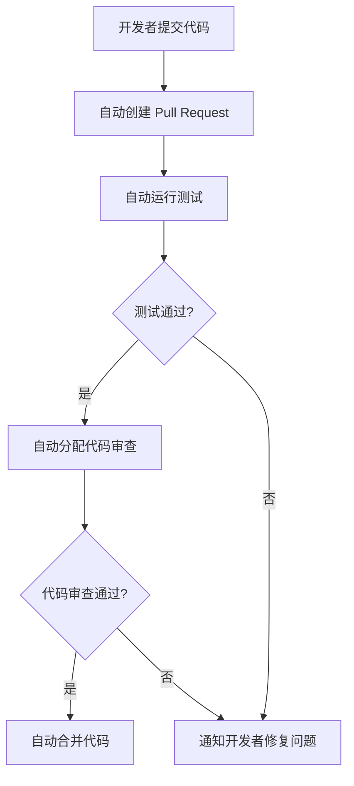

# Git 自动化实践

在现代软件开发中，Git 是不可或缺的版本控制工具。然而，随着项目规模的增大和团队协作的复杂化，手动执行 Git 操作可能会变得繁琐且容易出错。通过自动化 Git 操作，我们可以显著提高开发效率，减少人为错误，并确保代码库的一致性。本文将介绍 Git 自动化的基本概念、工具和实践方法，帮助初学者掌握这一技能。

## 什么是 Git 自动化？

Git 自动化是指通过脚本、工具或配置，自动执行常见的 Git 操作，例如提交代码、创建分支、合并代码等。自动化可以帮助开发者节省时间，减少重复性工作，并确保操作的一致性。

## 为什么需要 Git 自动化？

1. **提高效率**：自动化可以快速执行重复性任务，减少手动操作的时间。
2. **减少错误**：人为操作容易出错，自动化可以确保每次操作都按照预定的规则执行。
3. **一致性**：自动化可以确保团队成员遵循相同的流程，减少代码库中的不一致性。
4. **可扩展性**：随着项目规模的增大，自动化可以轻松扩展以适应更多的任务和团队成员。

## Git 自动化的常见场景

### 1. 自动提交代码

在某些情况下，你可能希望自动提交代码，例如在完成某个任务后自动生成提交信息并推送到远程仓库。以下是一个简单的 Bash 脚本示例：

```bash
#!/bin/bash

# 添加所有更改到暂存区
git add .

# 生成提交信息
commit_message="Auto commit on $(date +'%Y-%m-%d %H:%M:%S')"

# 提交更改
git commit -m "$commit_message"

# 推送到远程仓库
git push origin main
```

### 2. 自动创建分支

在开发新功能或修复 bug 时，通常需要创建新的分支。以下是一个自动创建分支的脚本：

```bash
#!/bin/bash

# 获取分支名称
branch_name="feature/$(date +'%Y%m%d%H%M%S')"

# 创建并切换到新分支
git checkout -b "$branch_name"

# 推送到远程仓库
git push origin "$branch_name"
```

### 3. 自动合并分支

在完成开发任务后，通常需要将分支合并到主分支。以下是一个自动合并分支的脚本：

```bash
#!/bin/bash

# 切换到主分支
git checkout main

# 拉取最新代码
git pull origin main

# 合并指定分支
git merge feature/new-feature

# 推送到远程仓库
git push origin main
```

## 使用 Git Hooks 实现自动化

Git Hooks 是 Git 提供的一种机制，允许你在特定的 Git 操作（如提交、推送等）前后执行自定义脚本。通过 Git Hooks，你可以实现更复杂的自动化流程。

### 1. 预提交钩子（pre-commit）

预提交钩子在每次提交代码之前执行。你可以使用它来运行代码格式化工具、静态分析工具等，以确保代码质量。

```bash
#!/bin/bash

# 运行代码格式化工具
npm run format

# 运行静态分析工具
npm run lint
```

### 2. 提交后钩子（post-commit）

提交后钩子在每次提交代码之后执行。你可以使用它来发送通知、更新文档等。

```bash
#!/bin/bash

# 发送提交通知
echo "Commit completed at $(date +'%Y-%m-%d %H:%M:%S')" | mail -s "Git Commit Notification" user@example.com
```

## 实际案例：自动化代码审查流程

假设你正在开发一个开源项目，并希望自动化代码审查流程。你可以使用以下步骤：

1. **创建 Pull Request**：开发者在完成功能开发后，自动创建 Pull Request。
2. **运行测试**：在 Pull Request 创建后，自动运行测试套件。
3. **代码审查**：自动分配代码审查任务，并通知相关开发者。
4. **合并代码**：在代码审查通过后，自动合并代码到主分支。

以下是一个简化的自动化流程示例：



## 总结

Git 自动化是现代软件开发中的重要实践，它可以帮助开发者提高效率、减少错误并确保代码库的一致性。通过脚本、Git Hooks 和自动化工具，你可以轻松实现各种 Git 操作的自动化。希望本文能帮助你理解 Git 自动化的基本概念，并开始在你的项目中应用这些实践。

## 附加资源

- [Git 官方文档](https://git-scm.com/doc)
- [Git Hooks 详解](https://git-scm.com/book/en/v2/Customizing-Git-Git-Hooks)
- [Bash 脚本教程](https://ryanstutorials.net/bash-scripting-tutorial/)

## 练习

1. 编写一个脚本，自动将当前分支合并到 `main` 分支，并推送到远程仓库。
2. 配置一个预提交钩子，确保每次提交前都运行代码格式化工具。
3. 尝试使用 Git Hooks 实现一个简单的代码审查流程。

通过完成这些练习，你将更深入地理解 Git 自动化的实际应用。