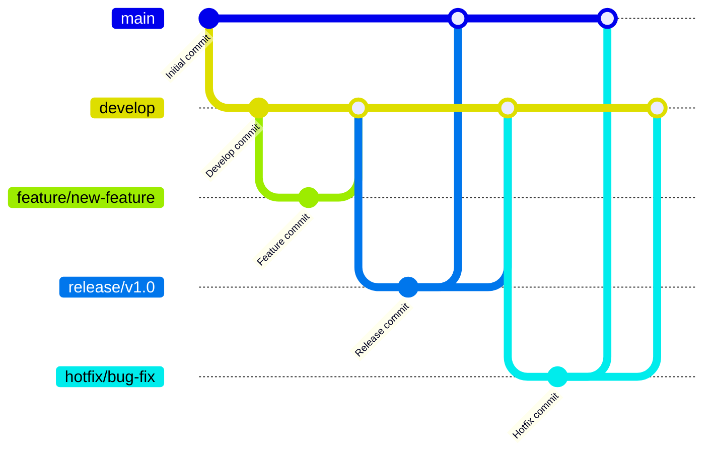

# Git 团队协作规范

在现代软件开发中，Git 是最常用的版本控制系统之一。它不仅帮助开发者管理代码的历史记录，还为团队协作提供了强大的工具。然而，如果没有明确的规范和流程，团队协作可能会变得混乱。本文将介绍 Git 团队协作的最佳实践，帮助你与团队成员高效协作。

## 1. 分支管理策略

分支是 Git 的核心功能之一，合理的分支管理策略是团队协作的基础。以下是常见的分支管理策略：

### 1.1 Git Flow

Git Flow 是一种经典的分支管理策略，适用于需要严格版本控制的团队。它的核心分支包括：

- **main**：主分支，存放稳定的生产代码。
- **develop**：开发分支，存放最新的开发代码。
- **feature/**：功能分支，用于开发新功能。
- **release/**：发布分支，用于准备发布版本。
- **hotfix/**：热修复分支，用于紧急修复生产环境中的问题。



### 1.2 GitHub Flow

GitHub Flow 是一种更简单的分支管理策略，适用于持续交付的团队。它的核心分支包括：

- **main**：主分支，存放可部署的代码。
- **feature/**：功能分支，用于开发新功能。

:::tip
GitHub Flow 强调快速迭代和持续集成，适合敏捷开发团队。
:::

## 2. 提交规范

清晰的提交信息有助于团队成员理解代码变更的目的。以下是常见的提交规范：

### 2.1 提交信息格式

提交信息应遵循以下格式：

```
<类型>: <描述>

<正文>

<页脚>
```

- **类型**：表示提交的类型，如 `feat`（新功能）、`fix`（修复）、`docs`（文档）、`style`（样式）、`refactor`（重构）、`test`（测试）、`chore`（杂项）。
- **描述**：简要描述提交的内容。
- **正文**：详细描述提交的内容（可选）。
- **页脚**：引用相关问题或任务（可选）。

例如：

```
feat: 添加用户登录功能

- 实现用户登录功能
- 添加登录页面的样式

Closes #123
```

### 2.2 使用 `git commit` 的 `-m` 选项

在命令行中提交时，可以使用 `-m` 选项添加提交信息：

```bash
git commit -m "feat: 添加用户登录功能"
```

## 3. 代码审查

代码审查是团队协作中不可或缺的一部分，它有助于提高代码质量并分享知识。以下是代码审查的最佳实践：

### 3.1 使用 Pull Request (PR)

在 GitHub 或 GitLab 等平台上，Pull Request 是进行代码审查的主要方式。以下是创建 PR 的步骤：

1. 创建一个功能分支并完成开发。
2. 将分支推送到远程仓库。
3. 在平台上创建一个 PR，并添加描述和审查者。
4. 审查者提出反馈，开发者根据反馈进行修改。
5. 审查通过后，合并 PR 到主分支。

### 3.2 审查要点

- **代码风格**：确保代码符合团队的编码规范。
- **功能实现**：检查功能是否按需求实现。
- **测试覆盖**：确保新增代码有足够的测试覆盖。
- **性能影响**：评估代码变更对性能的影响。

## 4. 实际案例

假设你正在开发一个电商网站，团队决定使用 Git Flow 进行分支管理。以下是具体的操作步骤：

1. 从 `develop` 分支创建一个新的功能分支 `feature/add-to-cart`。
2. 在 `feature/add-to-cart` 分支上开发“添加到购物车”功能。
3. 完成开发后，创建一个 PR 并请求团队成员进行代码审查。
4. 审查通过后，将 `feature/add-to-cart` 分支合并到 `develop` 分支。
5. 准备发布时，从 `develop` 分支创建一个 `release/v1.0` 分支。
6. 在 `release/v1.0` 分支上进行测试和修复。
7. 测试通过后，将 `release/v1.0` 分支合并到 `main` 分支，并打上 `v1.0` 标签。

## 5. 总结

Git 团队协作规范是确保团队高效协作的关键。通过合理的分支管理、清晰的提交规范和严格的代码审查，团队可以避免许多常见的协作问题。希望本文的内容能帮助你在团队中更好地使用 Git。

## 6. 附加资源

- [Git 官方文档](https://git-scm.com/doc)
- [GitHub Flow 指南](https://guides.github.com/introduction/flow/)
- [Git Flow 指南](https://nvie.com/posts/a-successful-git-branching-model/)

## 7. 练习

1. 在你的项目中尝试使用 Git Flow 或 GitHub Flow 进行分支管理。
2. 为你的下一个提交编写符合规范的提交信息。
3. 与团队成员进行一次代码审查，并记录审查过程中的收获。