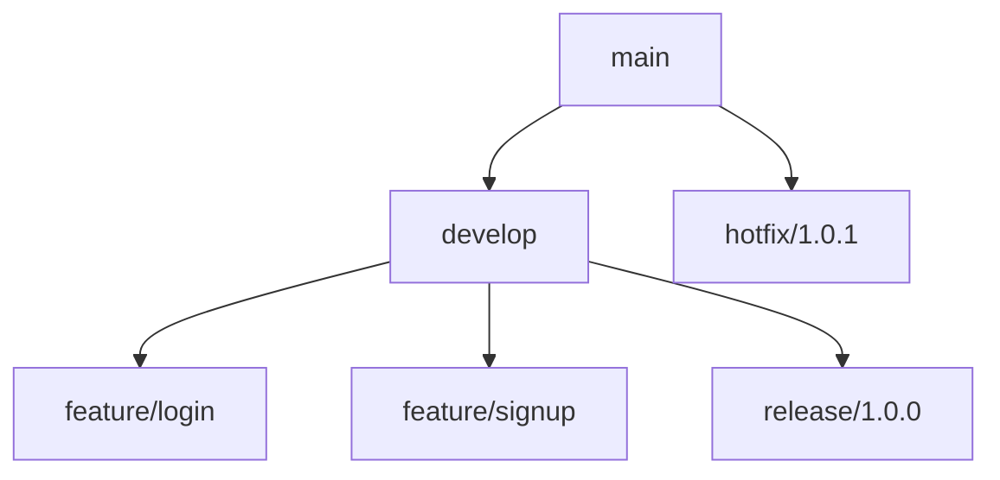

# Git 版本控制策略

版本控制是软件开发中不可或缺的一部分，而Git是最流行的分布式版本控制系统。掌握Git版本控制策略，可以帮助团队更高效地协作，减少冲突，并确保代码库的整洁和可维护性。本文将介绍Git版本控制策略的基本概念、常见工作流及其实际应用场景。

## 什么是Git版本控制策略？

Git版本控制策略是指在团队协作开发中，如何组织和管理代码库的分支、提交和合并的规则和方法。一个良好的版本控制策略可以提高开发效率，减少冲突，并确保代码库的稳定性和可维护性。

## 常见的Git工作流

### 1. 集中式工作流（Centralized Workflow）

集中式工作流是最简单的Git工作流，适合小型团队或初学者。所有开发者都在同一个分支（通常是`main`或`master`）上工作，并通过`git pull`和`git push`来同步代码。

#### 示例

```bash
# 克隆远程仓库
git clone https://github.com/your-repo.git

# 切换到主分支
git checkout main

# 拉取最新代码
git pull origin main

# 创建新分支并切换
git checkout -b feature-branch

# 提交更改
git add .
git commit -m "Add new feature"

# 推送分支到远程仓库
git push origin feature-branch

# 合并到主分支
git checkout main
git merge feature-branch
git push origin main
```

### 2. 功能分支工作流（Feature Branch Workflow）

功能分支工作流是集中式工作流的扩展，每个新功能或修复都在独立的分支上开发，完成后通过Pull Request（PR）合并到主分支。

#### 示例

```bash
# 创建新功能分支
git checkout -b feature-login

# 开发并提交更改
git add .
git commit -m "Implement login feature"

# 推送分支到远程仓库
git push origin feature-login

# 创建Pull Request并合并到主分支
# （通常在GitHub或GitLab等平台上操作）
```

### 3. Gitflow工作流

Gitflow工作流是一种更复杂的工作流，适合中大型项目。它定义了明确的分支模型，包括`main`、`develop`、`feature`、`release`和`hotfix`分支。



#### 示例

```bash
# 初始化Gitflow
git flow init

# 开始新功能开发
git flow feature start login

# 完成功能开发
git flow feature finish login

# 开始新版本发布
git flow release start 1.0.0

# 完成版本发布
git flow release finish 1.0.0

# 开始热修复
git flow hotfix start 1.0.1

# 完成热修复
git flow hotfix finish 1.0.1
```

### 4. Forking工作流

Forking工作流常用于开源项目，每个开发者都有自己的远程仓库副本（fork），并通过Pull Request向主仓库贡献代码。

#### 示例

```bash
# Fork远程仓库到自己的GitHub账户
# （通常在GitHub上操作）

# 克隆自己的远程仓库
git clone https://github.com/your-username/your-repo.git

# 添加主仓库为远程仓库
git remote add upstream https://github.com/original-repo.git

# 拉取主仓库的最新代码
git fetch upstream

# 创建新分支并开发
git checkout -b feature-branch

# 提交更改并推送到自己的远程仓库
git add .
git commit -m "Add new feature"
git push origin feature-branch

# 创建Pull Request
# （通常在GitHub上操作）
```

## 实际应用场景

### 场景1：小型团队开发

对于小型团队，集中式工作流或功能分支工作流是最合适的选择。它们简单易用，能够快速上手，并且不需要复杂的分支管理。

### 场景2：中大型项目

对于中大型项目，Gitflow工作流提供了更严格的分支管理，适合需要频繁发布和维护的项目。它能够确保代码库的稳定性和可维护性。

### 场景3：开源项目

对于开源项目，Forking工作流是最常见的选择。它允许贡献者在不影响主仓库的情况下进行开发，并通过Pull Request向主仓库贡献代码。

## 总结

Git版本控制策略是团队协作开发中至关重要的一部分。通过选择合适的工作流，团队可以更高效地协作，减少冲突，并确保代码库的整洁和可维护性。无论是小型团队、中大型项目还是开源项目，都有适合的Git工作流可供选择。

## 附加资源

- [Pro Git Book](https://git-scm.com/book/en/v2) - 官方Git文档，深入讲解Git的各个方面。
- [GitHub Guides](https://guides.github.com/) - GitHub官方指南，涵盖Git和GitHub的使用。
- [Gitflow Workflow](https://www.atlassian.com/git/tutorials/comparing-workflows/gitflow-workflow) - Atlassian提供的Gitflow工作流详细指南。

## 练习

1. 尝试在本地仓库中使用集中式工作流进行开发，并模拟团队协作。
2. 使用功能分支工作流开发一个新功能，并通过Pull Request合并到主分支。
3. 在Gitflow工作流中创建一个新版本，并完成发布流程。
4. 在GitHub上Fork一个开源项目，并尝试通过Pull Request贡献代码。

通过以上练习，你将更深入地理解Git版本控制策略，并能够在实际项目中灵活应用。