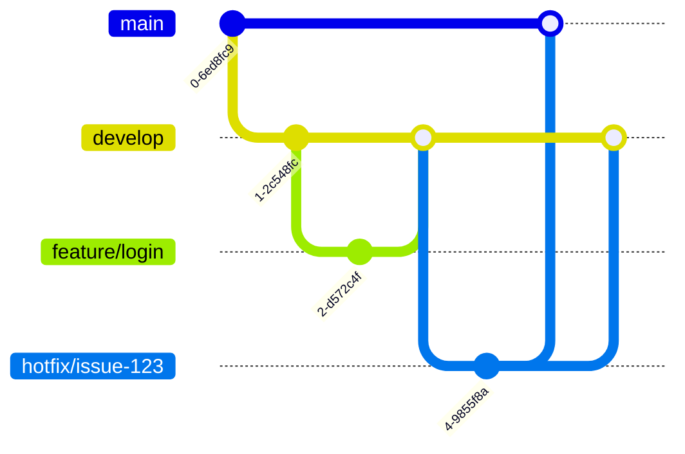

## 介绍

在软件开发中，Git是最常用的版本控制系统之一。为了更好地管理代码库，合理的Git仓库组织结构至关重要。一个良好的仓库结构不仅能提高团队协作效率，还能让代码库更易于维护和扩展。

本文将介绍Git仓库的组织结构，包括常见的目录布局、分支策略以及如何在实际项目中应用这些概念。

## 常见的Git仓库目录结构

一个典型的Git仓库通常包含以下目录和文件：

- **src/**: 存放源代码的目录。
- **tests/**: 存放测试代码的目录。
- **docs/**: 存放文档的目录。
- **config/**: 存放配置文件的目录。
- **README.md**: 项目的说明文件。
- **.gitignore**: 指定哪些文件或目录应该被Git忽略。

以下是一个简单的Git仓库目录结构示例：

```
my-project/
├── src/
│   ├── main.js
│   └── utils.js
├── tests/
│   └── main.test.js
├── docs/
│   └── README.md
├── config/
│   └── config.json
├── README.md
└── .gitignore
```

:::tip
在创建Git仓库时，建议遵循一致的目录结构，这样可以让团队成员更容易理解和维护代码库。
:::

## 分支策略

Git的分支策略是仓库组织结构的重要组成部分。常见的分支策略包括：

- **主分支（main/master）**: 用于存放稳定的、可发布的代码。
- **开发分支（develop）**: 用于日常开发，团队成员在此分支上进行功能开发。
- **功能分支（feature branches）**: 用于开发新功能，通常从`develop`分支创建，开发完成后合并回`develop`分支。
- **修复分支（hotfix branches）**: 用于修复生产环境中的紧急问题，通常从`main`分支创建，修复完成后合并回`main`和`develop`分支。

以下是一个典型的分支策略示例：



:::note
分支策略的选择应根据团队的工作流程和项目需求进行调整。常见的分支策略包括Git Flow、GitHub Flow和GitLab Flow等。
:::

## 实际案例

假设我们正在开发一个简单的Web应用程序，以下是我们在Git仓库中组织代码的步骤：

1. **初始化Git仓库**:

   ```bash
   git init my-web-app
   cd my-web-app
   ```

2. **创建目录结构**:

   ```bash
   mkdir src tests docs config
   touch src/main.js src/utils.js tests/main.test.js docs/README.md config/config.json README.md .gitignore
   ```

3. **添加初始提交**:

   ```bash
   git add .
   git commit -m "Initial commit with basic directory structure"
   ```

4. **创建开发分支**:

   ```bash
   git checkout -b develop
   ```

5. **开发新功能**:

   ```bash
   git checkout -b feature/login
   # 在feature/login分支上进行开发
   git add src/login.js
   git commit -m "Add login feature"
   git checkout develop
   git merge feature/login
   ```

6. **修复紧急问题**:

   ```bash
   git checkout main
   git checkout -b hotfix/issue-123
   # 在hotfix/issue-123分支上进行修复
   git add src/fix.js
   git commit -m "Fix issue #123"
   git checkout main
   git merge hotfix/issue-123
   git checkout develop
   git merge hotfix/issue-123
   ```

:::caution
在合并分支时，务必确保代码经过充分的测试，以避免引入新的问题。
:::

## 总结

合理的Git仓库组织结构是高效管理代码库的关键。通过遵循一致的目录结构和分支策略，团队可以更轻松地协作和维护代码库。本文介绍了常见的Git仓库目录结构和分支策略，并通过实际案例展示了如何在实际项目中应用这些概念。

## 附加资源与练习

- **练习**: 尝试在本地创建一个Git仓库，并按照本文介绍的目录结构和分支策略进行组织。
- **资源**: 
  - [Pro Git Book](https://git-scm.com/book/en/v2) - 一本全面介绍Git的免费书籍。
  - [GitHub Guides](https://guides.github.com/) - GitHub官方提供的Git使用指南。

通过不断实践和学习，你将能够更好地掌握Git仓库的组织结构，并在实际项目中应用这些最佳实践。