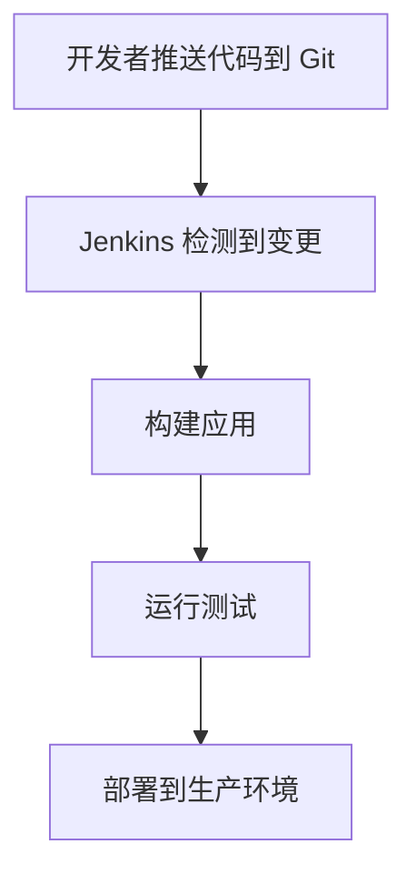

## 介绍

在现代软件开发中，Git 和 DevOps 是两个至关重要的概念。Git 是一个分布式版本控制系统，而 DevOps 是一种文化和实践，旨在通过自动化和协作来缩短开发周期并提高软件质量。本文将探讨 Git 如何与 DevOps 结合，帮助团队更高效地交付软件。

## Git 在 DevOps 中的作用

### 版本控制

Git 是 DevOps 中的核心工具之一，主要用于版本控制。它允许开发团队跟踪代码的变更，协作开发，并在出现问题时回滚到之前的版本。

```bash
# 克隆远程仓库
git clone https://github.com/example/repo.git

# 创建新分支
git checkout -b feature-branch

# 提交更改
git add .
git commit -m "Add new feature"

# 推送分支到远程仓库
git push origin feature-branch
```

### 持续集成与持续交付（CI/CD）

在 DevOps 中，持续集成（CI）和持续交付（CD）是关键实践。Git 与 CI/CD 工具（如 Jenkins、GitLab CI、GitHub Actions）集成，可以自动化构建、测试和部署流程。

```yaml
# Git Hub Actions 示例
name: CI

on:
  push:
    branches:
      - main

jobs:
  build:
    runs-on: ubuntu-latest
    steps:
      - uses: actions/checkout@v2
      - name: Set up Node.js
        uses: actions/setup-node@v2
        with:
          node-version: '14'
      - run: npm install
      - run: npm test
```

:::tip
使用 Git 钩子（hooks）可以在提交代码前自动运行测试，确保代码质量。
:::

### 基础设施即代码（IaC）

DevOps 提倡基础设施即代码（IaC），即通过代码来管理和配置基础设施。Git 可以用于版本控制这些基础设施代码，确保环境的一致性和可重复性。

```hcl
# Terraform 示例
provider "aws" {
  region = "us-west-2"
}

resource "aws_instance" "example" {
  ami           = "ami-0c55b159cbfafe1f0"
  instance_type = "t2.micro"
}
```

## 实际案例

### 案例 1：自动化部署流水线

假设你有一个 Web 应用，使用 Git 进行版本控制，并通过 Jenkins 实现 CI/CD。每次推送到 `main` 分支时，Jenkins 会自动构建、测试并部署应用。



### 案例 2：多环境管理

在 DevOps 中，通常会有多个环境（如开发、测试、生产）。Git 分支可以用于管理不同环境的代码版本。例如，`develop` 分支用于开发环境，`staging` 分支用于测试环境，`main` 分支用于生产环境。

```bash
# 切换到开发分支
git checkout develop

# 合并功能分支
git merge feature-branch

# 推送到远程仓库
git push origin develop
```

## 总结

Git 是 DevOps 实践中的关键工具，它不仅用于版本控制，还在 CI/CD、基础设施即代码等方面发挥着重要作用。通过 Git，团队可以更高效地协作，自动化软件交付流程，并确保代码和基础设施的一致性。

## 附加资源

- [Git 官方文档](https://git-scm.com/doc)
- [DevOps 实践指南](https://aws.amazon.com/devops/what-is-devops/)
- [GitHub Actions 文档](https://docs.github.com/en/actions)
- [Terraform 官方文档](https://www.terraform.io/docs)

## 练习

1. 创建一个 GitHub 仓库，并设置一个简单的 CI/CD 流水线，使用 GitHub Actions 自动运行测试。
2. 使用 Terraform 编写一个简单的 AWS EC2 实例配置，并将其版本控制在 Git 中。
3. 尝试使用 Git 钩子在提交代码前自动运行代码格式化工具。

通过以上练习，你将更深入地理解 Git 与 DevOps 的结合，并能够在实际项目中应用这些知识。